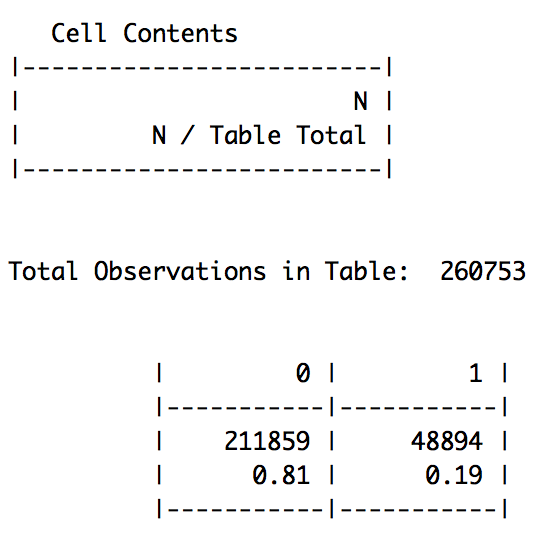
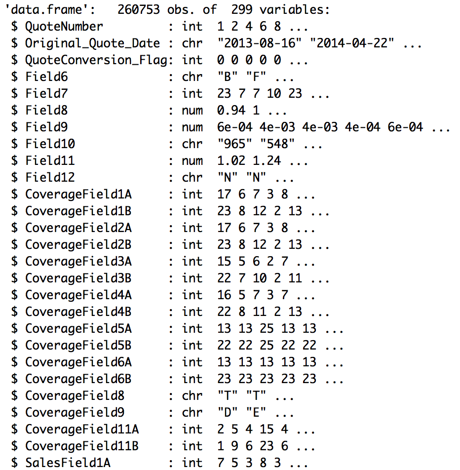
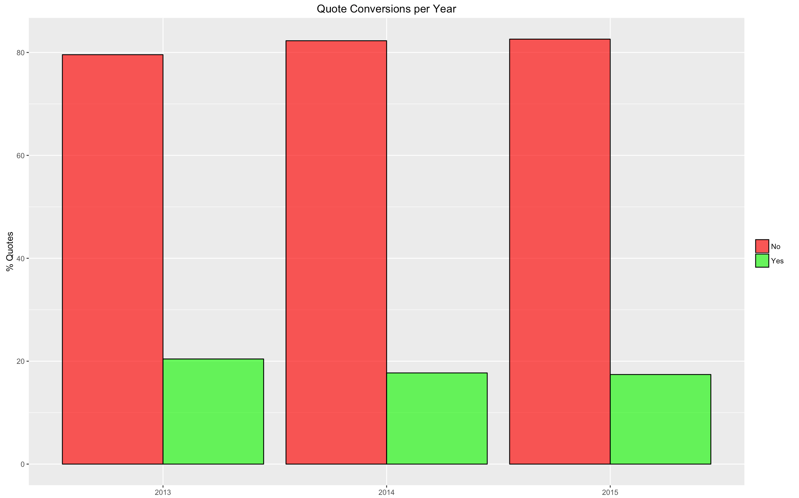
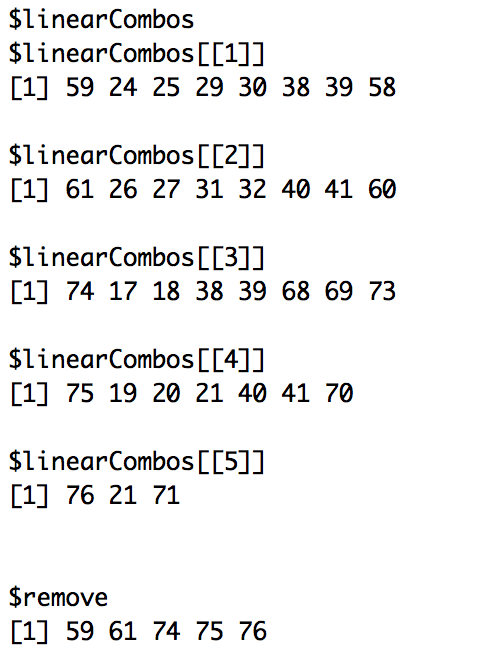
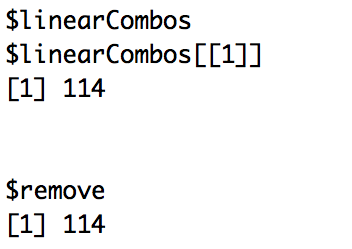

# Homesite Quote Conversion Prediction

This document contains a step-by-step analysis of the Homesite Quote Conversion dataset from kaggle. 


## Importing data and libraries 

```{r, eval = True}
library(caret)
library(gmodels)
library(ggplot2)
library(grid)
library(gridExtra)
library(xts)
library(Rmisc)
library(zoo)
library(dplyr)

rm(list = ls())
setwd("/Users/Riddhik/Desktop/Homesite")
options(stringsAsFactors = FALSE)

homesite.data <- read.csv("train.csv", 
                          nrows = 1000, 
                          header = T)


classes <- sapply(homesite.data, class)
colNames <- colnames(homesite.data) 


homesite.data <- read.csv("train.csv", 
                          colClasses = classes,
                          col.names = colNames,
                          header = T,
                          na.strings=c("", " ", "NA"),
                          stringsAsFactors = F)
```

Percentage distribution of the dependent variable:
```{r, eval = True}
CrossTable(dependent_var, digits = 2)

# QC_table <- table(homesite.data$QuoteConversion_Flag)
# QC_df <- as.data.frame(round(prop.table(QC_table)*100, 2))
# names(QC_df) = c("QuoteConversion","%Distribution")
# QC_df
# View(QC_df)
```



## Snapshot of the dataset
```{r, eval=T}
str(homesite.data, 
    vec.len = 2, 
    give.attr = T)

# reset memory
gc(reset = T)
gcinfo(verbose = T)
```



## Pre-processing NA values
```{r, eval=T}
count_na <- colSums(is.na(homesite.data))
NA_count <- sort(count_na[which(count_na != 0)], 
                 decreasing = T)
NA_percent <- round(NA_count/nrow(homesite.data) * 100, 4)
NA_percent <- paste(NA_percent, "%")
na_columns <- names(NA_count)


# Only 2 NA values occur for GeographicField63
# Thus, convert them to the most frequently 
# occuring category of the feature
gf63 <- homesite.data$GeographicField63
gf63_na <- which(is.na(gf63) == T)
homesite.data$GeographicField63[gf63_na] <- 'N'


# replace NA to -1
homesite.data[is.na(homesite.data)] <- -1


# Creating new feature to capture -1
count_neg_1 <- rowSums(homesite.data == -1)
homesite.data$count_neg_1 <- count_neg_1
summary(homesite.data$count_neg_1)


# Converting characters back to factors
char_df = homesite.data[sapply(homesite.data, 
                               is.character)]
char_name <- names(char_df)
homesite.data[, char_name] <- lapply(homesite.data[, char_name], 
                                     factor)


# Distribution of NA values
subset <- homesite.data[, na_columns]
Feature_class <- sapply(subset, class)
View(as.data.frame(cbind(NA_count, 
                          NA_percent, 
                          Feature_class)))
```


**EDA of NA columns:**
```{r, eval = T}
CrossTable(homesite.data$PropertyField29, 
           dependent_var, 
           digits=5, 
           chisq = F,  
           dnn=c("PropertyField29", "QuoteConversion_Flag"),
           prop.r = T, 
           prop.c = F,  
           prop.t = T,  
           prop.chisq = F)

# CrossTable(homesite.data$PersonalField84, dependent_var, 
#            digits=5, chisq = F,  dnn=c("PersonalField84",
#                                        "QuoteConversion_Flag"),
#            prop.r = T, prop.c = F,  prop.t = T,  prop.chisq = F)

```


```{r, eval=T}
CrossTable(homesite.data$PropertyField38, 
           dependent_var, 
           digits=5, 
           chisq = T,  
           dnn=c("PropertyField38", "QuoteConversion_Flag"),
           prop.r = T, 
           prop.c = F,  
           prop.t = F,  
           prop.chisq = F) # add in pres


# CrossTable(homesite.data$PersonalField7, dependent_var, 
#            digits=5, chisq = T,  dnn=c("PersonalField7",
#                                        "QuoteConversion_Flag"),
#            prop.r = T, prop.c = F,  prop.t = F,  prop.chisq = F)

 
# CrossTable(homesite.data$PropertyField36, dependent_var, 
#            digits=5, chisq = T,  dnn=c("PropertyField36",
#                                        "QuoteConversion_Flag"),
#            prop.r = T, prop.c = F,  prop.t = F,  prop.chisq = F)

 
# CrossTable(homesite.data$PropertyField3, dependent_var, 
#            digits=5, chisq = T,  dnn=c("PropertyField3",
#                                        "QuoteConversion_Flag"),
#            prop.r = T, prop.c = F,  prop.t = F,  prop.chisq = F)

 
# CrossTable(homesite.data$PropertyField32, dependent_var, 
#            digits=5, chisq = T,  dnn=c("PropertyField32",
#                                        "QuoteConversion_Flag"),
#            prop.r = T, prop.c = F,  prop.t = F,  prop.chisq = F)

 
# CrossTable(homesite.data$PropertyField34, dependent_var, 
#            digits=5, chisq = T,  dnn=c("PropertyField34",
#                                        "QuoteConversion_Flag"),
#            prop.r = T, prop.c = F,  prop.t = F,  prop.chisq = F)

 
# CrossTable(homesite.data$PropertyField4, dependent_var, 
#            digits=5, chisq = T,  dnn=c("PropertyField4",
#                                        "QuoteConversion_Flag"),
#            prop.r = T, prop.c = F,  prop.t = F,  prop.chisq = F)
```


Dropping none of the NA columns because the distribution of the NA values w.r.t the dependent variable is skewed towards 0. If instead, the distribution was unbiased like a 50/50 proportion, the column could have been dropped. Furthermore, all factor columns are statistically significant.


## Preprocessing Dates feature
```{r, eval = True}
dateConversion <- function(datestring) {
      as.POSIXct(datestring, format = "%Y-%m-%d")
}


# Add 3 new columns to the dataset with year, month and day information
quote_dates <- dateConversion(homesite.data$Original_Quote_Date)
Original_Quote_Year <- format(quote_dates, "%Y")
Original_Quote_Month <- format(quote_dates, "%m")
Original_Quote_Day <- format(quote_dates, "%d")

homesite.data$Original_Quote_Year <- as.factor(Original_Quote_Year)
homesite.data$Original_Quote_Month <- as.factor(Original_Quote_Month)
homesite.data$Original_Quote_Day <- as.factor(Original_Quote_Day)

# variable to perform trend analysis
trend <- cbind(Original_Quote_Year,
             Original_Quote_Month,
             Original_Quote_Day,
             dependent_var)


# Check yearly seasonality
y_tr <- as.data.frame(round(table(homesite.data$Original_Quote_Year, 
                 dependent_var)))


r1 = which(y_tr$Var1 == 2013)[1]
r2 = which(y_tr$Var1 == 2013)[2]


p1 = round(y_tr[r1, 3]/ (y_tr[r1, 3] + 
                               y_tr[r2, 3]) * 100, 2)
p2 = round(y_tr[r2, 3]/ (y_tr[r1,3] + 
                               y_tr[r2, 3]) * 100, 2)


r1.1 = which(y_tr$Var1 == 2014)[1]
r2.1 = which(y_tr$Var1 == 2014)[2]


p1.1 = round(y_tr[r1.1, 3]/ (y_tr[r1.1, 3] +
                                   y_tr[r2.1, 3]) * 100, 2)
p2.1 = round(y_tr[r2.1, 3]/ (y_tr[r1.1,3] + 
                                   y_tr[r2.1, 3]) * 100, 2)


r1.2 = which(y_tr$Var1 == 2015)[1]
r2.2 = which(y_tr$Var1 == 2015)[2]


p1.2 = round(y_tr[r1.2, 3]/ (y_tr[r1.2,3] + 
                                   y_tr[r2.2, 3]) * 100, 2)
p2.2 = round(y_tr[r2.2, 3]/ (y_tr[r1.2,3] + 
                                   y_tr[r2.2, 3]) * 100, 2)


per_col <- c(p1,p1.1,p1.2,p2,p2.1,p2.2)
y_tr <- cbind(y_tr, per_col)


gg <- ggplot(data = y_tr, aes(x = Var1,
                              y = per_col,
                              fill = dependent_var))


gg + geom_bar(stat = "identity", 
              position = "dodge", 
              alpha = 0.75, 
              color = "black") + 
      xlab(NULL) + 
      ggtitle("Quote Conversions per Year") +
      ylab("% Quotes") +
      scale_fill_manual(values=c("red", "green"), 
                        labels=c("No", "Yes")) +
    guides(fill=guide_legend(title = NULL))
```



```{r, eval = True}
# Check monthly seasonality
date <- as.Date(homesite.data$Original_Quote_Date)
score <- homesite.data$QuoteConversion_Flag
zoo <- zoo(score, date)


daily = apply.daily(zoo, sum)
weekly = apply.weekly(zoo, sum)
monthly = apply.monthly(zoo, sum)
quarterly = apply.quarterly(zoo, sum)


ts.daily <- autoplot(daily, 
                     geom = "point") + 
      xlab(NULL) + 
      ylab(NULL) +
      geom_smooth(color = "darkorange", 
                  fill = "purple", 
                  alpha = 0.2) + 
      theme(legend.position = "none") + 
      ggtitle("Daily Trend")


ts.weekly <- autoplot(weekly) +  
      xlab(NULL) + 
      ylab(NULL) +
      geom_smooth(color = "darkorange", 
                  fill = "purple", 
                  alpha = 0.2) + 
      theme(legend.position = "none") + 
      ggtitle("Weekly Trend")


ts.monthly <- autoplot(monthly) + 
      xlab(NULL) + 
      ylab(NULL) +
      geom_smooth(color = "darkorange", 
                  fill = "purple",
                  alpha = 0.2) + 
      theme(legend.position = "none") + 
      ggtitle("Monthly Trend")


ts.quarterly <- autoplot(quarterly) + 
      xlab(NULL) +
      ylab(NULL) +
      geom_smooth(color = "darkorange", 
                  fill = "purple", 
                  alpha = 0.2) + 
      theme(legend.position = "none") + 
      ggtitle("Quartely Trend")


multiplot(ts.daily, 
          ts.weekly, 
          ts.monthly, 
          ts.quarterly, 
          cols = 2)
```


```{r, eval = True}
############### Adding quarterly trend as a new feature
Original_Quote_Quarter <- as.yearqtr(quote_dates)
homesite.data$Original_Quote_Quarter <- as.factor(Original_Quote_Quarter)


############### Adding weekly trend as a new feature
Original_Quote_Week <- as.numeric(format(quote_dates, "%U"))
homesite.data$Original_Quote_Week <- as.factor(Original_Quote_Week)


# Drop Original_Quote_Date column
drops <- "Original_Quote_Date"
homesite.data = homesite.data[, !(names(homesite.data) %in% drops)]
```

## Feature Group Counts
```{r, eval = True}
fields <- select(homesite.data,
                 Field6:Field12, 
                 QuoteConversion_Flag)
Fields <- length(fields) - 1


coverageFields <- select(homesite.data, 
                         CoverageField1A:CoverageField11B,
                         QuoteConversion_Flag)
CoverageFields <- length(coverageFields) - 1


salesFields <- select(homesite.data, 
                      SalesField1A:SalesField15,
                      QuoteConversion_Flag)
SalesFields <- length(salesFields) - 1


personalFields <- select(homesite.data, 
                         PersonalField1:PersonalField84,
                         QuoteConversion_Flag)
PersonalFields <- length(personalFields) - 1


propertyFields <- select(homesite.data, 
                         PropertyField1A:PropertyField39B,
                         QuoteConversion_Flag)
PropertyFields <- length(propertyFields) - 1


geographicFields <- select(homesite.data, 
                           GeographicField1A:GeographicField64,
                           QuoteConversion_Flag)
GeographicFields <- length(geographicFields) - 1


Variable_Groups <- c("AnonymousFields", 
                     "CoverageFields",
                     "SalesFields", 
                     "PersonalFields", 
                     "PropertyFields", 
                     "GeographicFields", 
                     "QuoteNumber", 
                     "Date",
                     "Total")


Group_Counts <- c(Fields, 
                  CoverageFields, 
                  SalesFields,
                  PersonalFields,
                  PropertyFields,
                  GeographicFields, 
                  1, 1, 
                  298)


Feature_Types <- data.frame(Variable_Groups, 
                            Group_Counts)
View(Feature_Types)
```


## Zeo-Variance

Checking for variance and zero-variance

```{r, eval = True}
#dim(homesite.data)


# Zero Variance, first 100 features
homesite.100 <- homesite.data[, 1:100]
zero.values = nearZeroVar(homesite.100, 
                          saveMetrics = TRUE)
zero.values[zero.values[, "zeroVar"] == TRUE, ]


# Near-zero variance, first 100 features
zv <- zero.values[zero.values[, "zeroVar"] +
                        zero.values[, "nzv"] == TRUE, ]
zv_df <- as.data.frame(zv)


# save
ratio_names <- rownames(zv_df)
freqratio <- zv_df$freqRatio


# Zero Variance, next 100 features
homesite.200 <- homesite.data[, 101:200]
zero.values.2 = nearZeroVar(homesite.200, 
                            saveMetrics = TRUE)
zero.values.2[zero.values.2[, "zeroVar"] == TRUE, ]
```


```{r, eval=True}
# Near-zero variance, next 100 features
zv2 <- zero.values.2[zero.values.2[, "zeroVar"] +
                           zero.values.2[, "nzv"] == TRUE, ]
zv_df2 <- as.data.frame(zv2)


# save
ratio_names <- c(ratio_names, 
                 rownames(zv_df2))
freqratio <- c(freqratio, 
               zv_df2$freqRatio)


# Zero Variance, next 102 features
homesite.300 <- homesite.data[, 201:302]
zero.values.3 = nearZeroVar(homesite.300, 
                            saveMetrics = TRUE)
zero.values.3[zero.values.3[, "zeroVar"] == TRUE, ]


# Near-zero variance, next 102 features
zv3 <- zero.values.3[zero.values.3[, "zeroVar"] +
                           zero.values.3[, "nzv"] == TRUE, ]
zv_df3 <- as.data.frame(zv3)


# save
ratio_names <- c(ratio_names, rownames(zv_df3))
freqratio <- c(freqratio, zv_df3$freqRatio)


# Plot near-zv data
zv_ratio <- round(freqratio)
zv_features <- ratio_names


new_zv_df <- data.frame(zv_features, zv_ratio)
new_zv_df <- arrange(new_zv_df, -zv_ratio)


gg_zv <- head(new_zv_df, 25)
gg_zv$zv_features <- factor(gg_zv$zv_features, 
                            levels = gg_zv$zv_features[order(-gg_zv$zv_ratio)])


ggplot(data = gg_zv, aes(x = zv_features, 
                         y = zv_ratio, 
                         fill = zv_features)) + 
      geom_bar(stat = "identity") + 
      theme(legend.position = "none") + 
      theme(axis.text.x = element_text(angle = 90, 
                                       hjust = 1),
            axis.text=element_text(size=10,face="bold")) + 
      xlab(NULL) + 
      ylab(NULL) + 
      ggtitle("Near Zero-Variance") + 
      geom_hline(yintercept=10000, 
                 color = "red", 
                 linetype="dashed") + 
      scale_y_continuous(breaks=seq(0, 130500, 10000))
```


Dropping features with zero-variance and near zero-variance
```{r, eval=True}
# CrossTable(homesite.data$GeographicField10B)
# CrossTable(homesite.data$PropertyField20)
# CrossTable(homesite.data$PropertyField9)


#Drop zv and near-zv columns
drops <- c("PropertyField6", 
           "GeographicField10A", 
           "GeographicField10B",
           "PropertyField20",
           "PropertyField9")

homesite.data = homesite.data[, !(names(homesite.data) %in% drops)]
```

## Linear Combinations

Checking for linear combinations

```{r, eval=T}
# extract only numeric columns
num_df = homesite.data[sapply(homesite.data, 
                              is.numeric)]
#dim(num_df)
#colnames(num_df)


# 1. Fields
linear_columns_field <- num_df[, 3:6]
linear.matrix.fields <- as.matrix(linear_columns_field)
comboInfo.fields <- findLinearCombos(linear.matrix.fields)
comboInfo.fields
```


```{r,eval=True}
# 2. Coverage Fields
linear_columns_coverage <- num_df[, 7:20]
linear.matrix.coverage <- as.matrix(linear_columns_coverage)
comboInfo.coverage <- findLinearCombos(linear.matrix.coverage)
comboInfo.coverage
```


```{r, eval=True}
# 3. Sales Fields
linear_columns_sales <- num_df[, 21:36]
linear.matrix.sales <- as.matrix(linear_columns_sales)
comboInfo.sales <- findLinearCombos(linear.matrix.sales)
comboInfo.sales
```


```{r, eval=True}
# 4.a. Personal Fields
linear_columns_personal <- num_df[, 37:114]
linear.matrix.personal <- as.matrix(linear_columns_personal)
comboInfo.personal <- findLinearCombos(linear.matrix.personal)
comboInfo.personal
drops <- names(linear_columns_personal[,comboInfo.personal$remove])
homesite.data = homesite.data[, !(names(homesite.data) %in% drops)]

# Example:
# (X)*PersonalField27 + (Y)*Personal Field77 = PersonalField82 
# Drop Z

# [1] "PersonalField65" "PersonalField67"
# [3] "PersonalField80" "PersonalField81"
# [5] "PersonalField82"
```



```{r, eval=True}
# 5. Property Feilds
linear_columns_property <- num_df[, 115:144]
linear.matrix.property <- as.matrix(linear_columns_property)
comboInfo.property <- findLinearCombos(linear.matrix.property)
comboInfo.property
drops <- names(linear_columns_property[,comboInfo.property$remove])
homesite.data = homesite.data[, !(names(homesite.data) %in% drops)]
```


```{r, eval=T}
# 6. Geographic Fields
linear_columns_geo <- num_df[, 145:266]
linear.matrix.geo <- as.matrix(linear_columns_geo)
comboInfo.geo <- findLinearCombos(linear.matrix.geo)
comboInfo.geo
```


```{r, eval=True}
#7. All
num_df = homesite.data[sapply(homesite.data, is.numeric)]
linear.matrix <- as.matrix(num_df)
comboInfo <- findLinearCombos(linear.matrix)
comboInfo
```


```{r, eval = True}
drops <- c("PersonalField65",
           "PersonalField67",
           "PersonalField80",
           "PersonalField81",
           "PersonalField82")

homesite.data = homesite.data[, !(names(homesite.data) %in% drops)]
```


## Map Plot