# Homesite Quote Conversion Prediction

**Dataset:** https://www.kaggle.com/c/homesite-quote-conversion/data 

## Importing data and libraries 
```{r, eval = True}
# install.packages(c("caret","gmodels", 
#                    "ggplot2", "grid", 
#                    "gridExtra", "xts",
#                    "Rmisc","zoo","dplyr"))

library(caret)
library(gmodels)
library(ggplot2)
library(grid)
library(gridExtra)
library(xts)
library(Rmisc)
library(zoo)
library(dplyr)

rm(list = ls())

#setwd("/Users/Riddhik/Desktop/Homesite")
options(stringsAsFactors = FALSE)

# read only the first 1000 rows to store the feature names 
# and feature class types as variables. Then these variables
# are provided to the read.csv() function when reading the 
# entire dataset in order to optimize the reading process. 
homesite.data <- read.csv("train.csv", 
                          nrows = 1000, 
                          header = T)

classes <- sapply(homesite.data, class)
colNames <- colnames(homesite.data) 

# read the entire dataset
homesite.data <- read.csv("train.csv", 
                          colClasses = classes,
                          col.names = colNames,
                          header = T,
                          na.strings=c("", " ", "NA"),
                          stringsAsFactors = F)
```

## Percentage distribution of the dependent variable
```{r, eval = True}
CrossTable(dependent_var, digits = 2)

# QC_table <- table(homesite.data$QuoteConversion_Flag)
# QC_df <- as.data.frame(round(prop.table(QC_table)*100, 2))
# names(QC_df) = c("QuoteConversion","%Distribution")
# QC_df
# View(QC_df)
```
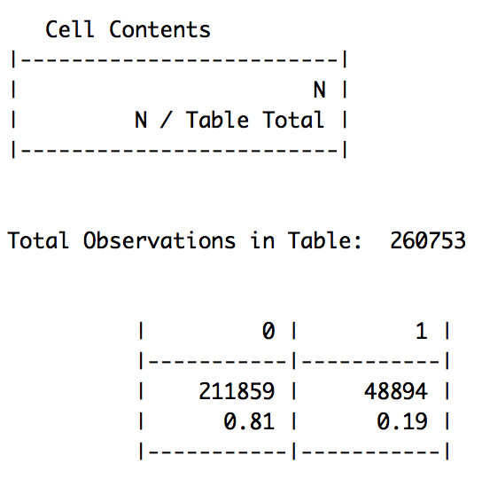


## Snapshot of the dataset
```{r, eval=T}
str(homesite.data, 
    vec.len = 2, 
    give.attr = T)

# reset memory
gc(reset = T)
gcinfo(verbose = T)
```
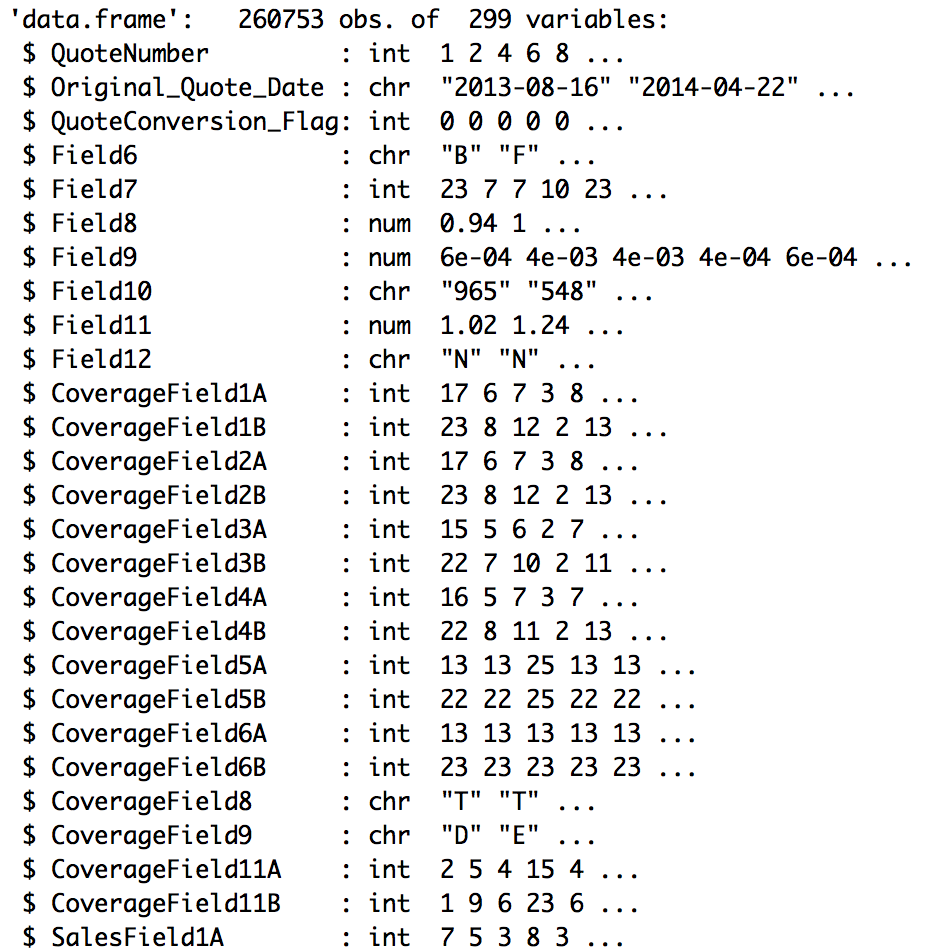

```{r, eval = True}
# Feature Group Counts

fields <- select(homesite.data,
                 Field6:Field12, 
                 QuoteConversion_Flag)
Fields <- length(fields) - 1

coverageFields <- select(homesite.data, 
                         CoverageField1A:CoverageField11B,
                         QuoteConversion_Flag)
CoverageFields <- length(coverageFields) - 1

salesFields <- select(homesite.data, 
                      SalesField1A:SalesField15,
                      QuoteConversion_Flag)
SalesFields <- length(salesFields) - 1

personalFields <- select(homesite.data, 
                         PersonalField1:PersonalField84,
                         QuoteConversion_Flag)
PersonalFields <- length(personalFields) - 1

propertyFields <- select(homesite.data, 
                         PropertyField1A:PropertyField39B,
                         QuoteConversion_Flag)
PropertyFields <- length(propertyFields) - 1

geographicFields <- select(homesite.data, 
                           GeographicField1A:GeographicField64,
                           QuoteConversion_Flag)
GeographicFields <- length(geographicFields) - 1

Variable_Groups <- c("AnonymousFields", 
                     "CoverageFields",
                     "SalesFields", 
                     "PersonalFields", 
                     "PropertyFields", 
                     "GeographicFields", 
                     "QuoteNumber", 
                     "Date",
                     "Total")

Group_Counts <- c(Fields, 
                  CoverageFields, 
                  SalesFields,
                  PersonalFields,
                  PropertyFields,
                  GeographicFields, 
                  1, 1, 
                  298)

Feature_Types <- data.frame(Variable_Groups, 
                            Group_Counts)
View(Feature_Types)
```
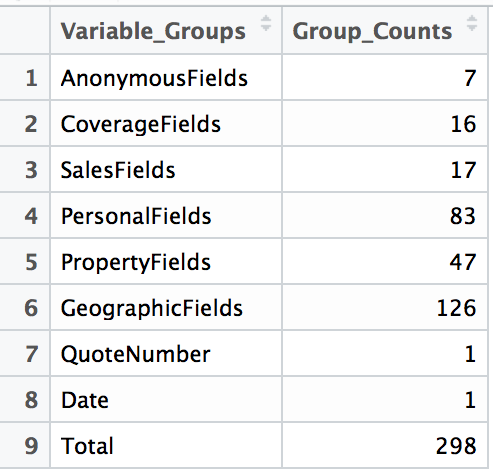

## Preprocessing: NA values
```{r, eval=T}
# Count the percentage of NA values per feature
count_na <- colSums(is.na(homesite.data))
NA_count <- sort(count_na[which(count_na != 0)], 
                 decreasing = T)
NA_percent <- round(NA_count/nrow(homesite.data) * 100, 4)
NA_percent <- paste(NA_percent, "%")
na_columns <- names(NA_count)

# Only 2 NA values occur for GeographicField63
# Thus, convert them to the most frequently 
# occuring category of the feature
gf63 <- homesite.data$GeographicField63
gf63_na <- which(is.na(gf63) == T)
homesite.data$GeographicField63[gf63_na] <- 'N'

# replace NA to -1
homesite.data[is.na(homesite.data)] <- -1

# Creating new feature to capture -1
count_neg_1 <- rowSums(homesite.data == -1)
homesite.data$count_neg_1 <- count_neg_1
summary(homesite.data$count_neg_1)

# Converting characters back to factors
char_df = homesite.data[sapply(homesite.data, 
                               is.character)]
char_name <- names(char_df)
homesite.data[, char_name] <- lapply(homesite.data[, char_name], 
                                     factor)

# Distribution of NA values
subset <- homesite.data[, na_columns]
Feature_class <- sapply(subset, class)
View(as.data.frame(cbind(NA_count, 
                          NA_percent, 
                          Feature_class)))
```
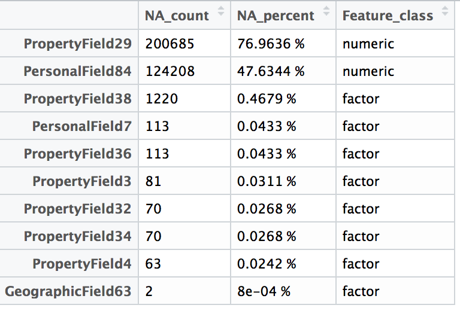


Check the distribution of the dependent variable with respen to features having NA values. This is done to decide of the features having NA values are to be dropped or not.
```{r, eval = T}
CrossTable(homesite.data$PropertyField29, 
           dependent_var, 
           digits=5, 
           chisq = F,  
           dnn=c("PropertyField29", "QuoteConversion_Flag"),
           prop.r = T, 
           prop.c = F,  
           prop.t = T,  
           prop.chisq = F)

# CrossTable(homesite.data$PersonalField84, dependent_var, 
#            digits=5, chisq = F,  dnn=c("PersonalField84",
#                                        "QuoteConversion_Flag"),
#            prop.r = T, prop.c = F,  prop.t = T,  prop.chisq = F)

```
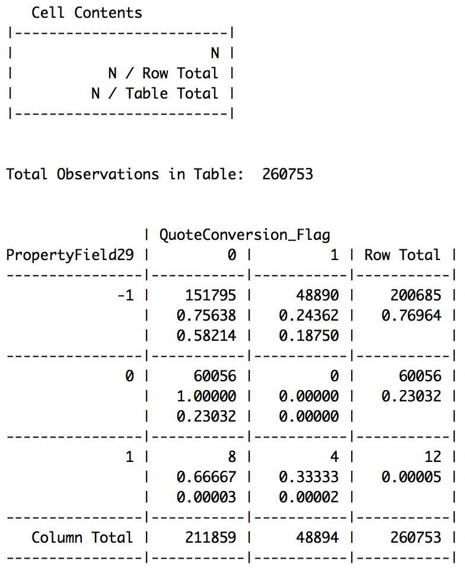


```{r, eval=T}
CrossTable(homesite.data$PropertyField38, 
           dependent_var, 
           digits=5, 
           chisq = T,  
           dnn=c("PropertyField38", "QuoteConversion_Flag"),
           prop.r = T, 
           prop.c = F,  
           prop.t = F,  
           prop.chisq = F) # add in pres

# CrossTable(homesite.data$PersonalField7, dependent_var, 
#            digits=5, chisq = T,  dnn=c("PersonalField7",
#                                        "QuoteConversion_Flag"),
#            prop.r = T, prop.c = F,  prop.t = F,  prop.chisq = F)
 
# CrossTable(homesite.data$PropertyField36, dependent_var, 
#            digits=5, chisq = T,  dnn=c("PropertyField36",
#                                        "QuoteConversion_Flag"),
#            prop.r = T, prop.c = F,  prop.t = F,  prop.chisq = F)
 
# CrossTable(homesite.data$PropertyField3, dependent_var, 
#            digits=5, chisq = T,  dnn=c("PropertyField3",
#                                        "QuoteConversion_Flag"),
#            prop.r = T, prop.c = F,  prop.t = F,  prop.chisq = F)
 
# CrossTable(homesite.data$PropertyField32, dependent_var, 
#            digits=5, chisq = T,  dnn=c("PropertyField32",
#                                        "QuoteConversion_Flag"),
#            prop.r = T, prop.c = F,  prop.t = F,  prop.chisq = F)
 
# CrossTable(homesite.data$PropertyField34, dependent_var, 
#            digits=5, chisq = T,  dnn=c("PropertyField34",
#                                        "QuoteConversion_Flag"),
#            prop.r = T, prop.c = F,  prop.t = F,  prop.chisq = F)
 
# CrossTable(homesite.data$PropertyField4, dependent_var, 
#            digits=5, chisq = T,  dnn=c("PropertyField4",
#                                        "QuoteConversion_Flag"),
#            prop.r = T, prop.c = F,  prop.t = F,  prop.chisq = F)
```
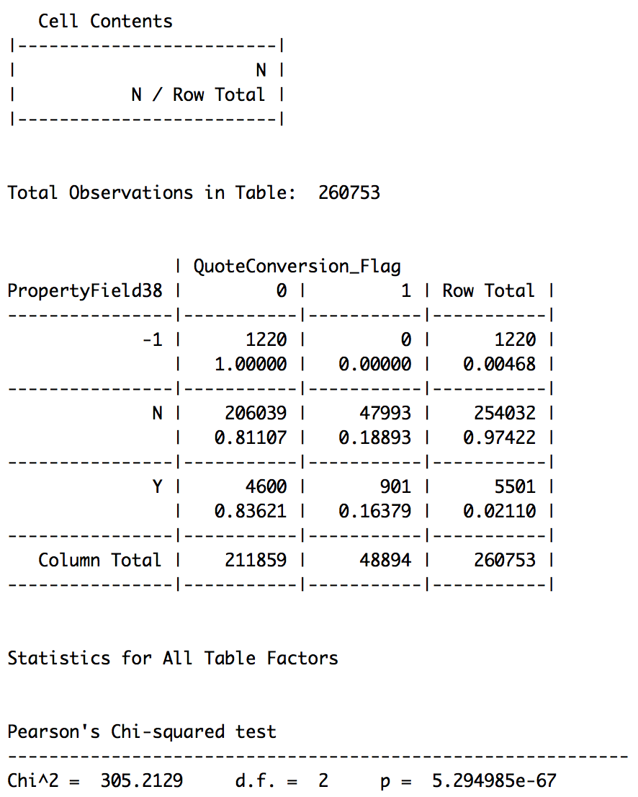

Dropping none of the NA columns because the distribution of the NA values w.r.t the dependent variable is skewed towards 0. If instead, the distribution was unbiased like a 50/50 proportion, the column could have been dropped. Furthermore, all the columns are statistically significant according to the Chi-Square test.


## Preprocessing: Date
```{r, eval = True}
dateConversion <- function(datestring) {
      as.POSIXct(datestring, format = "%Y-%m-%d")
}

# Add 3 new columns to the dataset with year, month and day information
quote_dates <- dateConversion(homesite.data$Original_Quote_Date)
Original_Quote_Year <- format(quote_dates, "%Y")
Original_Quote_Month <- format(quote_dates, "%m")
Original_Quote_Day <- format(quote_dates, "%d")

homesite.data$Original_Quote_Year <- as.factor(Original_Quote_Year)
homesite.data$Original_Quote_Month <- as.factor(Original_Quote_Month)
homesite.data$Original_Quote_Day <- as.factor(Original_Quote_Day)

# variable to perform trend analysis
trend <- cbind(Original_Quote_Year,
             Original_Quote_Month,
             Original_Quote_Day,
             dependent_var)

# Check yearly seasonality of the converted quotes
y_tr <- as.data.frame(round(table(homesite.data$Original_Quote_Year, 
                 dependent_var)))

r1 = which(y_tr$Var1 == 2013)[1]
r2 = which(y_tr$Var1 == 2013)[2]

p1 = round(y_tr[r1, 3]/ (y_tr[r1, 3] + 
                               y_tr[r2, 3]) * 100, 2)
p2 = round(y_tr[r2, 3]/ (y_tr[r1,3] + 
                               y_tr[r2, 3]) * 100, 2)

r1.1 = which(y_tr$Var1 == 2014)[1]
r2.1 = which(y_tr$Var1 == 2014)[2]

p1.1 = round(y_tr[r1.1, 3]/ (y_tr[r1.1, 3] +
                                   y_tr[r2.1, 3]) * 100, 2)
p2.1 = round(y_tr[r2.1, 3]/ (y_tr[r1.1,3] + 
                                   y_tr[r2.1, 3]) * 100, 2)

r1.2 = which(y_tr$Var1 == 2015)[1]
r2.2 = which(y_tr$Var1 == 2015)[2]

p1.2 = round(y_tr[r1.2, 3]/ (y_tr[r1.2,3] + 
                                   y_tr[r2.2, 3]) * 100, 2)
p2.2 = round(y_tr[r2.2, 3]/ (y_tr[r1.2,3] + 
                                   y_tr[r2.2, 3]) * 100, 2)

per_col <- c(p1,p1.1,p1.2,p2,p2.1,p2.2)
y_tr <- cbind(y_tr, per_col)

gg <- ggplot(data = y_tr, aes(x = Var1,
                              y = per_col,
                              fill = dependent_var))

gg + geom_bar(stat = "identity", 
              position = "dodge", 
              alpha = 0.75, 
              color = "black") + 
      xlab(NULL) + 
      ggtitle("Quote Conversions per Year") +
      ylab("% Quotes") +
      scale_fill_manual(values=c("red", "green"), 
                        labels=c("No", "Yes")) +
    guides(fill=guide_legend(title = NULL))
```
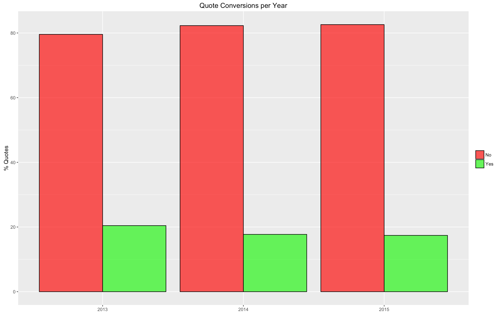


```{r, eval = True}
# Check monthly, weekly, quarterly and daily seasonality of the converted quotes
date <- as.Date(homesite.data$Original_Quote_Date)
score <- homesite.data$QuoteConversion_Flag
zoo <- zoo(score, date)

daily = apply.daily(zoo, sum)
weekly = apply.weekly(zoo, sum)
monthly = apply.monthly(zoo, sum)
quarterly = apply.quarterly(zoo, sum)

ts.daily <- autoplot(daily, 
                     geom = "point") + 
      xlab(NULL) + 
      ylab(NULL) +
      geom_smooth(color = "darkorange", 
                  fill = "purple", 
                  alpha = 0.2) + 
      theme(legend.position = "none") + 
      ggtitle("Daily Trend")

ts.weekly <- autoplot(weekly) +  
      xlab(NULL) + 
      ylab(NULL) +
      geom_smooth(color = "darkorange", 
                  fill = "purple", 
                  alpha = 0.2) + 
      theme(legend.position = "none") + 
      ggtitle("Weekly Trend")

ts.monthly <- autoplot(monthly) + 
      xlab(NULL) + 
      ylab(NULL) +
      geom_smooth(color = "darkorange", 
                  fill = "purple",
                  alpha = 0.2) + 
      theme(legend.position = "none") + 
      ggtitle("Monthly Trend")

ts.quarterly <- autoplot(quarterly) + 
      xlab(NULL) +
      ylab(NULL) +
      geom_smooth(color = "darkorange", 
                  fill = "purple", 
                  alpha = 0.2) + 
      theme(legend.position = "none") + 
      ggtitle("Quartely Trend")

multiplot(ts.daily, 
          ts.weekly, 
          ts.monthly, 
          ts.quarterly, 
          cols = 2)
```
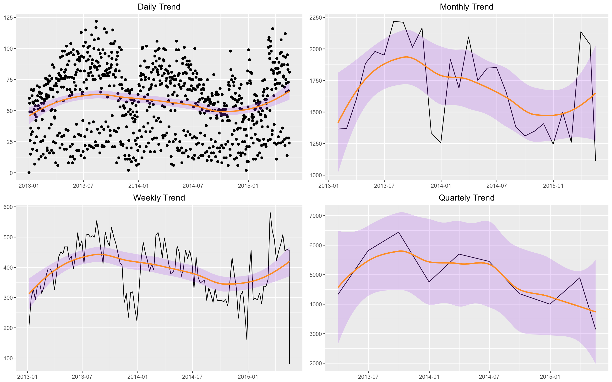


```{r, eval = True}
# Adding quarterly trend as a new feature
Original_Quote_Quarter <- as.yearqtr(quote_dates)
homesite.data$Original_Quote_Quarter <- as.factor(Original_Quote_Quarter)

# Adding weekly trend as a new feature
Original_Quote_Week <- as.numeric(format(quote_dates, "%U"))
homesite.data$Original_Quote_Week <- as.factor(Original_Quote_Week)

# Drop Original_Quote_Date column
drops <- "Original_Quote_Date"
homesite.data = homesite.data[, !(names(homesite.data) %in% drops)]
```

## Preprocessing: Zero Variance & Near-Zero Variance
```{r, eval = True}
#dim(homesite.data)

# Zero Variance, first 100 features
homesite.100 <- homesite.data[, 1:100]
zero.values = nearZeroVar(homesite.100, 
                          saveMetrics = TRUE)
zero.values[zero.values[, "zeroVar"] == TRUE, ]

# Near-zero variance, first 100 features
zv <- zero.values[zero.values[, "zeroVar"] +
                        zero.values[, "nzv"] == TRUE, ]
zv_df <- as.data.frame(zv)

# save
ratio_names <- rownames(zv_df)
freqratio <- zv_df$freqRatio

# Zero Variance, next 100 features
homesite.200 <- homesite.data[, 101:200]
zero.values.2 = nearZeroVar(homesite.200, 
                            saveMetrics = TRUE)
zero.values.2[zero.values.2[, "zeroVar"] == TRUE, ]
```
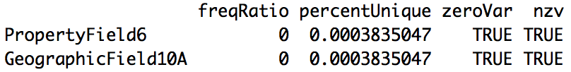

```{r, eval=True}
# Near-zero variance, next 100 features
zv2 <- zero.values.2[zero.values.2[, "zeroVar"] +
                           zero.values.2[, "nzv"] == TRUE, ]
zv_df2 <- as.data.frame(zv2)

# save
ratio_names <- c(ratio_names, 
                 rownames(zv_df2))
freqratio <- c(freqratio, 
               zv_df2$freqRatio)

# Zero Variance, next 102 features
homesite.300 <- homesite.data[, 201:302]
zero.values.3 = nearZeroVar(homesite.300, 
                            saveMetrics = TRUE)
zero.values.3[zero.values.3[, "zeroVar"] == TRUE, ]

# Near-zero variance, next 102 features
zv3 <- zero.values.3[zero.values.3[, "zeroVar"] +
                           zero.values.3[, "nzv"] == TRUE, ]
zv_df3 <- as.data.frame(zv3)

# save
ratio_names <- c(ratio_names, rownames(zv_df3))
freqratio <- c(freqratio, zv_df3$freqRatio)

# Plot near-zv data
zv_ratio <- round(freqratio)
zv_features <- ratio_names

new_zv_df <- data.frame(zv_features, zv_ratio)
new_zv_df <- arrange(new_zv_df, -zv_ratio)

gg_zv <- head(new_zv_df, 25)
gg_zv$zv_features <- factor(gg_zv$zv_features, 
                            levels = gg_zv$zv_features[order(-gg_zv$zv_ratio)])

ggplot(data = gg_zv, aes(x = zv_features, 
                         y = zv_ratio, 
                         fill = zv_features)) + 
      geom_bar(stat = "identity") + 
      theme(legend.position = "none") + 
      theme(axis.text.x = element_text(angle = 90, 
                                       hjust = 1),
            axis.text=element_text(size=10,face="bold")) + 
      xlab(NULL) + 
      ylab(NULL) + 
      ggtitle("Near Zero-Variance") + 
      geom_hline(yintercept=10000, 
                 color = "red", 
                 linetype="dashed") + 
      scale_y_continuous(breaks=seq(0, 130500, 10000))
```
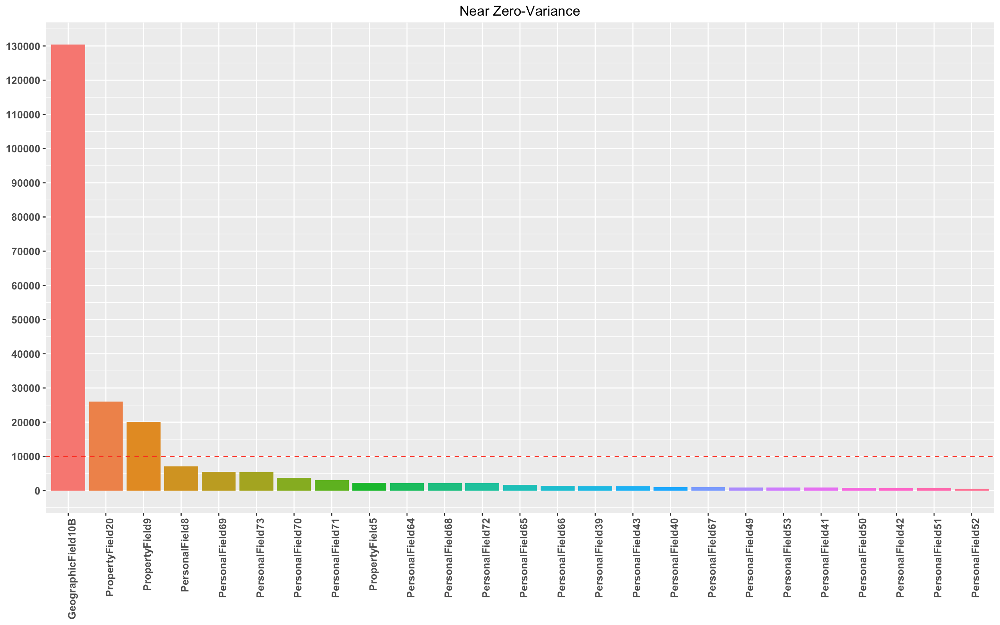

```{r, eval=True}
# CrossTable(homesite.data$GeographicField10B)
# CrossTable(homesite.data$PropertyField20)
# CrossTable(homesite.data$PropertyField9)

#Drop zv and near-zv columns
drops <- c("PropertyField6", 
           "GeographicField10A", 
           "GeographicField10B",
           "PropertyField20",
           "PropertyField9")

homesite.data = homesite.data[, !(names(homesite.data) %in% drops)]
```

## Preprocessing: Linear Combinations
```{r, eval=T}
# extract only numeric columns
num_df = homesite.data[sapply(homesite.data, 
                              is.numeric)]
#dim(num_df)
#colnames(num_df)

# Find linear combinations and drop features which are linear combinations of other features.

# Example:
# (X)*PersonalField27 + (Y)*Personal Field77 = PersonalField82 
# Drop PersonalField82

# 1. Fields
linear_columns_field <- num_df[, 3:6]
linear.matrix.fields <- as.matrix(linear_columns_field)
comboInfo.fields <- findLinearCombos(linear.matrix.fields)
comboInfo.fields # output not shown since no linear combinations found
```

```{r,eval=True}
# 2. Coverage Fields
linear_columns_coverage <- num_df[, 7:20]
linear.matrix.coverage <- as.matrix(linear_columns_coverage)
comboInfo.coverage <- findLinearCombos(linear.matrix.coverage)
comboInfo.coverage # output not shown since no linear combinations found
```

```{r, eval=True}
# 3. Sales Fields
linear_columns_sales <- num_df[, 21:36]
linear.matrix.sales <- as.matrix(linear_columns_sales)
comboInfo.sales <- findLinearCombos(linear.matrix.sales)
comboInfo.sales # output not shown since no linear combinations found
```

```{r, eval=True}
# 4.a. Personal Fields
linear_columns_personal <- num_df[, 37:114]
linear.matrix.personal <- as.matrix(linear_columns_personal)
comboInfo.personal <- findLinearCombos(linear.matrix.personal)
comboInfo.personal # show linear combinatios

# drop features which are linear combinations of other features
drops <- names(linear_columns_personal[,comboInfo.personal$remove])
homesite.data = homesite.data[, !(names(homesite.data) %in% drops)]
```
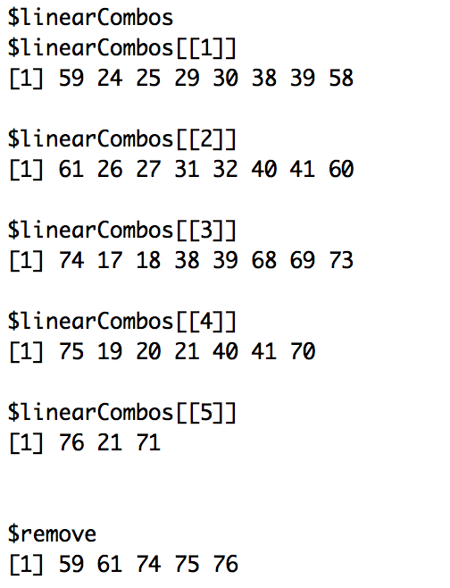


```{r, eval=True}
# 5. Property Feilds
linear_columns_property <- num_df[, 115:144]
linear.matrix.property <- as.matrix(linear_columns_property)
comboInfo.property <- findLinearCombos(linear.matrix.property)
comboInfo.property # show linear combinatios

# drop features which are linear combinations of other features
drops <- names(linear_columns_property[,comboInfo.property$remove])
homesite.data = homesite.data[, !(names(homesite.data) %in% drops)]
```
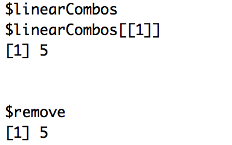

```{r, eval=T}
# 6. Geographic Fields
linear_columns_geo <- num_df[, 145:266]
linear.matrix.geo <- as.matrix(linear_columns_geo)
comboInfo.geo <- findLinearCombos(linear.matrix.geo)
comboInfo.geo # output not shown since no linear combinations found
```

```{r, eval=True}
#7. Check linear combinations across different feature groups
num_df = homesite.data[sapply(homesite.data, is.numeric)]
linear.matrix <- as.matrix(num_df)
comboInfo <- findLinearCombos(linear.matrix)
comboInfo # 
```
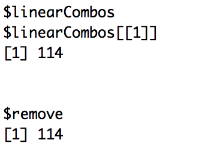

```{r, eval = True}
# drop features which are linear combinations of other features

drops <- c("PersonalField65",
           "PersonalField67",
           "PersonalField80",
           "PersonalField81",
           "PersonalField82")

homesite.data = homesite.data[, !(names(homesite.data) %in% drops)]
```


## Visualization of Quote Conversion
```{r}
usa_center <- as.numeric(geocode("United States"))
USAMap <- ggmap(get_googlemap(center = usa_center, 
                              scale = 2, 
                              zoom = 4), 
               extent="normal")

US_states <- names(table(homesite.data$GeographicField64))

ca <- geocode(US_states[1])
il <- geocode(US_states[2])
nj <- geocode(US_states[3])
tx <- geocode(US_states[4])

locations <- homesite.data$GeographicField64

geo_data <- as.data.frame(locations)
geo_data$QC <- dependent_var
geo_arrange <- arrange(geo_data, locations)

# CA analysis
only_ca <- which(geo_arrange$locations == "CA")
ca_df <- geo_arrange[only_ca, ]
ca_df <- arrange(ca_df, QC)
ca_0 <- length(which(ca_df$QC == 0))
ca_1 <- dim(ca_df)[1] - ca_0

# IL analysis
only_il <- which(geo_arrange$locations == "IL")
il_df <- geo_arrange[only_il, ]
il_df <- arrange(il_df, QC)
il_0 <- length(which(il_df$QC == 0))
il_1 <- dim(il_df)[1] - il_0

# NJ analysis
only_nj <- which(geo_arrange$locations == "NJ")
nj_df <- geo_arrange[only_nj, ]
nj_df <- arrange(nj_df, QC)
nj_0 <- length(which(nj_df$QC == 0))
nj_1 <- dim(nj_df)[1] - nj_0

# TX analysis
only_tx <- which(geo_arrange$locations == "TX")
tx_df <- geo_arrange[only_tx, ]
tx_df <- arrange(tx_df, QC)
tx_0 <- length(which(tx_df$QC == 0))
tx_1 <- dim(tx_df)[1] - tx_0

longs <- c(ca$lon, il$lon, nj$lon, tx$lon)
lats <- c(ca$lat, il$lat, nj$lat, tx$lat)
zer <- c(ca_0, il_0, nj_0, tx_0)
one <- c(ca_1, il_1, nj_1, tx_1)

xc <- data.frame(longs, lats, zer)
yc <- data.frame(longs, lats, one)

final_xc <- xc
final_xc$One <- yc$one
final_xc$State <- c("California", "Illinois", "New Jersey", "Texas")
names(final_xc) <- c("Longitude","Latitude","Zero","One","State")
final_xc <- select(final_xc, State, Longitude, Latitude, Zero, One)

scales_z <- (xc$zer/4121)
scales_o <- (yc$one/4121)

final_xc$radius_0 <- scales_z
final_xc$radius_1 <- scales_o

names(final_xc) <- c("State","Longitude","Latitude","Zero","One",
                     "r0=Zero/(min(One))", "r1=One/(min(One))")
View(final_xc)
```
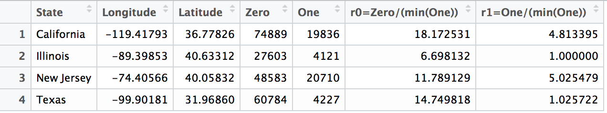


```{r}
# plot a gg-map
USAMap + geom_point(data = xc, 
                    aes(x = longs, y = lats),
                    col="red", 
                    alpha=0.4, size = (xc$zer/4121)) + 
      scale_size_continuous(range=range(xc$zer)) + 
      geom_point(data = yc, 
           aes(x = longs, y = lats),
           col="green", 
           alpha=0.4, size = (yc$one/4121)) + 
    ggtitle("Quote Conversion Per State")
```
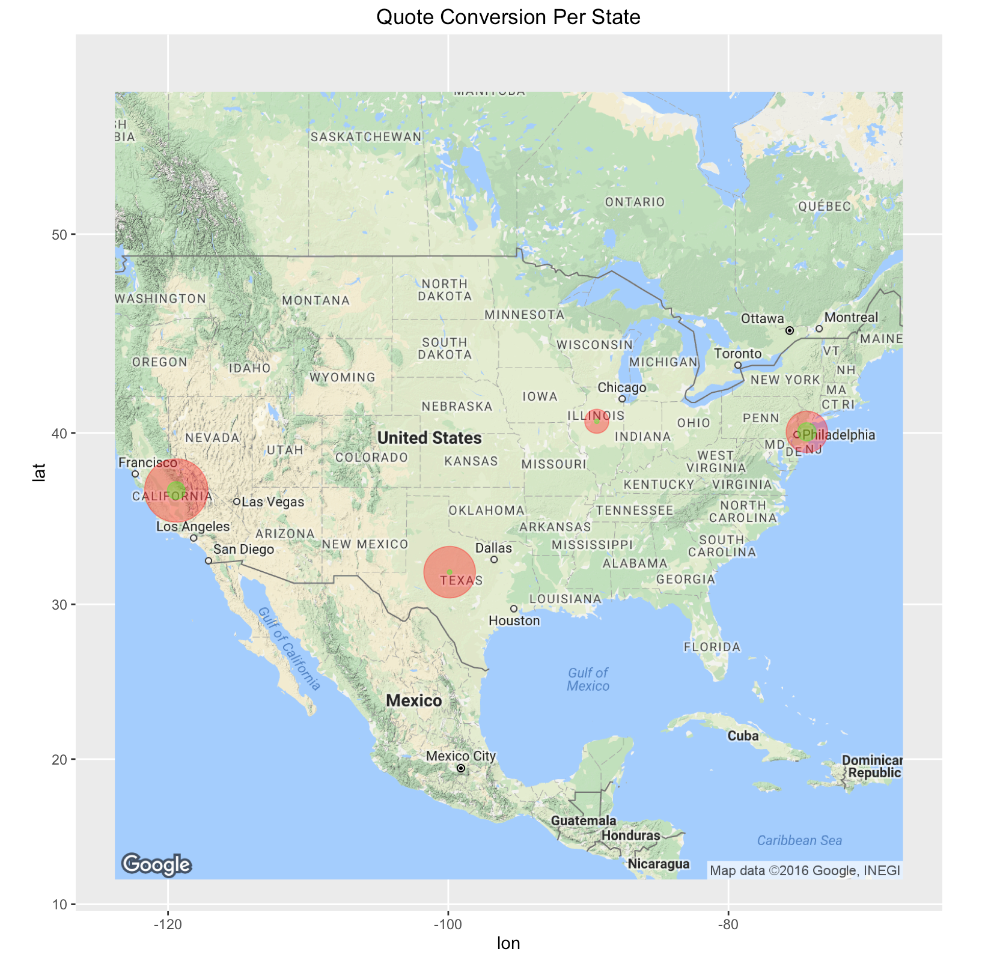


## Univariate Analysis of Categorical Features

The variable importance of each category of the feature is found with respect to the dependent variable by fitting a 3-fold cross-validated Random Forest model. Levels/Categories with a low importance are merged together. Snapshots of the important categories of a few features are shown below.

```{r}
registerDoMC(cores = 3) # parallel processing

# extract only factor columns
factor_df <- homesite.data[sapply(homesite.data,
                                  is.factor)]
factor_df <- cbind(factor_df,
                   dependent_var)
```

```{r}
# Analysis of Factor variables with categories >=5
# Checking variable importance using Random Forest:
myControl <- trainControl(method = "cv",
                          number = 3, 
                          repeats = 3,
                          returnResamp = "none",
                          verboseIter = TRUE)
```

```{r}
# CoverageField9
t1 = Sys.time()
model_CoverageField9 <- train(dependent_var ~ CoverageField9,
                              data = factor_df,
                              method = "rf",
                              trControl = myControl)

# Check execution time
t2 = Sys.time()
t2 - t1

rfImp_CoverageField9 <- varImp(model_CoverageField9, scale = TRUE)
category_CoverageField9 <- rownames(rfImp_CoverageField9$importance) 
importance_CoverageField9 <- rfImp_CoverageField9$importance$Overall 
importance_df_CoverageField9 <- data.frame(category_CoverageField9, 
                                           importance_CoverageField9)
importance_df_CoverageField9 <- arrange(importance_df_CoverageField9, 
                                        -importance_CoverageField9)

ggplot(data = importance_df_CoverageField9, 
       aes(x = reorder(category_CoverageField9, importance_CoverageField9),
           y = log(importance_df_CoverageField9$importance, base = 2), 
           fill = category_CoverageField9)) + 
    geom_bar(stat = "identity", width = 0.8) +
    theme(legend.position = "none") + 
    coord_flip() + 
    xlab(NULL) + 
    ylab("log(importance, base = 2)") + 
    ggtitle("CoverageField9")

# merge
{
    levels(homesite.data$CoverageField9)[levels(homesite.data$CoverageField9) == "L"] <- "LIBCH"
    levels(homesite.data$CoverageField9)[levels(homesite.data$CoverageField9) == "I"] <- "LIBCH"
    levels(homesite.data$CoverageField9)[levels(homesite.data$CoverageField9) == "B"] <- "LIBCH"
    levels(homesite.data$CoverageField9)[levels(homesite.data$CoverageField9) == "C"] <- "LIBCH"
    levels(homesite.data$CoverageField9)[levels(homesite.data$CoverageField9) == "H"] <- "LIBCH"
}
```
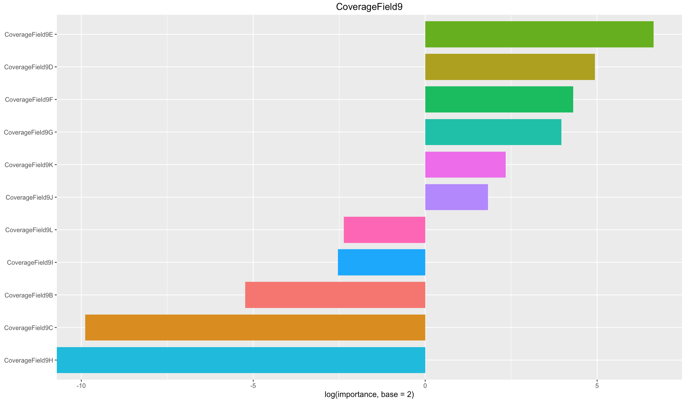

```{r}
# PersonalField18
t1 = Sys.time()
model_PersonalField18 <- train(dependent_var ~ PersonalField18,
                               data = factor_df,
                               method = "rf",
                               trControl = myControl)
t2 = Sys.time()
t2 - t1 

rfImp_PersonalField18 <- varImp(model_PersonalField18, scale = TRUE)
category_PersonalField18 <- rownames(rfImp_PersonalField18$importance) 
importance_PersonalField18 <- rfImp_PersonalField18$importance$Overall 
importance_df_PersonalField18 <- data.frame(category_PersonalField18, 
                                            importance_PersonalField18)
importance_df_PersonalField18 <- arrange(importance_df_PersonalField18, 
                                         -importance_PersonalField18)

ggplot(data = importance_df_PersonalField18, 
       aes(x = reorder(category_PersonalField18, importance_PersonalField18),
           y = log(importance_df_PersonalField18$importance, base = 2), 
           fill = category_PersonalField18)) + 
    geom_bar(stat = "identity", width = 0.8) +
    theme(legend.position = "none") + 
    coord_flip() + 
    xlab(NULL) + 
    ylab("log(importance, base = 2)") + 
    ggtitle("PersonalField18")

# merge
{
    levels(homesite.data$PersonalField18)[levels(homesite.data$PersonalField18) == "XW"] <- "XYZOO"
    levels(homesite.data$PersonalField18)[levels(homesite.data$PersonalField18) == "ZL"] <- "XYZOO"
    levels(homesite.data$PersonalField18)[levels(homesite.data$PersonalField18) == "ZQ"] <- "XYZOO"
    levels(homesite.data$PersonalField18)[levels(homesite.data$PersonalField18) == "XU"] <- "XYZOO"
    levels(homesite.data$PersonalField18)[levels(homesite.data$PersonalField18) == "ZM"] <- "XYZOO"
    levels(homesite.data$PersonalField18)[levels(homesite.data$PersonalField18) == "XZ"] <- "XYZOO"
    levels(homesite.data$PersonalField18)[levels(homesite.data$PersonalField18) == "ZK"] <- "XYZOO"
    levels(homesite.data$PersonalField18)[levels(homesite.data$PersonalField18) == "YL"] <- "XYZOO"
    levels(homesite.data$PersonalField18)[levels(homesite.data$PersonalField18) == "XK"] <- "XYZOO"
    levels(homesite.data$PersonalField18)[levels(homesite.data$PersonalField18) == "XP"] <- "XYZOO"
    levels(homesite.data$PersonalField18)[levels(homesite.data$PersonalField18) == "ZE"] <- "XYZOO"
    levels(homesite.data$PersonalField18)[levels(homesite.data$PersonalField18) == "ZJ"] <- "XYZOO"
    levels(homesite.data$PersonalField18)[levels(homesite.data$PersonalField18) == "XH"] <- "XYZOO"
    levels(homesite.data$PersonalField18)[levels(homesite.data$PersonalField18) == "ZV"] <- "XYZOO"
    levels(homesite.data$PersonalField18)[levels(homesite.data$PersonalField18) == "XT"] <- "XYZOO"
    levels(homesite.data$PersonalField18)[levels(homesite.data$PersonalField18) == "XQ"] <- "XYZOO"
    levels(homesite.data$PersonalField18)[levels(homesite.data$PersonalField18) == "ZR"] <- "XYZOO"
    levels(homesite.data$PersonalField18)[levels(homesite.data$PersonalField18) == "ZH"] <- "XYZOO"
    levels(homesite.data$PersonalField18)[levels(homesite.data$PersonalField18) == "YJ"] <- "XYZOO"
    levels(homesite.data$PersonalField18)[levels(homesite.data$PersonalField18) == "ZA"] <- "XYZOO"
    levels(homesite.data$PersonalField18)[levels(homesite.data$PersonalField18) == "ZN"] <- "XYZOO"
    levels(homesite.data$PersonalField18)[levels(homesite.data$PersonalField18) == "XY"] <- "XYZOO"
    levels(homesite.data$PersonalField18)[levels(homesite.data$PersonalField18) == "ZC"] <- "XYZOO"
    levels(homesite.data$PersonalField18)[levels(homesite.data$PersonalField18) == "XO"] <- "XYZOO"
    levels(homesite.data$PersonalField18)[levels(homesite.data$PersonalField18) == "ZD"] <- "XYZOO"
    levels(homesite.data$PersonalField18)[levels(homesite.data$PersonalField18) == "YK"] <- "XYZOO"
    levels(homesite.data$PersonalField18)[levels(homesite.data$PersonalField18) == "XL"] <- "XYZOO"
    levels(homesite.data$PersonalField18)[levels(homesite.data$PersonalField18) == "XI"] <- "XYZOO"
    levels(homesite.data$PersonalField18)[levels(homesite.data$PersonalField18) == "ZS"] <- "XYZOO"
    levels(homesite.data$PersonalField18)[levels(homesite.data$PersonalField18) == "ZO"] <- "XYZOO"
    levels(homesite.data$PersonalField18)[levels(homesite.data$PersonalField18) == "XJ"] <- "XYZOO"
    levels(homesite.data$PersonalField18)[levels(homesite.data$PersonalField18) == "YO"] <- "XYZOO"
    levels(homesite.data$PersonalField18)[levels(homesite.data$PersonalField18) == "XN"] <- "XYZOO"
    levels(homesite.data$PersonalField18)[levels(homesite.data$PersonalField18) == "XM"] <- "XYZOO"
    levels(homesite.data$PersonalField18)[levels(homesite.data$PersonalField18) == "YR"] <- "XYZOO"
    levels(homesite.data$PersonalField18)[levels(homesite.data$PersonalField18) == "YQ"] <- "XYZOO"
    levels(homesite.data$PersonalField18)[levels(homesite.data$PersonalField18) == "YM"] <- "XYZOO"
    levels(homesite.data$PersonalField18)[levels(homesite.data$PersonalField18) == "XD"] <- "XYZOO"
    levels(homesite.data$PersonalField18)[levels(homesite.data$PersonalField18) == "XX"] <- "XYZOO"
    levels(homesite.data$PersonalField18)[levels(homesite.data$PersonalField18) == "XV"] <- "XYZOO"
    levels(homesite.data$PersonalField18)[levels(homesite.data$PersonalField18) == "ZB"] <- "XYZOO"
    levels(homesite.data$PersonalField18)[levels(homesite.data$PersonalField18) == "ZI"] <- "XYZOO"
    levels(homesite.data$PersonalField18)[levels(homesite.data$PersonalField18) == "ZG"] <- "XYZOO"
}
```
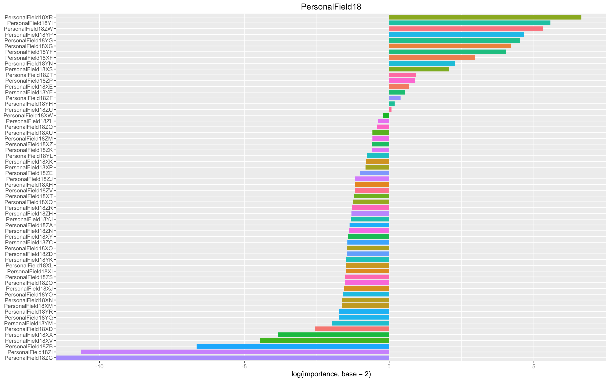

```{r}
# PropertyField7
t1 = Sys.time()
model_PropertyField7 <- train(dependent_var ~ PropertyField7,
                               data = factor_df,
                               method = "rf",
                               trControl = myControl)
t2 = Sys.time()
t2 - t1 

rfImp_PropertyField7 <- varImp(model_PropertyField7, scale = TRUE)
category_PropertyField7 <- rownames(rfImp_PropertyField7$importance) 
importance_PropertyField7 <- rfImp_PropertyField7$importance$Overall 
importance_df_PropertyField7 <- data.frame(category_PropertyField7, 
                                            importance_PropertyField7)
importance_df_PropertyField7 <- arrange(importance_df_PropertyField7, 
                                         -importance_PropertyField7)

ggplot(data = importance_df_PropertyField7, 
       aes(x = reorder(category_PropertyField7, importance_PropertyField7),
           y = log(importance_df_PropertyField7$importance, base = 2), 
           fill = category_PropertyField7)) + 
    geom_bar(stat = "identity", width = 0.8) +
    theme(legend.position = "none") + 
    coord_flip() + 
    xlab(NULL) + 
    ylab("log(importance, base = 2)") + 
    ggtitle("PropertyField7")

# merge
{
    levels(homesite.data$PropertyField7)[levels(homesite.data$PropertyField7) == "E"] <- "EMPGCB"
    levels(homesite.data$PropertyField7)[levels(homesite.data$PropertyField7) == "M"] <- "EMPGCB"
    levels(homesite.data$PropertyField7)[levels(homesite.data$PropertyField7) == "P"] <- "EMPGCB"
    levels(homesite.data$PropertyField7)[levels(homesite.data$PropertyField7) == "G"] <- "EMPGCB"
    levels(homesite.data$PropertyField7)[levels(homesite.data$PropertyField7) == "C"] <- "EMPGCB"
    levels(homesite.data$PropertyField7)[levels(homesite.data$PropertyField7) == "B"] <- "EMPGCB"
}
```
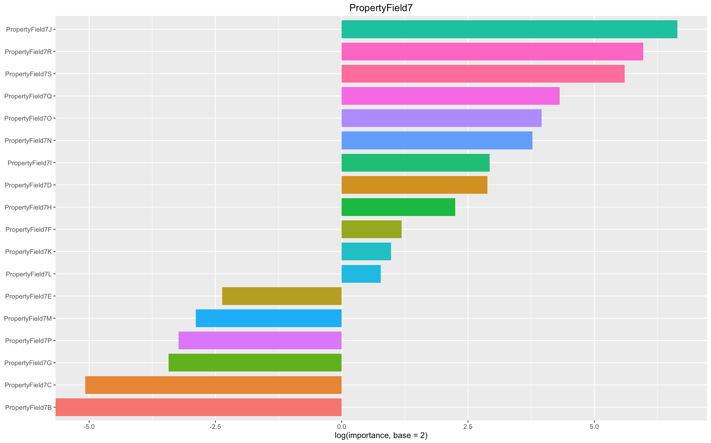

```{r}
# PersonalField17
t1 = Sys.time()
model_PersonalField17 <- train(dependent_var ~ PersonalField17,
                               data = factor_df,
                               method = "rf",
                               trControl = myControl)
t2 = Sys.time()
t2 - t1

rfImp_PersonalField17 <- varImp(model_PersonalField17, scale = TRUE)
category_PersonalField17 <- rownames(rfImp_PersonalField17$importance) 
importance_PersonalField17 <- rfImp_PersonalField17$importance$Overall 
importance_df_PersonalField17 <- data.frame(category_PersonalField17, 
                                            importance_PersonalField17)
importance_df_PersonalField17 <- arrange(importance_df_PersonalField17, 
                                         -importance_PersonalField17)

ggplot(data = importance_df_PersonalField17, 
       aes(x = reorder(category_PersonalField17, importance_PersonalField17),
           y = log(importance_df_PersonalField17$importance, base = 2), 
           fill = category_PersonalField17)) + 
    geom_bar(stat = "identity", width = 0.8) +
    theme(legend.position = "none") + 
    coord_flip() + 
    xlab(NULL) + 
    ylab("log(importance, base = 2)") + 
    ggtitle("PersonalField17")

# merge
{
    levels(homesite.data$PersonalField17)[levels(homesite.data$PersonalField17) == "XK"] <- "XYZXYZ"
    levels(homesite.data$PersonalField17)[levels(homesite.data$PersonalField17) == "YU"] <- "XYZXYZ"
    levels(homesite.data$PersonalField17)[levels(homesite.data$PersonalField17) == "ZH"] <- "XYZXYZ"
    levels(homesite.data$PersonalField17)[levels(homesite.data$PersonalField17) == "XU"] <- "XYZXYZ"
    levels(homesite.data$PersonalField17)[levels(homesite.data$PersonalField17) == "YX"] <- "XYZXYZ"
    levels(homesite.data$PersonalField17)[levels(homesite.data$PersonalField17) == "ZF"] <- "XYZXYZ"
    levels(homesite.data$PersonalField17)[levels(homesite.data$PersonalField17) == "ZR"] <- "XYZXYZ"
    levels(homesite.data$PersonalField17)[levels(homesite.data$PersonalField17) == "ZL"] <- "XYZXYZ"
    levels(homesite.data$PersonalField17)[levels(homesite.data$PersonalField17) == "ZS"] <- "XYZXYZ"
    levels(homesite.data$PersonalField17)[levels(homesite.data$PersonalField17) == "XI"] <- "XYZXYZ"
    levels(homesite.data$PersonalField17)[levels(homesite.data$PersonalField17) == "XE"] <- "XYZXYZ"
    levels(homesite.data$PersonalField17)[levels(homesite.data$PersonalField17) == "XP"] <- "XYZXYZ"
    levels(homesite.data$PersonalField17)[levels(homesite.data$PersonalField17) == "ZC"] <- "XYZXYZ"
    levels(homesite.data$PersonalField17)[levels(homesite.data$PersonalField17) == "ZW"] <- "XYZXYZ"
    levels(homesite.data$PersonalField17)[levels(homesite.data$PersonalField17) == "YH"] <- "XYZXYZ"
    levels(homesite.data$PersonalField17)[levels(homesite.data$PersonalField17) == "YS"] <- "XYZXYZ"
    levels(homesite.data$PersonalField17)[levels(homesite.data$PersonalField17) == "XQ"] <- "XYZXYZ"
    levels(homesite.data$PersonalField17)[levels(homesite.data$PersonalField17) == "ZO"] <- "XYZXYZ"
    levels(homesite.data$PersonalField17)[levels(homesite.data$PersonalField17) == "YK"] <- "XYZXYZ"
    levels(homesite.data$PersonalField17)[levels(homesite.data$PersonalField17) == "XX"] <- "XYZXYZ"
    levels(homesite.data$PersonalField17)[levels(homesite.data$PersonalField17) == "YM"] <- "XYZXYZ"
    levels(homesite.data$PersonalField17)[levels(homesite.data$PersonalField17) == "YT"] <- "XYZXYZ"
    levels(homesite.data$PersonalField17)[levels(homesite.data$PersonalField17) == "ZD"] <- "XYZXYZ"
    levels(homesite.data$PersonalField17)[levels(homesite.data$PersonalField17) == "ZG"] <- "XYZXYZ"
    levels(homesite.data$PersonalField17)[levels(homesite.data$PersonalField17) == "YE"] <- "XYZXYZ"
    levels(homesite.data$PersonalField17)[levels(homesite.data$PersonalField17) == "XC"] <- "XYZXYZ"
    levels(homesite.data$PersonalField17)[levels(homesite.data$PersonalField17) == "ZU"] <- "XYZXYZ"
    levels(homesite.data$PersonalField17)[levels(homesite.data$PersonalField17) == "YI"] <- "XYZXYZ"
    levels(homesite.data$PersonalField17)[levels(homesite.data$PersonalField17) == "YQ"] <- "XYZXYZ"
    levels(homesite.data$PersonalField17)[levels(homesite.data$PersonalField17) == "ZM"] <- "XYZXYZ"
    levels(homesite.data$PersonalField17)[levels(homesite.data$PersonalField17) == "XT"] <- "XYZXYZ"
    levels(homesite.data$PersonalField17)[levels(homesite.data$PersonalField17) == "ZT"] <- "XYZXYZ"
    levels(homesite.data$PersonalField17)[levels(homesite.data$PersonalField17) == "YW"] <- "XYZXYZ"
    levels(homesite.data$PersonalField17)[levels(homesite.data$PersonalField17) == "YG"] <- "XYZXYZ"
    levels(homesite.data$PersonalField17)[levels(homesite.data$PersonalField17) == "XD"] <- "XYZXYZ"
    levels(homesite.data$PersonalField17)[levels(homesite.data$PersonalField17) == "XM"] <- "XYZXYZ"
    levels(homesite.data$PersonalField17)[levels(homesite.data$PersonalField17) == "YP"] <- "XYZXYZ"
    levels(homesite.data$PersonalField17)[levels(homesite.data$PersonalField17) == "ZB"] <- "XYZXYZ"
    levels(homesite.data$PersonalField17)[levels(homesite.data$PersonalField17) == "XY"] <- "XYZXYZ"
    levels(homesite.data$PersonalField17)[levels(homesite.data$PersonalField17) == "XO"] <- "XYZXYZ"
    levels(homesite.data$PersonalField17)[levels(homesite.data$PersonalField17) == "XJ"] <- "XYZXYZ"
    levels(homesite.data$PersonalField17)[levels(homesite.data$PersonalField17) == "XW"] <- "XYZXYZ"
    levels(homesite.data$PersonalField17)[levels(homesite.data$PersonalField17) == "YZ"] <- "XYZXYZ"
}
```
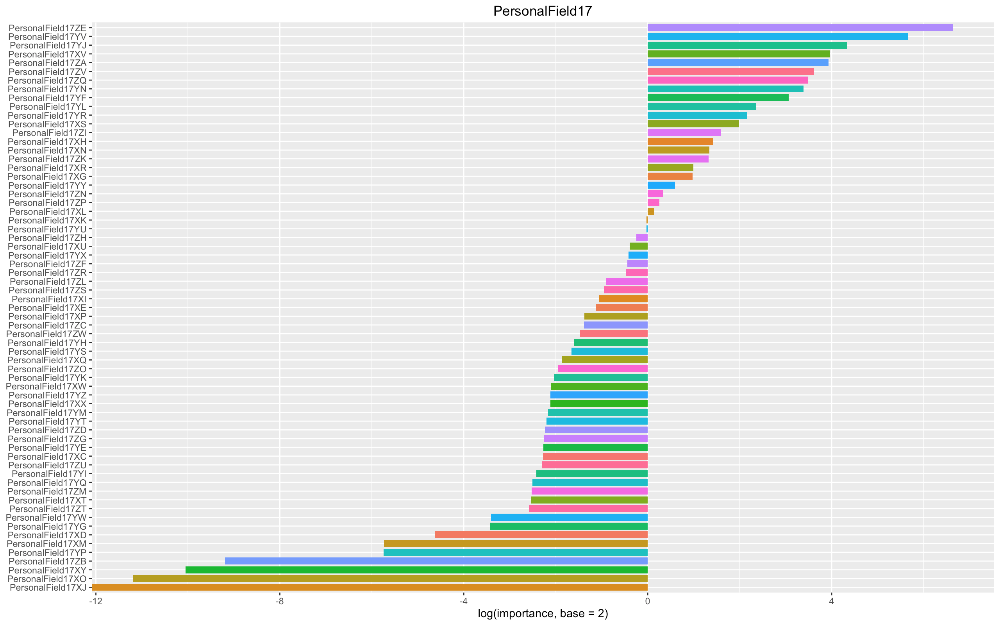


```{r}
# PersonalField19
t1 = Sys.time()
model_PersonalField19 <- train(dependent_var ~ PersonalField19,
                               data = factor_df,
                               method = "rf",
                               trControl = myControl)
t2 = Sys.time()
t2 - t1 

rfImp_PersonalField19 <- varImp(model_PersonalField19, scale = TRUE)
category_PersonalField19 <- rownames(rfImp_PersonalField19$importance) 
importance_PersonalField19 <- rfImp_PersonalField19$importance$Overall 
importance_df_PersonalField19 <- data.frame(category_PersonalField19, 
                                            importance_PersonalField19)
importance_df_PersonalField19 <- arrange(importance_df_PersonalField19, 
                                         -importance_PersonalField19)

ggplot(data = importance_df_PersonalField19, 
       aes(x = reorder(category_PersonalField19, importance_PersonalField19),
           y = log(importance_df_PersonalField19$importance, base = 2), 
           fill = category_PersonalField19)) + 
    geom_bar(stat = "identity", width = 0.8) +
    theme(legend.position = "none") + 
    coord_flip() + 
    xlab(NULL) + 
    ylab("log(importance, base = 2)") + 
    ggtitle("PersonalField19")

# merge
{
    levels(homesite.data$PersonalField19)[levels(homesite.data$PersonalField19) == "ZU"] <- "PF19"
    levels(homesite.data$PersonalField19)[levels(homesite.data$PersonalField19) == "ZE"] <- "PF19"
    levels(homesite.data$PersonalField19)[levels(homesite.data$PersonalField19) == "ZH"] <- "PF19"
    levels(homesite.data$PersonalField19)[levels(homesite.data$PersonalField19) == "XT"] <- "PF19"
    levels(homesite.data$PersonalField19)[levels(homesite.data$PersonalField19) == "XV"] <- "PF19"
    levels(homesite.data$PersonalField19)[levels(homesite.data$PersonalField19) == "XW"] <- "PF19"
    levels(homesite.data$PersonalField19)[levels(homesite.data$PersonalField19) == "ZB"] <- "PF19"
    levels(homesite.data$PersonalField19)[levels(homesite.data$PersonalField19) == "XQ"] <- "PF19"
    levels(homesite.data$PersonalField19)[levels(homesite.data$PersonalField19) == "YN"] <- "PF19"
    levels(homesite.data$PersonalField19)[levels(homesite.data$PersonalField19) == "ZD"] <- "PF19"
    levels(homesite.data$PersonalField19)[levels(homesite.data$PersonalField19) == "XM"] <- "PF19"
    levels(homesite.data$PersonalField19)[levels(homesite.data$PersonalField19) == "ZK"] <- "PF19"
    levels(homesite.data$PersonalField19)[levels(homesite.data$PersonalField19) == "XU"] <- "PF19"
    levels(homesite.data$PersonalField19)[levels(homesite.data$PersonalField19) == "XE"] <- "PF19"
    levels(homesite.data$PersonalField19)[levels(homesite.data$PersonalField19) == "XJ"] <- "PF19"
    levels(homesite.data$PersonalField19)[levels(homesite.data$PersonalField19) == "XR"] <- "PF19"
    levels(homesite.data$PersonalField19)[levels(homesite.data$PersonalField19) == "ZP"] <- "PF19"
    levels(homesite.data$PersonalField19)[levels(homesite.data$PersonalField19) == "XO"] <- "PF19"
    levels(homesite.data$PersonalField19)[levels(homesite.data$PersonalField19) == "ZL"] <- "PF19"
    levels(homesite.data$PersonalField19)[levels(homesite.data$PersonalField19) == "XY"] <- "PF19"
    levels(homesite.data$PersonalField19)[levels(homesite.data$PersonalField19) == "ZM"] <- "PF19"
    levels(homesite.data$PersonalField19)[levels(homesite.data$PersonalField19) == "YL"] <- "PF19"
    levels(homesite.data$PersonalField19)[levels(homesite.data$PersonalField19) == "ZG"] <- "PF19"
    levels(homesite.data$PersonalField19)[levels(homesite.data$PersonalField19) == "XS"] <- "PF19"
    levels(homesite.data$PersonalField19)[levels(homesite.data$PersonalField19) == "ZR"] <- "PF19"
    levels(homesite.data$PersonalField19)[levels(homesite.data$PersonalField19) == "XK"] <- "PF19"
    levels(homesite.data$PersonalField19)[levels(homesite.data$PersonalField19) == "YG"] <- "PF19"
    levels(homesite.data$PersonalField19)[levels(homesite.data$PersonalField19) == "ZJ"] <- "PF19"
    levels(homesite.data$PersonalField19)[levels(homesite.data$PersonalField19) == "ZI"] <- "PF19"
    levels(homesite.data$PersonalField19)[levels(homesite.data$PersonalField19) == "XH"] <- "PF19"
    levels(homesite.data$PersonalField19)[levels(homesite.data$PersonalField19) == "XN"] <- "PF19"
    levels(homesite.data$PersonalField19)[levels(homesite.data$PersonalField19) == "XI"] <- "PF19"
    levels(homesite.data$PersonalField19)[levels(homesite.data$PersonalField19) == "XG"] <- "PF19"
    levels(homesite.data$PersonalField19)[levels(homesite.data$PersonalField19) == "XP"] <- "PF19"
    levels(homesite.data$PersonalField19)[levels(homesite.data$PersonalField19) == "YK"] <- "PF19"
    levels(homesite.data$PersonalField19)[levels(homesite.data$PersonalField19) == "ZW"] <- "PF19"
    levels(homesite.data$PersonalField19)[levels(homesite.data$PersonalField19) == "XF"] <- "PF19"
    levels(homesite.data$PersonalField19)[levels(homesite.data$PersonalField19) == "YI"] <- "PF19"
    levels(homesite.data$PersonalField19)[levels(homesite.data$PersonalField19) == "YE"] <- "PF19"
    levels(homesite.data$PersonalField19)[levels(homesite.data$PersonalField19) == "ZO"] <- "PF19"
    levels(homesite.data$PersonalField19)[levels(homesite.data$PersonalField19) == "XZ"] <- "PF19"
    levels(homesite.data$PersonalField19)[levels(homesite.data$PersonalField19) == "ZC"] <- "PF19"
    levels(homesite.data$PersonalField19)[levels(homesite.data$PersonalField19) == "XL"] <- "PF19"
}
```
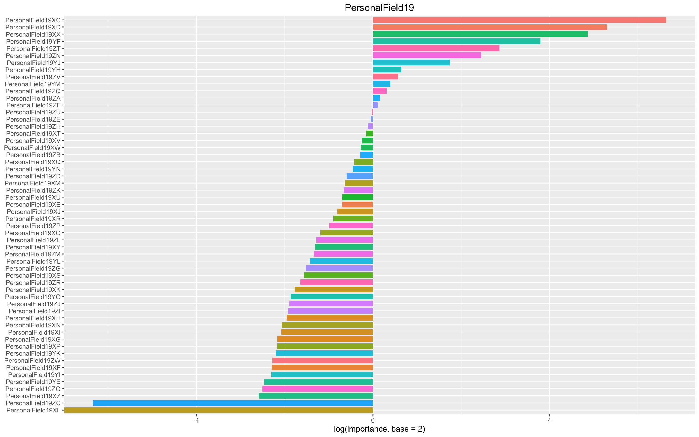

```{r}
# the same process shown above is followed for the rest of the features below (plots not shown)

# Field6
t1 = Sys.time()
model_Field6 <- train(dependent_var ~ Field6,
                  data = factor_df,
                  method = "rf",
                  trControl = myControl)
t2 = Sys.time()
t2 - t1

rfImp_Field6 <- varImp(model_Field6, scale = TRUE)
category_Field6 <- rownames(rfImp_Field6$importance) 
importance_Field6 <- rfImp_Field6$importance$Overall 
importance_df_Field6 <- data.frame(category_Field6, importance_Field6)
importance_df_Field6 <- arrange(importance_df_Field6, -importance_Field6)

ggplot(data = importance_df_Field6, 
       aes(x = reorder(category_Field6, importance_Field6),
           y = log(importance_df_Field6$importance, base = 2), 
           fill = category_Field6)) + 
    geom_bar(stat = "identity", width = 0.8) +
    theme(legend.position = "none") + 
    coord_flip() + 
    xlab(NULL) + 
    ylab("log(importance, base = 2)") + 
    ggtitle("Field6")


# merge
{
    levels(homesite.data$Field6)[levels(homesite.data$Field6) == "C"] <- "CD"
    levels(homesite.data$Field6)[levels(homesite.data$Field6) == "D"] <- "CD"
}


# Field10
t1 = Sys.time()
model_Field10 <- train(dependent_var ~ Field10,
                      data = factor_df,
                      method = "rf",
                      trControl = myControl)
t2 = Sys.time()
t2 - t1

rfImp_Field10 <- varImp(model_Field10, scale = TRUE)
category_Field10 <- rownames(rfImp_Field10$importance) 
importance_Field10 <- rfImp_Field10$importance$Overall 
importance_df_Field10 <- data.frame(category_Field10, importance_Field10)
importance_df_Field10 <- arrange(importance_df_Field10, -importance_Field10)

ggplot(data = importance_df_Field10, 
       aes(x = reorder(category_Field10, importance_Field10),
           y = log(importance_df_Field10$importance, base = 2), 
           fill = category_Field10)) + 
    geom_bar(stat = "identity", width = 0.8) +
    theme(legend.position = "none") + 
    coord_flip() + 
    xlab(NULL) + 
    ylab("log(importance, base = 2)") + 
    ggtitle("Field10")


# CoverageField8
t1 = Sys.time()
model_CoverageField8 <- train(dependent_var ~ CoverageField8,
                       data = factor_df,
                       method = "rf",
                       trControl = myControl)
t2 = Sys.time()
t2 - t1

rfImp_CoverageField8 <- varImp(model_CoverageField8, scale = TRUE)
category_CoverageField8 <- rownames(rfImp_CoverageField8$importance) 
importance_CoverageField8 <- rfImp_CoverageField8$importance$Overall 
importance_df_CoverageField8 <- data.frame(category_CoverageField8, 
                                           importance_CoverageField8)
importance_df_CoverageField8 <- arrange(importance_df_CoverageField8, 
                                        -importance_CoverageField8)

ggplot(data = importance_df_CoverageField8, 
       aes(x = reorder(category_CoverageField8, importance_CoverageField8),
           y = log(importance_df_CoverageField8$importance, base = 2), 
           fill = category_CoverageField8)) + 
    geom_bar(stat = "identity", width = 0.8) +
    theme(legend.position = "none") + 
    coord_flip() + 
    xlab(NULL) + 
    ylab("log(importance, base = 2)") + 
    ggtitle("CoverageField8")

#merge
{
    levels(homesite.data$CoverageField8)[levels(homesite.data$CoverageField8) == "W"] <- "WZUV"
    levels(homesite.data$CoverageField8)[levels(homesite.data$CoverageField8) == "Z"] <- "WZUV"
    levels(homesite.data$CoverageField8)[levels(homesite.data$CoverageField8) == "U"] <- "WZUV"
    levels(homesite.data$CoverageField8)[levels(homesite.data$CoverageField8) == "V"] <- "WZUV"
}


# SalesField7
t1 = Sys.time()
model_SalesField7 <- train(dependent_var ~ SalesField7,
                              data = factor_df,
                              method = "rf",
                              trControl = myControl)
t2 = Sys.time()
t2 - t1

rfImp_SalesField7 <- varImp(model_SalesField7, scale = TRUE)
category_SalesField7 <- rownames(rfImp_SalesField7$importance) 
importance_SalesField7 <- rfImp_SalesField7$importance$Overall 
importance_df_SalesField7 <- data.frame(category_SalesField7, 
                                           importance_SalesField7)
importance_df_SalesField7 <- arrange(importance_df_SalesField7, 
                                        -importance_SalesField7)

ggplot(data = importance_df_SalesField7, 
       aes(x = reorder(category_SalesField7, importance_SalesField7),
           y = log(importance_df_SalesField7$importance, base = 2), 
           fill = category_SalesField7)) + 
    geom_bar(stat = "identity", width = 0.8) +
    theme(legend.position = "none") + 
    coord_flip() + 
    xlab(NULL) + 
    ylab("log(importance, base = 2)") + 
    ggtitle("SalesField7")

# merge
{
    levels(homesite.data$SalesField7)[levels(homesite.data$SalesField7) == "T"] <- "TP"
    levels(homesite.data$SalesField7)[levels(homesite.data$SalesField7) == "P"] <- "TP"
}


# PersonalField16
t1 = Sys.time()
model_PersonalField16 <- train(dependent_var ~ PersonalField16,
                           data = factor_df,
                           method = "rf",
                           trControl = myControl)
t2 = Sys.time()
t2 - t1

rfImp_PersonalField16 <- varImp(model_PersonalField16, scale = TRUE)
category_PersonalField16 <- rownames(rfImp_PersonalField16$importance) 
importance_PersonalField16 <- rfImp_PersonalField16$importance$Overall 
importance_df_PersonalField16 <- data.frame(category_PersonalField16, 
                                        importance_PersonalField16)
importance_df_PersonalField16 <- arrange(importance_df_PersonalField16, 
                                     -importance_PersonalField16)

ggplot(data = importance_df_PersonalField16, 
       aes(x = reorder(category_PersonalField16, importance_PersonalField16),
           y = log(importance_df_PersonalField16$importance, base = 2), 
           fill = category_PersonalField16)) + 
    geom_bar(stat = "identity", width = 0.8) +
    theme(legend.position = "none") + 
    coord_flip() + 
    xlab(NULL) + 
    ylab("log(importance, base = 2)") + 
    ggtitle("PersonalField16")

# merge
{
    levels(homesite.data$PersonalField16)[levels(homesite.data$PersonalField16) == "ZU"] <- "ZZXX"
    levels(homesite.data$PersonalField16)[levels(homesite.data$PersonalField16) == "ZP"] <- "ZZXX"
    levels(homesite.data$PersonalField16)[levels(homesite.data$PersonalField16) == "XY"] <- "ZZXX"
    levels(homesite.data$PersonalField16)[levels(homesite.data$PersonalField16) == "ZV"] <- "ZZXX"
    levels(homesite.data$PersonalField16)[levels(homesite.data$PersonalField16) == "XV"] <- "ZZXX"
    levels(homesite.data$PersonalField16)[levels(homesite.data$PersonalField16) == "XN"] <- "ZZXX"
    levels(homesite.data$PersonalField16)[levels(homesite.data$PersonalField16) == "ZB"] <- "ZZXX"
    levels(homesite.data$PersonalField16)[levels(homesite.data$PersonalField16) == "XF"] <- "ZZXX"
    levels(homesite.data$PersonalField16)[levels(homesite.data$PersonalField16) == "ZI"] <- "ZZXX"
    levels(homesite.data$PersonalField16)[levels(homesite.data$PersonalField16) == "XT"] <- "ZZXX"
    levels(homesite.data$PersonalField16)[levels(homesite.data$PersonalField16) == "XU"] <- "ZZXX"
    levels(homesite.data$PersonalField16)[levels(homesite.data$PersonalField16) == "ZS"] <- "ZZXX"
    levels(homesite.data$PersonalField16)[levels(homesite.data$PersonalField16) == "ZO"] <- "ZZXX"
    levels(homesite.data$PersonalField16)[levels(homesite.data$PersonalField16) == "ZQ"] <- "ZZXX"
    levels(homesite.data$PersonalField16)[levels(homesite.data$PersonalField16) == "ZL"] <- "ZZXX"
}


# Original_Quote_Month
t1 = Sys.time()
model_month <- train(dependent_var ~ Original_Quote_Month,
                              data = factor_df,
                              method = "rf",
                              trControl = myControl)
t2 = Sys.time()
t2 - t1 

rfImp_month <- varImp(model_month, scale = TRUE)
category_month <- rownames(rfImp_month$importance) 
importance_month <- rfImp_month$importance$Overall 
importance_df_month <- data.frame(category_month, 
                                  importance_month)
importance_df_month<- arrange(importance_df_month, 
                              -importance_month)

ggplot(data = importance_df_month, 
       aes(x = reorder(category_month, importance_month),
           y = log(importance_df_month$importance, base = 2), 
           fill = category_month)) + 
    geom_bar(stat = "identity", width = 0.8) +
    theme(legend.position = "none") + 
    coord_flip() + 
    xlab(NULL) + 
    ylab("log(importance, base = 2)") + 
    ggtitle("Months")


#merge
{
    levels(homesite.data$Original_Quote_Month)[levels(homesite.data$Original_Quote_Month) == "08"] <- "0807"
    levels(homesite.data$Original_Quote_Month)[levels(homesite.data$Original_Quote_Month) == "07"] <- "0807"
}


# Original_Quote_Day
t1 = Sys.time()
model_day <- train(dependent_var ~ Original_Quote_Day,
                     data = factor_df,
                     method = "rf",
                     trControl = myControl)
t2 = Sys.time()
t2 - t1 

rfImp_day <- varImp(model_day, scale = TRUE)
category_day <- rownames(rfImp_day$importance) 
importance_day <- rfImp_day$importance$Overall 
importance_df_day <- data.frame(category_day, 
                                  importance_day)
importance_df_day <- arrange(importance_df_day, 
                              -importance_day)

ggplot(data = importance_df_day, 
       aes(x = reorder(category_day, importance_day),
           y = log(importance_df_day$importance, base = 2), 
           fill = category_day)) + 
    geom_bar(stat = "identity", width = 0.8) +
    theme(legend.position = "none") + 
    coord_flip() + 
    xlab(NULL) + 
    ylab("log(importance, base = 2)") + 
    ggtitle("Day")


#Original_Quote_Day
{
    levels(homesite.data$Original_Quote_Day)[levels(homesite.data$Original_Quote_Day) == "23"] <- "day"
    levels(homesite.data$Original_Quote_Day)[levels(homesite.data$Original_Quote_Day) == "25"] <- "day"    
    levels(homesite.data$Original_Quote_Day)[levels(homesite.data$Original_Quote_Day) == "29"] <- "day"
    levels(homesite.data$Original_Quote_Day)[levels(homesite.data$Original_Quote_Day) == "04"] <- "day"  
    levels(homesite.data$Original_Quote_Day)[levels(homesite.data$Original_Quote_Day) == "26"] <- "day"
}


# Original_Quote_Quarter
t1 = Sys.time()
model_quarter <- train(dependent_var ~ Original_Quote_Quarter,
                   data = factor_df,
                   method = "rf",
                   trControl = myControl)
t2 = Sys.time()
t2 - t1 

rfImp_quarter <- varImp(model_quarter, scale = TRUE)
category_quarter <- rownames(rfImp_quarter$importance) 
importance_quarter <- rfImp_quarter$importance$Overall 
importance_df_quarter <- data.frame(category_quarter, 
                                importance_quarter)
importance_df_quarter <- arrange(importance_df_quarter, 
                             -importance_quarter)

ggplot(data = importance_df_quarter, 
       aes(x = reorder(category_quarter, importance_quarter),
           y = log(importance_df_quarter$importance, base = 2), 
           fill = category_quarter)) + 
    geom_bar(stat = "identity", width = 0.8) +
    theme(legend.position = "none") + 
    coord_flip() + 
    xlab(NULL) + 
    ylab("log(importance, base = 2)") + 
    ggtitle("Quarter")


# merge
{
    levels(homesite.data$Original_Quote_Quarter)[levels(homesite.data$Original_Quote_Quarter) == "2012 Q4"] <- "2012_Q4"
    levels(homesite.data$Original_Quote_Quarter)[levels(homesite.data$Original_Quote_Quarter) == "2013 Q1"] <- "2013_Q1"
    levels(homesite.data$Original_Quote_Quarter)[levels(homesite.data$Original_Quote_Quarter) == "2013 Q2"] <- "2013_Q2"
    levels(homesite.data$Original_Quote_Quarter)[levels(homesite.data$Original_Quote_Quarter) == "2013 Q3"] <- "2013_Q3"
    levels(homesite.data$Original_Quote_Quarter)[levels(homesite.data$Original_Quote_Quarter) == "2013 Q4"] <- "2013_Q4"
    levels(homesite.data$Original_Quote_Quarter)[levels(homesite.data$Original_Quote_Quarter) == "2014 Q1"] <- "2014_Q1"
    levels(homesite.data$Original_Quote_Quarter)[levels(homesite.data$Original_Quote_Quarter) == "2014 Q2"] <- "Q2Q2"
    levels(homesite.data$Original_Quote_Quarter)[levels(homesite.data$Original_Quote_Quarter) == "2014 Q3"] <- "2014_Q3"
    levels(homesite.data$Original_Quote_Quarter)[levels(homesite.data$Original_Quote_Quarter) == "2014 Q4"] <- "2014_Q4"
    levels(homesite.data$Original_Quote_Quarter)[levels(homesite.data$Original_Quote_Quarter) == "2015 Q1"] <- "2015_Q1"
    levels(homesite.data$Original_Quote_Quarter)[levels(homesite.data$Original_Quote_Quarter) == "2015 Q2"] <- "Q2Q2"    
}


#Original_Quote_Week
{
    levels(homesite.data$Original_Quote_Week)[levels(homesite.data$Original_Quote_Week) == "31"] <- "mWeek"
    levels(homesite.data$Original_Quote_Week)[levels(homesite.data$Original_Quote_Week) == "22"] <- "mWeek"
    levels(homesite.data$Original_Quote_Week)[levels(homesite.data$Original_Quote_Week) == "25"] <- "mWeek"
    levels(homesite.data$Original_Quote_Week)[levels(homesite.data$Original_Quote_Week) == "30"] <- "mWeek"
    levels(homesite.data$Original_Quote_Week)[levels(homesite.data$Original_Quote_Week) == "28"] <- "mWeek"
    levels(homesite.data$Original_Quote_Week)[levels(homesite.data$Original_Quote_Week) == "33"] <- "mWeek"
    levels(homesite.data$Original_Quote_Week)[levels(homesite.data$Original_Quote_Week) == "51"] <- "mWeek"
    levels(homesite.data$Original_Quote_Week)[levels(homesite.data$Original_Quote_Week) == "32"] <- "mWeek"
    levels(homesite.data$Original_Quote_Week)[levels(homesite.data$Original_Quote_Week) == "43"] <- "mWeek"
}
```