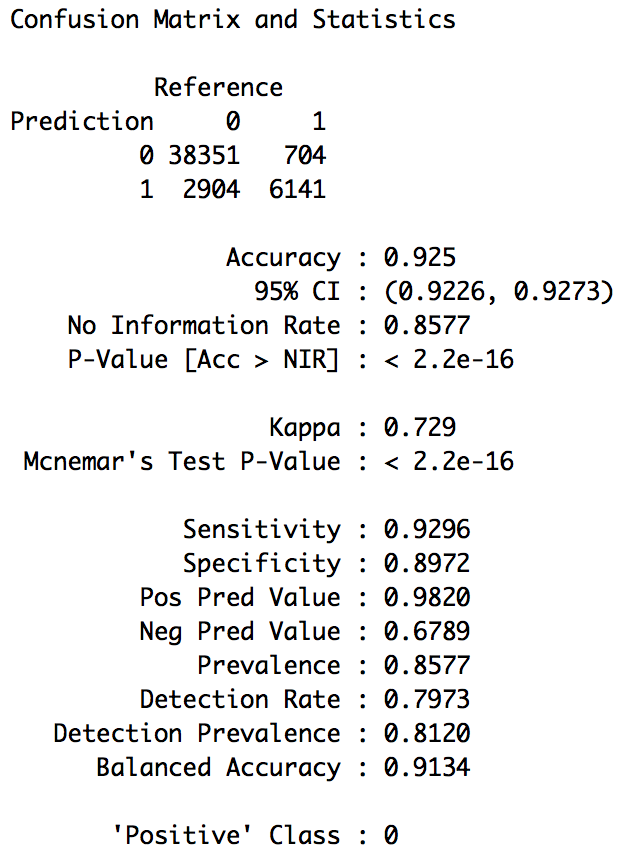
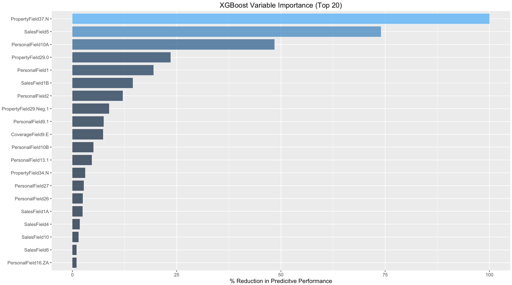
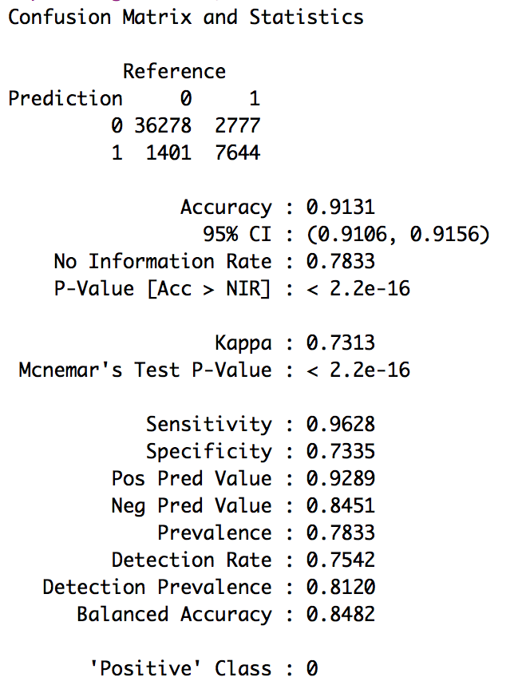
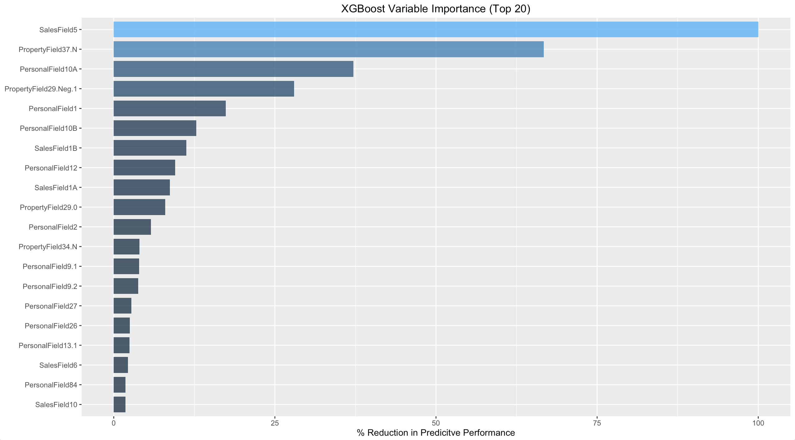
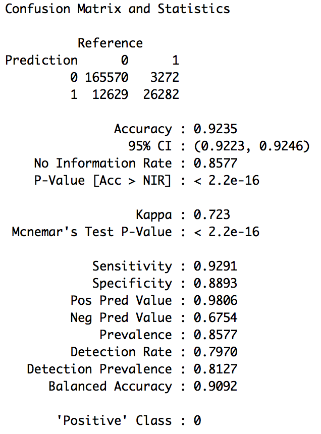
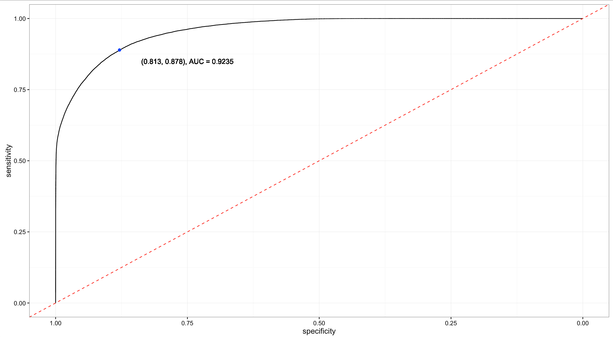

# HOMESITE QUOTE CONVERSION PREDICTION

```{r}
rm(list = ls())
setwd("/Users/Riddhik/Desktop/Homesite")

library(caret)
library(gmodels)
library(ggplot2)
library(grid)
library(gridExtra)
library(xts)
library(Rmisc)
library(zoo)
library(dplyr)
library(doMC)
library(pROC)
registerDoMC(cores = 4) 
```

## SIMPLE RANDOM SAMPLE

```{r}
train <- read.csv("ready_for_sampling_train.csv", header = T)[, -1]
test <- read.csv("ready_for_sampling_test.csv", header = T)[, -1]

train$QuoteConversion_Flag <- as.factor(train$QuoteConversion_Flag)

#### Margin of Error: 0.05%
#### Confidence Level: 99%
#### Population Size Train: 260753
#### Population Size Test: 173836
#### Proportion: 0.50

#### Sample Size Train: 53,000
#### Sample Size Test: 48,100

# Randomize the dataset
train <- train[sample(1:nrow(train)), ]
test <- test[sample(1:nrow(test)), ]

# sample
sample_train = sample(1:260753, 53000)
simple_random_sample_train = train[sample_train, ]
sample_test = sample(1:173836, 48100)
simple_random_sample_test = train[sample_test, ]

#str(simple_random_sample_test)
```

## MODEL - SIMPLE RANDOM SAMPLE

```{r}
set.seed(100)

myControl <- trainControl(method = 'repeatedcv',
                          number = 3,
                          repeats = 3,
                          returnResamp = 'none',
                          verboseIter = T)

xgb1 <- train(QuoteConversion_Flag ~ . ,
              data = simple_random_sample_train,
              method = "xgbTree",
              trControl = myControl)

preds_xgb1_test <- predict(object = xgb1, simple_random_sample_test[,-2])
confusionMatrix(simple_random_sample_test$QuoteConversion_Flag, 
                preds_xgb1_test)
```


```{r}
# Variable Importance Plot
gbmImp1 <- varImp(xgb1, scale = TRUE)
category_1 <- rownames(gbmImp1$importance)
importance_1 <- gbmImp1$importance$Overall
importance_df_1 <- data.frame(category_1, importance_1)
importance_df_1 <- arrange(importance_df_1, -importance_1)
importance_df_1 <- importance_df_1[1:20,]

ggplot(data = importance_df_1,
       aes(x = reorder(category_1, importance_1),
           y = (importance_df_1$importance),
           fill = importance_df_1$importance)) +
    geom_bar(stat = "identity",
             width = 0.8,
             alpha = 0.8) +
    theme(legend.position = "none") +
    coord_flip() +
    xlab(NULL) +
    ylab("% Reduction in Predicitve Performance") +
    ggtitle("XGBoost Variable Importance (Top 20)")
```



## STRATIFIED SAMPLING

```{r}
# The samples are selected separately from QuoteConversion_Flag 0 and 1

# Arrange training set according to QuoteConversion_Flag
train_arranged <- arrange(train, QuoteConversion_Flag)

#### Margin of Error: 0.05%
#### Confidence Level: 99%
#### Population Size for Zero: 211859
#### Proportion: 0.50

#### Sample Size Zero: 51,000

train_0 <- train_arranged[1:211859, ]
sample_0 = sample(1:211859, 51000)
sample_0 <- train_0[sample_0, ]

#### Margin of Error: 0.5%
#### Confidence Level: 99%
#### Population Size for One: 48894
#### Proportion: 0.50

#### Sample Size One: 29,000

train_1 <- train_arranged[211860:nrow(train_arranged), ]
sample_1 = sample(1:48894, 29000)
sample_1 <- train_1[sample_1, ]

# Merge
stratified_sample_train <- rbind(sample_0, sample_1)
stratified_sample_train <- stratified_sample_train[sample(1:nrow(stratified_sample_train)), ] #randomize

# table(stratefied_sample$QuoteConversion_Flag)
# str(stratefied_sample)

stratified_sample_train$QuoteConversion_Flag = as.factor(stratified_sample_train$QuoteConversion_Flag)
```

## MODEL - STRATIFIED SAMPLE

```{r}
xgb2 <- train(QuoteConversion_Flag ~ . ,
              data = stratified_sample_train,
              method = "xgbTree",
              trControl = myControl)

preds_xgb2_test1 <- predict(object = xgb2, simple_random_sample_test[,-2])
confusionMatrix(simple_random_sample_test$QuoteConversion_Flag,
                preds_xgb2_test1)
```


```{r}
# Variable Importance Plot
gbmImp2 <- varImp(xgb2, scale = TRUE)
category_2 <- rownames(gbmImp2$importance)
importance_2 <- gbmImp2$importance$Overall
importance_df_2 <- data.frame(category_2, importance_2)
importance_df_2 <- arrange(importance_df_2, -importance_2)
importance_df_2 <- importance_df_2[1:20,]

ggplot(data = importance_df_2,
       aes(x = reorder(category_2, importance_2),
           y = (importance_df_2$importance),
           fill = importance_df_2$importance)) +
    geom_bar(stat = "identity",
             width = 0.8,
             alpha = 0.8) +
    theme(legend.position = "none") +
    coord_flip() +
    xlab(NULL) +
    ylab("% Reduction in Predicitve Performance") +
    ggtitle("XGBoost Variable Importance (Top 20)")
```



## FINAL MODEL WITH INTERACTION TERMS
```{r}
# add iteractions of top 3 variables
train <- mutate(train, aplusb = PropertyField37.N+SalesField5)
train <- mutate(train, aplusc = PropertyField37.N+PersonalField10A)
train <- mutate(train, bplusc = SalesField5+PersonalField10A)
train <- mutate(train, aminusb = PropertyField37.N-SalesField5)
train <- mutate(train, aminusc = PropertyField37.N-PersonalField10A)
train <- mutate(train, bminusc = SalesField5-PersonalField10A)
train <- mutate(train, ab = PropertyField37.N*SalesField5)
train <- mutate(train, ac = PropertyField37.N*PersonalField10A)
train <- mutate(train, bc = SalesField5*PersonalField10A)
train <- mutate(train, abc = PropertyField37.N*SalesField5*PersonalField10A)
train <- mutate(train, abcd = PropertyField37.N*SalesField5*PersonalField10A*PersonalField10B)
```
```{r}
# train and test the model
sample_train = sample(1:260753, 53000)
random_sample_train = train[sample_train, ]
random_sample_test = train[-sample_train, ]

myControl <- trainControl(method = 'repeatedcv',
                          number = 5,
                          repeats = 5,
                          returnResamp = 'none',
                          verboseIter = T)

xgb3 <- train(QuoteConversion_Flag ~ . ,
              data = random_sample_train,
              method = "xgbTree",
              trControl = myControl)

preds_xgb3_test1 <- predict(object = xgb3, random_sample_test[,-2])
confusionMatrix(random_sample_test$QuoteConversion_Flag, 
                preds_xgb3_test1)
```


```{r}
# ROC curve
result.predicted.prob <- predict(object = xgb3,
                                 random_sample_test[,-2],
                                 type = "prob")

result.roc <- roc(random_sample_test$QuoteConversion_Flag,
                  result.predicted.prob$`1`)

result.coords <- coords(result.roc, "best",
                        best.method="closest.topleft",
                        ret=c("threshold",
                              "accuracy"))

# print(result.coords) #to get threshold and accuracy

x <- coords(result.roc, x = "all",
            input=c("threshold", "specificity","sensitivity"),
            ret=c("threshold", "specificity", "sensitivity"))
x <- as.data.frame(x)
x <- t(x)
x<- as.data.frame(x)

ggplot(data = x,
       aes(x = specificity,
           y = sensitivity)) +
    geom_line() +
    scale_x_reverse()  +
    geom_point(aes(x = 0.8788,
                   y = 0.8893),
               color = "blue") +
    theme_bw() +
    geom_abline(intercept = 1,
                slope = 1,
                color = "red",
                linetype =
                    "dashed") +
    geom_text(aes(x = 0.75 ,
                  y = 0.85),
              label = "(0.8788, 0.8893), AUC = 0.9235")
```


The above model, trained using sample data, was used for generating predictions for the test dataset from Kaggle. The final AUC score was found to be: **0.96468**.