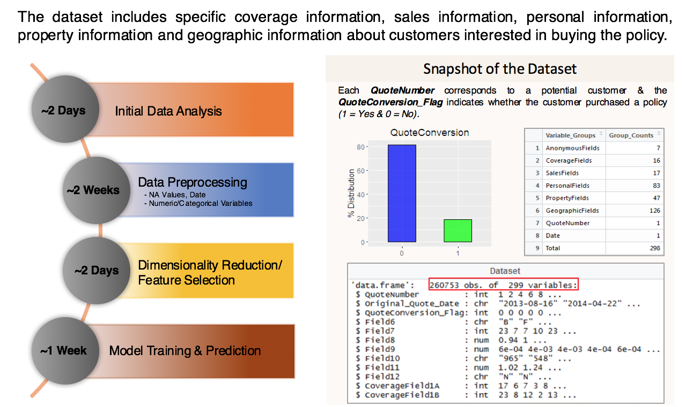
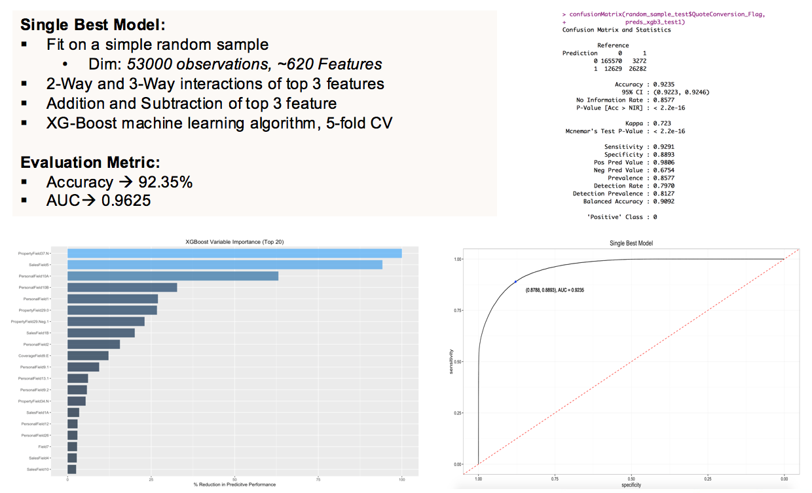
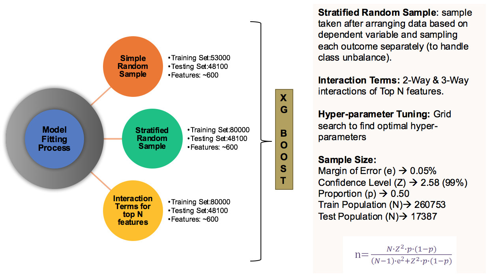

# Homesite Quote Conversion Prediction

The Homesite quote conversion predictive modeling script contains the R code with sample outputs/visualizations of the complete modeling process. It is structured into 3 parts:
* Part 1 - Data preprocessing, exploratory data analysis and data preparation of the **training dataset**.
* Part 2 - Data preprocessing and data preparation of the **testing dataset**.
* Part 3 - Model Fitting, Predictions and Accuracy

**Download the dataset**: https://www.kaggle.com/c/homesite-quote-conversion/data

## Project Worflow & Data

## Prediction, Accuracy and Rank

			

**Note:** The model is trained using sample data due to processing power constraints. The above rank is represented for the model trained using sample data. 

## Model Training & Sampling

## Improvements/Future Work

* Sophisticated feature engineering based on variable importance.
* Ensemble Modeling, Cross-Validation and Hyperparameter Tuning.
* Leveraging domain experience for feature selection.
* Modeling fitting on the entire dataset. 

