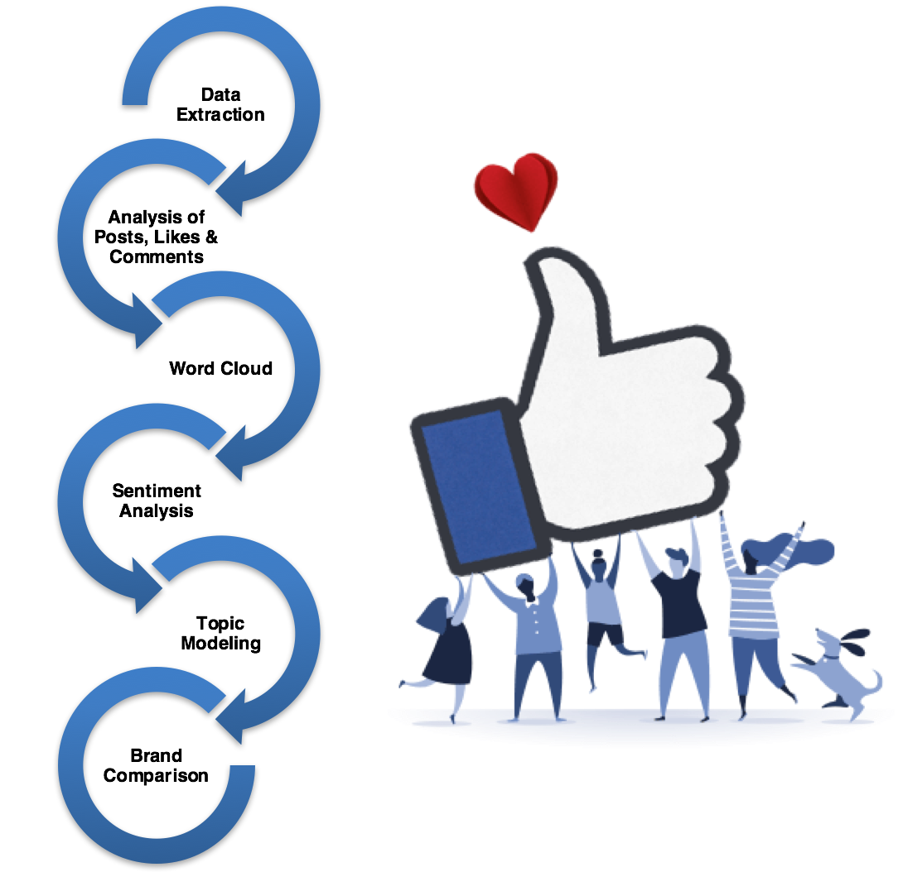

# Social Media Analysis ??? Facebook

The **Social Media Analysis - Facebook.Rmd** file contains detailed analysis of the **American Express India** Facebook page. Data is extracted from Facebook using the ```rfacebook``` package and the comments, likes and posts of the page are analyzed with the help of visualizations. Additionally, sentiment analysis is performed on the user comments of the posts, and a trend comparison of the brand popularity is visualized for the American Express India and the Visa India Facebook pages.

# Project Workflow 


# Improvements and Future Work
* Advanced text preprocessing and data cleaning
* Predictive sentiment modeling
