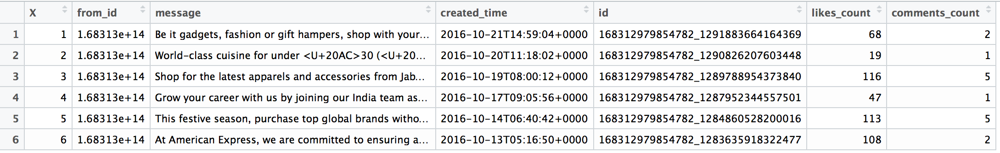

#FACEBOOK SOCIAL MEDIA ANALYSIS 

## DATA EXTRACTION
In order to download data from Facebook pages, an access token is required from the Facebook Developers Page. This access token is generated by creating a Facebook application, which involves creating an App ID and an App Secret code. Follow the steps in the given link to create a Facebook application and get the ID and the Secret code: https://smashballoon.com/custom-facebook-feed/access-token/ . This ID and the Secret code are then used for connecting R to Facebook (using the Rfacebook package). Aditionally, you need to go to the **Settings** page of the created application and choose **+ Add Platform** under the **Basic** tab and then choose **Website** from the pop-up menu. In the box that comes up for the website you just added, add the following **Site URL:** http://localhost:1410/ and click **Save Changes**. Please make sure you follow this step or else you will not be able to access Facebook from R Studio.

**Note:** Only data from **public pages and posts** is accessible via the token. Private data is not accessible using the current version of the Facebook application.

```{r}
#install.packages("Rfacebook")
#install.packages("httr")
#install.packages("httpuv")
#install.packages("rjson")

library(httr)
library(rjson)
library(httpuv)
library(Rfacebook)

fb_oauth <- fbOAuth(app_id = "110222119400991", # add your app id
                    app_secret = "f5fa820ceb6cb40aa54a59d3aa12a3ba", # add your token
                    extended_permissions = TRUE)

save(fb_oauth, file = "fbo_auth") # save the token
getwd() # to check where the token is saved
load("fbo_auth")
```


Now, checking personal details using the code below:
```{r}
me <- getUsers("me", token = fb_oauth, private_info = TRUE)
me
```


In order to extract data from a Facebook page, the **Facebook page ID** is required for that page. To get the page ID, we need the URL of the page of interest (*American Express India* in this case: https://www.facebook.com/AmericanExpressIndia/). Now, we copy the URL in the following webpage and get the respective page Id: http://www.findmyfbid.com/
The American Express page id is found to be: **168312979854782**.

**Note: ** You can use the page name directly to download information from the page. However, I prefer using the Page ID in order to avoid mistakes while typing in the page name. 

```{r}
page <- getPage(168312979854782, token = fb_oauth,  n = 10000)
head(page[,c(1,2,4,5,8,9,10)], 10)
write.csv(page, "amex_posts.csv") # save to csv
```


In the code above, the parameter n = 10000 extracts the recent 10000 posts or all of the posts if the number of posts is < 10000. The posts are then saved in a variable called page. 

Now, we extract the *comments* and the *likes* **for each of these posts**. Using the code below, the likes and the comments are first saved in a new data frame and then to a csv file. Furthermore, the respective post id for *each like and comment* is appended to the data frames as a new column. 

**Note:** The code below will take some time to download the likes and comments data.

```{r}
like.info <- data.frame()
comment.info <- data.frame()

for (i in 1:nrow(page)){
    
    post_id <- page$id[i] #get post id
    
	# for each post get all comments and likes
    post <- getPost(post_id, 
                    token = fb_oauth,
                    n = 10000, 
                    likes = TRUE, 
                    comments = TRUE)
    
    like.row <- nrow(like.info)
    comment.row <- nrow(comment.info)
    
	# add comments as new rows
    if(nrow(post$comments) != 0){
        new.comment <- cbind(post$comments, post_id)
        comment.info <- rbind(comment.info[1:comment.row,],
                              new.comment,
                              comment.info[-(1:comment.row),])
    }
    
	# add likes as new rows
    if(nrow(post$likes) != 0){
        new.like <- cbind(post$likes, post_id)
        like.info <- rbind(like.info[1:like.row,],
                           new.like,
                           like.info[-(1:like.row), ])
    }
}


write.csv(like.info, "amex_likes.csv")
write.csv(comment.info, "amex_comments.csv")
```
Now we have **3 separate csv files** which contain information about the posts, likes and comments for the Amex page. We will analyze each of these files separately and then together. 

```{r}
posts <- read.csv(file.choose(), header = T) # amex_posts.csv
comments <- read.csv(file.choose(), header = T) # amex_comments.csv
likes <- read.csv(file.choose(), header = T) # amex_likes.csv

head(posts[,c(1,2,4,5,8,9,10)], 10)
```


```{r}
View(head(comments[,c(2,3,6,7)]))
```


```{r}
View(head(likes))
```
