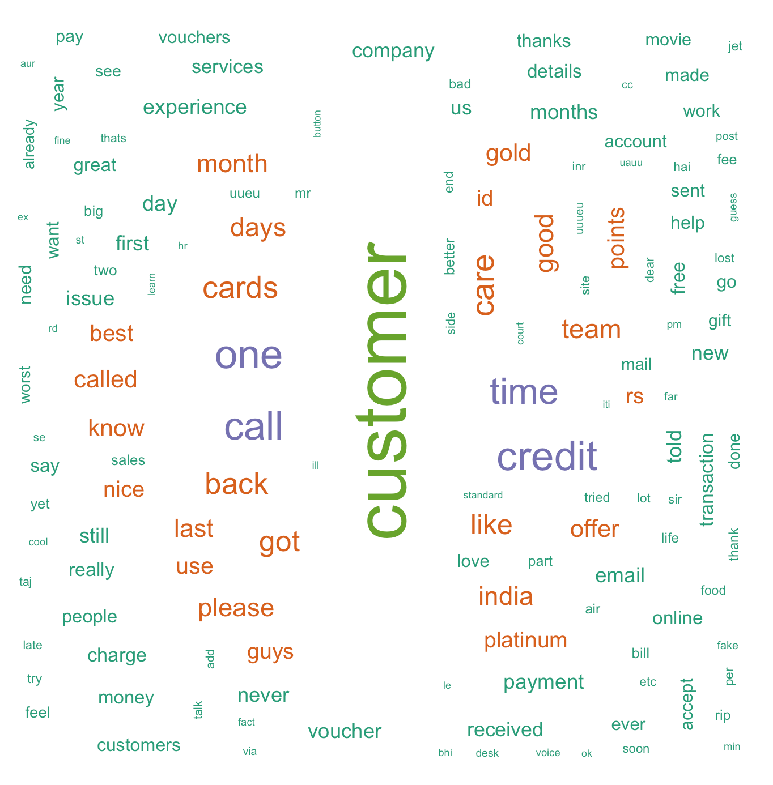

#FACEBOOK SOCIAL MEDIA ANALYSIS 

## DATA EXTRACTION

In order to download data from Facebook pages, an access token is required from the Facebook Developers Page. This access token is generated by creating a Facebook application, which involves creating an App ID and an App Secret code. Follow the steps in the given link to create a Facebook application and get the ID and the Secret code: https://smashballoon.com/custom-facebook-feed/access-token/.

This ID and the Secret code are then used for connecting R to Facebook (using the **Rfacebook** package). Aditionally, you need to go to the **Settings** page of the created application and choose **+ Add Platform** under the **Basic** tab and then choose **Website** from the pop-up menu. In the box that comes up for the website you just added, add the following **Site URL:** http://localhost:1410/ and click **Save Changes**. 

Please make sure you follow this step or else you will not be able to access Facebook from R Studio.

**Note:** Only data from **public pages and posts** is accessible via the token. Private data is not accessible using the current version of the Facebook application.

```{r}
#install.packages("Rfacebook")
#install.packages("httr")
#install.packages("httpuv")
#install.packages("rjson")

library(httr)
library(rjson)
library(httpuv)
library(Rfacebook)

fb_oauth <- fbOAuth(app_id = "110222119400991", # add your app id
                    app_secret = "f5**c**40**5**1***a", # add your token
                    extended_permissions = TRUE)

save(fb_oauth, file = "fbo_auth") # save the token
getwd() # to check where the token is saved
load("fbo_auth")
```


Now, checking personal details using the code below:
```{r}
me <- getUsers("me", token = fb_oauth, private_info = TRUE)
me
```


In order to extract data from a Facebook page, the **Facebook page ID** is required for that page. To get the page ID, we need the URL of the page of interest (*Amex India* in this case: https://www.facebook.com/AmericanExpressIndia/). Now, we copy the URL in the following webpage and get the respective page Id: http://www.findmyfbid.com/

* The American Express page id is found to be: **168312979854782**.

**Note:** You can use the page name directly to download information from the page. However, I prefer using the Page ID in order to avoid mistakes while typing in the page name. 

```{r}
page <- getPage(168312979854782, token = fb_oauth,  n = 10000)
head(page[ ,c(1,2,4,5,8,9,10)], 10)
write.csv(page, "amex_posts.csv") # save to csv
```


In the code above, the parameter n = 10000 extracts the recent 10000 posts or all of the posts if the number of posts is < 10000. The posts are then saved in a variable called page. 

Now, we extract the *comments* and the *likes* **for each of these posts**. Using the code below, the likes and the comments are first saved in a new data frame and then to a csv file. Furthermore, the respective post id for *each like and comment* is appended to the data frames as a new column. 

**Note:** The code below will take some time to download the likes and comments data.

```{r}
like.info <- data.frame()
comment.info <- data.frame()

for (i in 1:nrow(page)){
    
    post_id <- page$id[i] #get post id
    
	# for each post get all comments and likes
    post <- getPost(post_id, 
                    token = fb_oauth,
                    n = 10000, 
                    likes = TRUE, 
                    comments = TRUE)
    
    like.row <- nrow(like.info)
    comment.row <- nrow(comment.info)
    
	# add comments as new rows
    if(nrow(post$comments) != 0){
        new.comment <- cbind(post$comments, post_id)
        comment.info <- rbind(comment.info[1:comment.row, ],
                              new.comment,
                              comment.info[-(1:comment.row), ])
    }
    
	# add likes as new rows
    if(nrow(post$likes) != 0){
        new.like <- cbind(post$likes, post_id)
        like.info <- rbind(like.info[1:like.row, ],
                           new.like,
                           like.info[-(1:like.row), ])
    }
}


write.csv(like.info, "amex_likes.csv")
write.csv(comment.info, "amex_comments.csv")
```

Now we have **3 separate csv files** which contain information about the posts, likes and comments for the Amex page. We will analyze each of these files separately and then together. 

```{r}
posts <- read.csv(file.choose(), header = T) # amex_posts.csv
comments <- read.csv(file.choose(), header = T) # amex_comments.csv
likes <- read.csv(file.choose(), header = T) # amex_likes.csv

head(posts[, c(1,2,4,5,8,9,10)], 10)
```


```{r}
View(head(comments[, c(2,3,6,7)]))
```


```{r}
View(head(likes))
```


## Analysis of Likes

Here, we will look at the posts having the most number of likes and the users who have liked the most number of posts. We will use a simple bar plot to show the top 10 liked posts and top 10 users who have liked the most number of posts. We will import the **likes.csv** file for the analysis.

```{r}
# install.packages("ggplot2")
library(ggplot2)
likes <- read.csv(file.choose(), header = T)[, -1] #amex_likes.csv file
```
```{r}
# Top Posts
sorted_posts <- sort(table(likes[,3]), decreasing = T)
posts.df <- as.data.frame(sorted_posts)
n <- 10 # change number to get top n 
top_posts <- posts.df[1:n, ] # top n posts

gg <- ggplot(top_posts, aes(Var1, Freq, fill  = Var1))
gg + geom_bar(stat="identity", alpha = 0.75, colour = "black")  + 
    labs(x = "Post ID") + 
    labs(y = "Likes") +
    labs(title = "Top N most liked Posts (ID)") +
    guides(fill = FALSE) + theme(axis.text = element_text(size = 4.5))
```


```{r}
# Top N Users liking the posts
sorted_likes <- sort(table(likes[, 2]), decreasing = T)
likes.df <- as.data.frame(sorted_likes)
n <- 10
top_likes  <-  likes.df[1:n, ] # top n users

gg <- ggplot(top_likes, aes(Var1, Freq, fill  = Var1))
gg + geom_bar(stat = "identity", alpha = 0.75, colour = "black") + 
    labs(x = "User ID") + 
    labs(y = "Likes") +
    labs(title = "Top Likes - User ID") +
    guides(fill = FALSE) + theme(axis.text = element_text(size = 6))
```


**NOTE**: It is possible to show the name of the person instead of the ID but this will require text preprocessing (not shown here).


## Analysis of Posts

Let???s import the **amex_posts.csv** file to do some basic analysis on the Amex Posts.
```{r}
post <- read.csv(file.choose(), header = T)[, -1] #amex_posts.csv file
```

The post with maximum likes, comments and shares is found using the code below.
```{r}
max_likes_post <- post[which.max(post$likes_count), ]
View(max_likes_post[, c(3, 4, 5, 7, 8)])
```


```{r}
max_comments_post <- post[which.max(post$comments_count), ]
View(max_comments_post[, c(3, 4, 5, 7, 9)])
```


```{r}
max_shares_post <- post[which.max(post$shares_count), ]
View(max_shares_post[, c(3, 4, 5, 7, 10)])
```


Now, we can check the most recent post given a time period (say 2016-06-06). In order to do this, we would first need to preprocess the created_time feature by converting it into an R date format.  The function below formats the created_time feature to an R date format. 
```{r}
format.facebook.date <- function(datestring) {
    date <- as.POSIXct(datestring, format = "%Y-%m-%dT%H:%M:%S+0000", tz = "GMT")
}

post$datetime <- format.facebook.date(post$created_time)
post$month <- format(post$datetime, "%Y-%m")
```
```{r}
postRecent <- post[which(post$month > "2016-06-06"), ]
sort_months <- postRecent[order(postRecent$month), ]
View(head(sort_months[, c(3, 12, 5, 8, 9, 10)], 15))

# top <- postRecent[order(-postRecent$likes), ] # sort by likes
# View(top)
```


The graph below shows the number of posts by Amex for each month.
```{r}
plot_month <- as.data.frame(table(post$month))
Var <- substr(plot_month$Var1, 1, 4)

gg <- ggplot(plot_month, aes(x = as.factor(Var1), y = Freq, fill = as.factor(Var)))
gg + geom_bar(stat = "identity", alpha = 0.8, colour ="black", position = "dodge") + 
    theme(axis.text = element_text(size = 8)) + 
    labs(x = "Months") + labs(y = "Frequency") + 
    labs(title = "Frequency of Posts Per Month - Amex")+
    theme(axis.text.x = element_text(angle = 90, face = "bold"))
```


## Word Cloud

We will now create a word cloud for the **comments.csv** file in order to find out what the users of the Amex page talk about the most. However, before we do that, we will be going through some basic steps of cleaning text data and removing the unwanted words. The following steps for text cleaning are shown in the code below:
* Removing all non-alphanumeric characters
* Removing punctuations
* Changing all words to lower case
* Removing stop words

Other preprocessing techniques such as negation handling, POS (part-of-speech) tagging, stemming, and spelling correction (using qdap package) have not been done here. 
The above cleaning techniques are applied to the **message column** of the comments.csv file. First, we create a **Corpus (a collection of words/non-words)** of the message column and then apply the cleaning techniques to the corpus. The ```tm package``` in R is used for creating the corpus.

```{r}
# install.packages("slam")
# install.packages("tm")
library(slam)
library(tm)

comments <- read.csv(file.choose(), header = T) #amex_comments.csv file
messages <- comments$message 
```

The ```gsub("[^a-zA-Z0-9]","", x)``` command replaces everything that is not in the specified set of 62 characters (lower case a to z, upper case A to Z, and digits 0 to 9) by an empty string. Additionally, the space between the non-empty strings is preserved. 
```{r}
# remove non-alphanumeric characters first
messages <- gsub(" +"," ",gsub("^ +","",gsub("[^a-zA-Z0-9 ]","", messages)))
messages[1:3]
```


```{r}
# Create a corpus
myCorpus <- Corpus(VectorSource(messages)) # create corpus
inspect(myCorpus [1:3]) # inspect first 3 elements of the corpus
```


Now, we will use the ```tm_map()``` function for text cleaning.
```{r}
# convert to lower case
clean_corpus <- tm_map(myCorpus, PlainTextDocument)
clean_corpus <- tm_map(clean_corpus, content_transformer(tolower))

# remove numbers from the corpus
clean_corpus <- tm_map(clean_corpus, removeNumbers)

# remove punctuations if present
clean_corpus <- tm_map(clean_corpus, removePunctuation)

# remove stop words
clean_corpus <- tm_map(clean_corpus, removeWords, stopwords())

# strip the extra whitespace
clean_corpus <- tm_map(clean_corpus, stripWhitespace)
```

View the cleaned corpus as a dataframe of messages
```{r}
dataframe <- data.frame(text = unlist(sapply(clean_corpus, `[`, "content")), stringsAsFactors = F)
View(head(dataframe, 15))
```


Remove more stop words after examining clean corpus in detail
```{r}
# remove stop words and nonsensical words after examining the corpus
# also removing obvious high-frequency words such as amex, card, american, express, etc.
clean_corpus <- tm_map(clean_corpus, removeWords, c(stopwords('english'), "uue", "uuue", "uuuu", "uua", "udu", "uau","ucuuu", "uuuu", "uuu", "nnnn", "uuauub","uuauu","ueuu","can", "will", "get", "amex", "card", "american", "express", "uub", "also", "just", "didnt", "till", "eue", "ufu", "since", "now", "let", "using", "hii","make", "even", "dont", "sure", "uu", "hi", "th", "oh", "uuucu", "ne", "ive", "ur", "ki", "ko", "uuub", "uubu"))

# strip the extra whitespace
clean_corpus <- tm_map(clean_corpus, stripWhitespace)
```

Now, we can tokenize the corpus by creating a Term Document Matrix. A token is a single element in a text string, in most cases a word. The Term Document Matrix gives the frequency of each word per document/message. 
```{r}
# remove words having less than 2 letters and greater than 15 letters
tdm <- TermDocumentMatrix(clean_corpus, control = list(wordLengths = c(3, 15)))
```

Now, we calculate the frequency of each of the words by taking a summation of the rows and plot the word cloud. In order to get the frequency, we convert the TermDocumentMatrix to a matrix.
```{r}
#install.packages("RcolorBrewer")
#install.packages("wordcloud")
library(RColorBrewer) 
library(wordcloud)

mat <- as.matrix(tdm)

# calculate the frequency of each word and sort
word.freq <- sort(rowSums(mat), decreasing = T)

# word cloud colors
pal <- brewer.pal(5, "Dark2")

# show wordcloud
wordcloud(words = names(word.freq), 
          freq = word.freq, 
          min.freq = 10,
          random.order = F, 
          colors = pal)
```


## Sentiment Analysis

In order to perform Sentiment Analysis, we will compare each of the words in the cleaned corpus above to the **AFINN-111 lexicon**, and give each word a score.  AFINN is a list of English words rated for valence with an integer between minus five (negative) and plus five (positive). For more information on this lexicon and to download the lexicon, please refer to the link: http://www2.imm.dtu.dk/pubdb/views/publication_details.php?id=6010 

```{r}
#load the AFINN-111 lexicon which contains English words and their positive/negative score
afinn_list <- read.delim(file.choose(), header = FALSE, stringsAsFactors = FALSE) # import AFINN-111.txt file (check data folder)

names(afinn_list) <- c('word', 'score')
afinn_list$word <- tolower(afinn_list$word)
```

The function ```sentimentScore()``` below calculates the sentiment score for each word of the comment and then classifies the word into one of the 4 buckets ??? very negative, negative, positive, very positive. Each word is compared to the word in the lexicon. If the words does not match to the word in the lexicon, it is not considered.

First, we create the 4 buckets of words and add known words to the lexicon which are not present in the lexicon.
```{r}
vNegTerms <- afinn_list$word[afinn_list$score==-5 | afinn_list$score==-4]

negTerms <- c(afinn_list$word[afinn_list$score==-3 | afinn_list$score==-2 | afinn_list$score==-1], "second-rate", "moronic", "third-rate", "flawed", "juvenile", "boring", "distasteful", "ordinary", "disgusting", "senseless", "static", "brutal", "confused", "disappointing", "bloody", "silly", "tired", "predictable", "stupid", "uninteresting", "trite", "uneven", "outdated", "dreadful", "bland")

posTerms <- c(afinn_list$word[afinn_list$score==3 | afinn_list$score==2 | afinn_list$score==1], "first-rate", "insightful", "clever", "charming", "comical", "charismatic", "enjoyable", "absorbing", "sensitive", "intriguing", "powerful", "pleasant", "surprising", "thought-provoking", "imaginative", "unpretentious")

vPosTerms <- c(afinn_list$word[afinn_list$score==5 | afinn_list$score==4], "uproarious", "riveting", "fascinating", "dazzling", "legendary")   
```

In order to get the sentiment scores of the words of the comments, we will drop the comments which are empty or null. 
```{r}
# convert the corpus to a data frame
dataframe<-data.frame(text = unlist(sapply(myCorpus, `[`, "content")), stringsAsFactors=F)
dataframe$text <- as.character(dataframe$text)

# drop comments which are NA or empty
useful_comments <- dataframe[!is.na(dataframe$text) & (dataframe$text !=""), ]
dataframe <- as.data.frame(useful_comments, stringsAsFactors = F)
dataframe$useful_comments <- as.character(dataframe$useful_comments)
useful_comments <- dataframe[!is.na(dataframe$useful_comments) & (dataframe$useful_comments !=" "), ]
```

Now, we can start classifying the words of the comments as positive or negative. The code with the final plot is shown below.
```{r}
sentimentScore <- function(sentences, vNegTerms, negTerms, posTerms, vPosTerms){
    
    final_scores <- matrix('', 0, 5)
    
    # calculate the score for each word
    scores <- laply(sentences, function(sentence, vNegTerms, negTerms, posTerms, vPosTerms){
        
        initial_sentence <- sentence
        
        #tokenize words
        wordList <- str_split(sentence, '\\s+')
        words <- unlist(wordList)
        
        #build vector with matches between sentence and each category
        vPosMatches <- match(words, vPosTerms)
        posMatches <- match(words, posTerms)
        vNegMatches <- match(words, vNegTerms)
        negMatches <- match(words, negTerms)
        
        #sum up number of words in each category
        vPosMatches <- sum(!is.na(vPosMatches))
        posMatches <- sum(!is.na(posMatches))
        vNegMatches <- sum(!is.na(vNegMatches))
        negMatches <- sum(!is.na(negMatches))
        score <- c(vNegMatches, negMatches, posMatches, vPosMatches)
        
        #add row to scores table
        newrow <- c(initial_sentence, score)
        final_scores <- rbind(final_scores, newrow)
        return(final_scores)
    }, vNegTerms, negTerms, posTerms, vPosTerms)
    
    return(scores)
}

commentResult <- as.data.frame(sentimentScore(useful_comments, 
                                              vNegTerms, 
                                              negTerms, 
                                              posTerms, 
                                              vPosTerms))
```
```{r}
# count sentiment scores to plot
commentResult$`2` <- as.numeric(commentResult[,2])
commentResult$`3` <- as.numeric(commentResult[,3])
commentResult$`4` <- as.numeric(commentResult[,4])
commentResult$`5` <- as.numeric(commentResult[,5])
count_1 <- sum(commentResult[,2])
count_2 <- sum(commentResult[,3])
count_3 <- sum(commentResult[,4])
count_4 <- sum(commentResult[,5])

# bar plot for the sentiments for each category
count_sum = sum(count_1, count_2, count_3, count_4)

counts = c(count_1*100/count_sum, 
           count_2*100/count_sum, 
           count_3*100/count_sum, 
           count_4*100/count_sum)

names <- c("VERY BAD","BAD","GOOD","VERY GOOD")

count_df <- as.data.frame(counts, names)

gg2 <- ggplot(count_df, aes(x = names, y = counts, fill = names))
gg2 + geom_bar(stat = "identity", color = "black", alpha = 0.8, width = 0.5 ) + 
    labs(title = "Positive vs. Negative Sentiments") + 
    guides(fill = FALSE) +
    labs(x = "", y = "% of comments") + 
    theme_bw(base_size = 15) + 
    scale_fill_manual(values = c("red","green", "red","green"))
```

