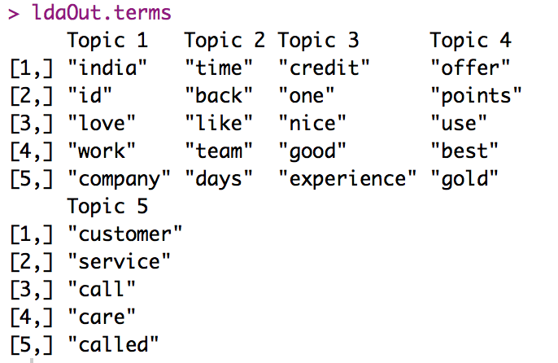
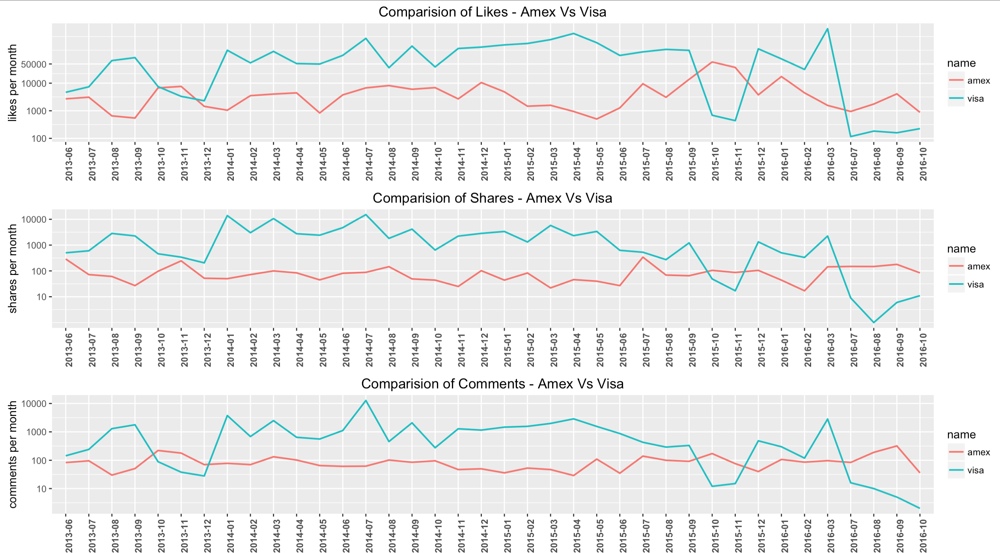

#Social Media Analysis - Facebook

## DATA EXTRACTION

In order to download data from Facebook pages, an access token is required from the **Facebook Developers** page (https://developers.facebook.com/). This access token is generated by creating a **Facebook application**, which involves creating an App Id and an App Secret code. Follow the steps in the given link to create a new Facebook application and to get the Id and the code: https://smashballoon.com/custom-facebook-feed/access-token/ .


The App Id and the App Secret code are then used for connecting R to Facebook (using the **Rfacebook** package). Additionally, you need to go to the **Settings** page of the created application and choose **+Add Platform** under the **Basic** tab, and then choose **Website** from the pop-up menu. In the box that comes up after adding the website platform, you need to add the following **Site URL**: http://localhost:1410/ and then click on **Save Changes**. Please make sure you follow this step or else you will not be able to access Facebook from R Studio.

**Note:** Only data from **public pages and posts** is accessible via the token generated above. 

```{r}
#install.packages("Rfacebook")
#install.packages("httr")
#install.packages("httpuv")
#install.packages("rjson")
library(httr)
library(rjson)
library(httpuv)
library(Rfacebook)

fb_oauth <- fbOAuth(app_id = "110222119400991", # add your app id
                    app_secret = "f5**c**40**5**1***a", # add your token
                    extended_permissions = TRUE)

save(fb_oauth, file = "fbo_auth") # save the token
getwd() # to check where the token is saved
load("fbo_auth")
```


```{r}
# Display my information
me <- getUsers("me", token = fb_oauth, private_info = TRUE)
me
```


In order to extract data from a particular Facebook page, the **Facebook page ID** is required for that page. To get the page ID, we need the **Facebook URL** of the page (**American Express India** in this case: https://www.facebook.com/AmericanExpressIndia/). We can copy the Amex URL and paste it here to get the page Id: http://www.findmyfbid.com/ . The American Express India page id is found to be: **168312979854782**.

**Note:** You can directly use the page name to download data from the page. However, I prefer using the Page ID in order to avoid mistakes while typing in the page name.

```{r}
page <- getPage(168312979854782, token = fb_oauth,  n = 10000)
head(page[ ,c(1,2,4,5,8,9,10)], 10)
write.csv(page, "amex_posts.csv") # save to csv
```


In the code above, the parameter *n = 10000* extracts the recent 10000 posts or all of the posts if posts < 10,000.  The posts are then saved in a variable called page.

Now, we extract the **comments** and the **likes** for **each of the posts**. Using the code below, the likes and the comments are first saved in a new data frame and then to a csv file. Furthermore, the respective post id for *each like and comment* is appended to the data frames as a new column. 

**Note:** The code below will take time to download the post, likes & comments data.

```{r}
like.info <- data.frame()
comment.info <- data.frame()

for (i in 1:nrow(page)){
    
    post_id <- page$id[i] #get post id
    
	# for each post get all comments and likes
    post <- getPost(post_id, 
                    token = fb_oauth,
                    n = 10000, 
                    likes = TRUE, 
                    comments = TRUE)
    
    like.row <- nrow(like.info)
    comment.row <- nrow(comment.info)
    
	# add comments as new rows
    if(nrow(post$comments) != 0){
        new.comment <- cbind(post$comments, post_id)
        comment.info <- rbind(comment.info[1:comment.row, ],
                              new.comment,
                              comment.info[-(1:comment.row), ])
    }
    
	# add likes as new rows
    if(nrow(post$likes) != 0){
        new.like <- cbind(post$likes, post_id)
        like.info <- rbind(like.info[1:like.row, ],
                           new.like,
                           like.info[-(1:like.row), ])
    }
}


write.csv(like.info, "amex_likes.csv")
write.csv(comment.info, "amex_comments.csv")
```

We now have **3 separate csv files** which contain information about the posts, likes and comments for the Amex India page. We will analyze each of these files separately and then together.

```{r}
# Preview of the posts, likes and comments of the Amex Facebook page
posts <- read.csv(file.choose(), header = T) # amex_posts.csv
comments <- read.csv(file.choose(), header = T) # amex_comments.csv
likes <- read.csv(file.choose(), header = T) # amex_likes.csv

head(posts[, c(1, 2, 4, 5, 8, 9, 10)], 10)
```


```{r}
View(head(comments[, c(2, 3, 6, 7)]))
```


```{r}
View(head(likes))
```


## ANALYSIS OF LIKES

Here, we will look at the posts having the most number of likes and the users who have liked the most number of posts. We will use a simple bar plot to show the top 10 liked posts and top 10 users who have liked the most number of posts. We will import the **likes.csv** file for the analysis.

```{r}
# install.packages("ggplot2")
# install.packages("scales")
library(ggplot2)
library(scales)

likes <- read.csv(file.choose(), header = T)[, -1] #amex_likes.csv file
```
```{r}
# Top Posts
sorted_posts <- sort(table(likes[,3]), decreasing = T)
posts.df <- as.data.frame(sorted_posts)
n <- 10 # change number to get top n 
top_posts <- posts.df[1:n, ] # top n posts

gg <- ggplot(top_posts, aes(Var1, Freq, fill  = Var1))
gg + geom_bar(stat = "identity", alpha = 0.75, colour = "black")  + 
    labs(x = "Post ID") + 
    labs(y = "Likes") +
    labs(title = "Top N most liked Posts (ID)") +
    guides(fill = FALSE) + theme(axis.text = element_text(size = 4.5))
```


```{r}
# Top N Users liking the posts
sorted_likes <- sort(table(likes[, 2]), decreasing = T)
likes.df <- as.data.frame(sorted_likes)
n <- 10
top_likes  <-  likes.df[1:n, ] # top n users

gg <- ggplot(top_likes, aes(Var1, Freq, fill  = Var1))
gg + geom_bar(stat = "identity", alpha = 0.75, colour = "black") + 
    labs(x = "User ID") + 
    labs(y = "Likes") +
    labs(title = "Top Likes - User ID") +
    guides(fill = FALSE) + theme(axis.text = element_text(size = 6))
```


**NOTE**: It is possible to show the user name instead of the ID but this will require text preprocessing (not shown here).


## ANALYSIS OF POSTS

Import the **amex_posts.csv** file in order to do some basic analysis on the Amex Posts.
```{r}
post <- read.csv(file.choose(), header = T)[, -1] #amex_posts.csv file
```

```{r}
# The post with maximum likes, comments and shares is found using the code below.
max_likes_post <- post[which.max(post$likes_count), ]
View(max_likes_post[, c(3, 4, 5, 7, 8)])
```


```{r}
max_comments_post <- post[which.max(post$comments_count), ]
View(max_comments_post[, c(3, 4, 5, 7, 9)])
```


```{r}
max_shares_post <- post[which.max(post$shares_count), ]
View(max_shares_post[, c(3, 4, 5, 7, 10)])
```


Now, we can check the most recent post given a time period (say > 2016-06-06). In order to do this, we would first need to preprocess the ```created_time``` feature by converting it into an R date format. The ```facebook.format.date``` function below formats the ```created_time``` feature to an R date format.

```{r}
format.facebook.date <- function(datestring) {
    date <- as.POSIXct(datestring, format = "%Y-%m-%dT%H:%M:%S+0000", tz = "GMT")
}

post$datetime <- format.facebook.date(post$created_time)
post$month <- format(post$datetime, "%Y-%m")
```
```{r}
postRecent <- post[which(post$month > "2016-06-06"), ]
sort_months <- postRecent[order(postRecent$month), ]
View(head(sort_months[, c(3, 12, 5, 8, 9, 10)], 15))

# top <- postRecent[order(-postRecent$likes), ] # sort by likes
# View(top)
```


```{r}
# The graph below shows the number of posts by Amex for each month.
plot_month <- as.data.frame(table(post$month))
Var <- substr(plot_month$Var1, 1, 4)

gg <- ggplot(plot_month, aes(x = as.factor(Var1), y = Freq, fill = as.factor(Var)))
gg + geom_bar(stat = "identity", alpha = 0.8, colour ="black", position = "dodge") + 
    theme(axis.text = element_text(size = 8)) + 
    labs(x = "Months") + labs(y = "Frequency") + 
    labs(title = "Frequency of Posts Per Month - Amex")+
    theme(axis.text.x = element_text(angle = 90, face = "bold"))
```


Lastly, the code below illustrates how to aggregate the metrics by month in order to compute the median count of likes/comments/shares per post.
```{r}
# aggregate metric counts over month
aggregate.metric <- function(metric) {
    m <- aggregate(posts[[paste0(metric, "_count")]], list(month = posts$month), 
                   mean)
    m$month <- as.Date(paste0(m$month, "-15"))
    m$metric <- metric
    return(m)
}

# create data frame with average metric counts per month
df.list <- lapply(c("likes", "comments", "shares"), aggregate.metric)
df <- do.call(rbind, df.list)

ggplot(df, aes(x = month, y = x, group = metric)) + geom_line(aes(color = metric)) + 
    scale_y_log10("Average count per post", breaks = c(10, 100, 1000, 10000, 50000)) + 
    theme_bw() + 
    theme(axis.title.x = element_blank())
```


## WORD CLOUD

We will now create a word cloud for the **comments.csv** file to find out what the users of the Amex India page talk about the most. First, we will go through some basic steps of text cleaning and remove unwanted/non-sensible words. The following steps for text cleaning are shown in the code below:
* Removing all non-alphanumeric characters
* Removing punctuations
* Changing all words to lower case
* Removing stop words

Other preprocessing steps such as negation handling, POS (part-of-speech) tagging, stemming, and spelling correction (using qdap package) have not been done here.

The cleaning techniques mentioned above are applied to the **message column** of the comments.csv file. We first create a **Corpus (a collection of words/non-words)** from the message column and then apply the cleaning techniques to the corpus. The ```tm package``` in R is used for creating the corpus.

```{r}
# install.packages("slam")
# install.packages("tm")
# install.packages("stringr")
library(slam)
library(tm)
library(stringr)

comments <- read.csv(file.choose(), header = T) #amex_comments.csv file
messages <- comments$message 
```

The ```gsub("[^a-zA-Z0-9]","", x)``` command below replaces everything that is not in the specified set of 62 characters (lower case a to z, upper case A to Z, and digits 0 to 9) by an empty string. Additionally, the space between the non-empty strings is preserved. 

```{r}
# remove non-alphanumeric characters first
messages <- gsub(" +"," ",gsub("^ +","",gsub("[^a-zA-Z0-9 ]","", messages)))
messages[1:3]
```


```{r}
# Create a corpus
myCorpus <- Corpus(VectorSource(messages)) # create corpus
# inspect(myCorpus [1:3]) # inspect first 3 elements of the corpus
```

Now, we will use the ```tm_map()``` function for text cleaning.
```{r}
# convert to lower case
clean_corpus <- tm_map(myCorpus, PlainTextDocument)
clean_corpus <- tm_map(clean_corpus, content_transformer(tolower))

# remove numbers from the corpus
clean_corpus <- tm_map(clean_corpus, removeNumbers)

# remove punctuations if present
clean_corpus <- tm_map(clean_corpus, removePunctuation)

# remove stop words
clean_corpus <- tm_map(clean_corpus, removeWords, stopwords())

# strip the extra whitespace
clean_corpus <- tm_map(clean_corpus, stripWhitespace)
```
```{r}
# View the cleaned corpus as a dataframe of messages.
dataframe <- data.frame(text = unlist(sapply(clean_corpus, `[`, "content")), stringsAsFactors = F)
View(head(dataframe, 15))
```


```{r}
# remove stop words and nonsensical words after examining the corpus
# also removing obvious high-frequency words such as amex, card, american, express, etc.
clean_corpus <- tm_map(clean_corpus, removeWords, c(stopwords('english'), "uue", "uuue", "uuuu", 
                                                    "uua", "udu", "uau","ucuuu", "uuuu", "uuu", 
                                                    "nnnn", "uuauub","uuauu","ueuu","can", "will", 
                                                    "get", "amex", "card", "american", "express", 
                                                    "uub", "also", "just", "didnt", "till", "eue", 
                                                    "ufu", "since", "now", "let", "using", "hii",
                                                    "make", "even", "dont", "sure", "uu", "hi", 
                                                    "th", "oh", "uuucu", "ne", "ive", "ur", "ki", 
                                                    "ko", "uuub", "uubu"))

# strip the extra whitespace
clean_corpus <- tm_map(clean_corpus, stripWhitespace)
```

Now, we can tokenize the corpus by creating a Term Document Matrix. A **token** is a single element in a text string, in most cases a word. The **Term Document Matrix** gives the frequency of each word per document/message. 

```{r}
# remove words having less than 2 letters and greater than 15 letters
tdm <- TermDocumentMatrix(clean_corpus, control = list(wordLengths = c(2, 15)))
```

We then calculate the frequency of each word by taking a summation of the rows and plot the word cloud. In order get the frequency, we convert the Term Document Matrix to a matrix.
```{r}
#install.packages("RcolorBrewer")
#install.packages("wordcloud")
library(RColorBrewer) 
library(wordcloud)

mat <- as.matrix(tdm)

# calculate the frequency of each word and sort
word.freq <- sort(rowSums(mat), decreasing = T)

# word cloud colors
pal <- brewer.pal(5, "Dark2")

# show wordcloud
wordcloud(words = names(word.freq), 
          freq = word.freq, 
          min.freq = 10,
          random.order = F, 
          colors = pal)
```


## SENTIMENT ANALYSIS

In order to perform Sentiment Analysis, we will compare each of the words in the cleaned corpus above to the **AFINN-111 lexicon**, and give each word a score.  AFINN is a list of English words rated for valence with an integer between minus five (negative) and plus five (positive). For more information on this lexicon, and to download the lexicon, please refer to the link: http://www2.imm.dtu.dk/pubdb/views/publication_details.php?id=6010 

```{r}
#load the AFINN-111 lexicon which contains English words and their positive/negative score
afinn_list <- read.delim(file.choose(), 
                         header = FALSE, 
                         stringsAsFactors = FALSE) # import AFINN-111.txt file (check data folder)

names(afinn_list) <- c('word', 'score')
afinn_list$word <- tolower(afinn_list$word)
```

The ```sentimentScore()``` function below calculates the sentiment score for each word of the comment and then classifies the word into one of the 4 buckets: **very negative**, **negative**, **positive**, **very positive**. Each word is compared to the word in the lexicon. If the words does not match to the word in the lexicon, it is not considered.

First, we create the buckets and then add known words not present in the lexicon to the buckets.
```{r}
vNegTerms <- afinn_list$word[afinn_list$score == -5 | afinn_list$score == -4]

negTerms <- c(afinn_list$word[afinn_list$score == -3 | afinn_list$score == -2 | afinn_list$score == -1], 
              "second-rate", "moronic", "third-rate", "flawed", "boring", "distasteful", 
              "ordinary", "disgusting", "senseless", "static", "brutal", "confused", "disappointing", 
              "bloody", "silly", "tired", "predictable", "stupid", "uninteresting", "trite", "uneven", 
              "outdated", "dreadful", "bland")

posTerms <- c(afinn_list$word[afinn_list$score == 3 | afinn_list$score == 2 | afinn_list$score == 1], 
              "first-rate", "insightful", "clever", "charming", "comical", "charismatic", 
              "enjoyable", "absorbing", "sensitive", "intriguing", "powerful", "pleasant", 
              "surprising", "thought-provoking", "imaginative", "unpretentious")

vPosTerms <- c(afinn_list$word[afinn_list$score == 5 | afinn_list$score == 4], 
               "uproarious", "riveting", "fascinating", "dazzling", "legendary")   
```

In order to get the sentiment scores of the words of the comments, we will drop the comments which are empty or null. 
```{r}
# convert the corpus to a data frame
dataframe<-data.frame(text = unlist(sapply(clean_corpus, `[`, "content")), stringsAsFactors=F)
dataframe$text <- as.character(dataframe$text)

# drop comments which are NA or empty
useful_comments <- dataframe[!is.na(dataframe$text) & (dataframe$text !=""), ]
dataframe <- as.data.frame(useful_comments, stringsAsFactors = F)
dataframe$useful_comments <- as.character(dataframe$useful_comments)
useful_comments <- dataframe[!is.na(dataframe$useful_comments) & (dataframe$useful_comments !=" "), ]
```

Now, we can start classifying the words of the comments as positive or negative. The code with the final plot is shown below.
```{r}
sentimentScore <- function(sentences, vNegTerms, negTerms, posTerms, vPosTerms){
    
    final_scores <- matrix('', 0, 5)
    
    # calculate the score for each word
    scores <- lapply(sentences, function(sentence, vNegTerms, negTerms, posTerms, vPosTerms){
        
        initial_sentence <- sentence
        
        #tokenize words
        wordList <- str_split(sentence, '\\s+')
        words <- unlist(wordList)
        
        #build vector with matches between sentence and each category
        vPosMatches <- match(words, vPosTerms)
        posMatches <- match(words, posTerms)
        vNegMatches <- match(words, vNegTerms)
        negMatches <- match(words, negTerms)
        
        #sum up number of words in each category
        vPosMatches <- sum(!is.na(vPosMatches))
        posMatches <- sum(!is.na(posMatches))
        vNegMatches <- sum(!is.na(vNegMatches))
        negMatches <- sum(!is.na(negMatches))
        score <- c(vNegMatches, negMatches, posMatches, vPosMatches)
        
        #add row to scores table
        newrow <- c(initial_sentence, score)
        final_scores <- rbind(final_scores, newrow)
        return(final_scores)
    }, vNegTerms, negTerms, posTerms, vPosTerms)
    
    return(scores)
}

commentResult <- as.data.frame(sentimentScore(useful_comments, 
                                              vNegTerms, 
                                              negTerms, 
                                              posTerms, 
                                              vPosTerms))
```
```{r}
# count sentiment scores to plot
commentResult$`2` <- as.numeric(commentResult[,2])
commentResult$`3` <- as.numeric(commentResult[,3])
commentResult$`4` <- as.numeric(commentResult[,4])
commentResult$`5` <- as.numeric(commentResult[,5])
count_1 <- sum(commentResult[,2])
count_2 <- sum(commentResult[,3])
count_3 <- sum(commentResult[,4])
count_4 <- sum(commentResult[,5])

# bar plot for the sentiments for each category
count_sum = sum(count_1, count_2, count_3, count_4)

counts = c(count_1*100/count_sum, 
           count_2*100/count_sum, 
           count_3*100/count_sum, 
           count_4*100/count_sum)

names <- c("Very Bad","Bad","Good","Very Good")

count_df <- as.data.frame(counts, names)

gg2 <- ggplot(count_df, aes(x = names, y = counts, fill = names))
gg2 + geom_bar(stat = "identity", color = "black", alpha = 0.8, width = 0.5 ) + 
    labs(title = "Positive vs. Negative Sentiments") + 
    guides(fill = FALSE) +
    labs(x = "", y = "% of comments") + 
    theme_bw(base_size = 15) + 
    scale_fill_manual(values = c("red","green", "red","green"))
```


## TOPIC MODELING

**Topic Modeling** is a way of identifying patterns in a corpus by finding and tracing clusters of co-occurring words. Topics can be understood as a collection of words having different probabilities of appearances in the corpus discussing the topics. In topic modeling, we extrapolate backwards from the corpus to infer the discourses (topics) that could have generated the corpus. When you run the corpus/text through a standard topic modeling tool or algorithm, what comes out of the other end is a list of words, which are supposedly ???topics???.

**Latent Dirichlet Allocation (LDA)** is a popular topic modeling algorithm which attempts to automatically classify documents into topics or themes.  Here is a brief explanation of how the algorithm works:
* Go through each document, and randomly assign each word in the document to one of the K topics (Note: One of the shortcomings of LDA is that one has to specify the number of topics, denoted by K, upfront.)
* Iteratively for each word in each of the documents, compute the following 2 things:
    * **p(topic t | document d)** = the proportion of words in document d that are currently assigned to topic t
    * **p(word w | topic t)** = the proportion of assignments to topic t over all documents that come from this word w.
* Reassign w a new topic, where you choose topic t with probability **p(topic t | document d) * p(word w | topic t)**

In the iterative step mentioned above, we assume that all topic assignments except for the current word in question are correct. Furthermore, the iterative process is implemented using the **Gibbs Sampling** technique (sampling based on multivariate probability distribution). 

Reference: http://blog.echen.me/2011/08/22/introduction-to-latent-dirichlet-allocation/  
Reference: https://www.quora.com/What-is-a-good-explanation-of-Latent-Dirichlet-Allocation 

A very basic example to show how LDA works:
* Let the documents be as shown below:
    * Document 1 => hi my name is
    * Document 2 => my name is the best
* Randomly allocate the words of the document to **2 topics**:
    * Topic 1: hi, my, name, best
    * Topic 2: is, the name, is, my
* For the word **hi**:
    * p(topic t | document d) = 3/4 (since 3 words from document1 are currently assigned to Topic 1)
    * p(word w | topic t) = 1/2 (since hi occurs only in 1 topic)
* Probability of hi to be assigned to a new topic = 3/4 * 1/2 = 3/8

A few more points on topic modeling:
* Topic Modeling works best of large texts
* Topic modeling algorithms are constrained by the words used in the text.
* The corpus should be cleaned and tokenized before modeling.
* It is helpful to be familiar with the corpus in order to spot outliers in the topics.  

**Gibbs sampling** works by performing a random walk (path that consists of a succession of random steps) in such a way that reflects the characteristics of a desired distribution of the words. Because the starting point of the walk is chosen at random, it is necessary to discard the first few steps of the walk (as these do not correctly reflect the properties of distribution). This is referred to as the burn-in period. We set the burn-in parameter to 4000. Following the burn-in period, we perform 2000 iterations, taking every 500th iteration for further use. The reason we do this is to avoid correlations between samples. We use 5 different starting points (nstart=5), i.e., five independent runs. Each starting point requires a seed integer (this also ensures reproducibility), so I have provided 5 random integers in my seed list.

The Document Term Matrix (or Term Document Matrix) produced above is passed as an input to the LDA algorithm. We will use the ```topicmodels``` package and specifically the ```LDA()``` function with the Gibbs sampling option to create out topic model. 

```{r}
#install.packages("topicmodels")
library(topicmodels)

# create a document term matrix for the corpus and remove empty documents
dtm <- DocumentTermMatrix(clean_corpus, control = list(wordLengths = c(2, 15)))
row_total <- apply(dtm, 1, sum)
dtm.new <- dtm[row_total > 0 ,]
```
```{r}
#Set parameters for Gibbs sampling
burnin <- 4000
iter <- 2000
thin <- 500
seed <-list(1, 2, 3, 500, 1000)
nstart <- 5

#Number of topics
k <- 5
```
```{r}
#Run LDA using Gibbs sampling
ldaOut <-LDA(dtm.new, k, method = "Gibbs", 
             control = list(nstart = nstart, 
                            seed = seed, 
                            burnin = burnin, 
                            iter = iter, 
                            thin = thin))

ldaOut.topics <- as.matrix(topics(ldaOut))

#probabilities associated with each topic assignment
topicProbabilities <- as.data.frame(ldaOut@gamma)
head(topicProbabilities)

#top 5 terms in each topic
ldaOut.terms <- as.matrix(terms(ldaOut,5))
ldaOut.terms
```


Reference: https://eight2late.wordpress.com/2015/09/29/a-gentle-introduction-to-topic-modeling-using-r/  


## SENTIMENT ANALYSIS FOR TOPICS


## BRAND COMPARISON - AMEX VS. VISA

Using the same data extraction code mentioned previously, the posts, likes, and comments for the **Visa India** Facebook page were downloaded and saved to csv files (visa_posts.csv, visa_comments.csv, visa_likes.csv).

A trend comparison to compare the brand popularity between Amex and Visa is shown below. The function ```getTrend()``` calculates the sum of each of the metrics (likes, shares and comments) for Amex and Visa per month. These metrics are then compared by plotting them on the same graph to check which brand involves more user activity. 

```{r}
# install.packages("grid")
# install.packages("gridExtra")
library(grid)
library(gridExtra)
library(ggplot2)

# import files
amex_post <- read.csv(file.choose(), header = T) # amex_posts.csv
visa_post <- read.csv(file.choose(), header = T) # visa_posts.csv
```
```{r}
# convert Facebook date format to R date format
format.facebook.date <- function(datestring) {
    date <- as.POSIXct(datestring, format = "%Y-%m-%dT%H:%M:%S+0000", tz = "GMT")
}

# add year-month as a new feature
visa_post$datetime <- format.facebook.date(visa_post$created_time)
visa_post$month <- format(visa_post$datetime, "%Y-%m")
amex_post$datetime <- format.facebook.date(amex_post$created_time)
amex_post$month <- format(amex_post$datetime, "%Y-%m")
```
```{r}
# get the total number of posts/likes/comments per month for a file name and metric
getTrend <- function(file, metric) {
    trend <- as.data.frame(table(file$month))
    counter <- 0
    total <- c()
    strr = paste0(metric, "_count")
    
    for(i in 1:nrow(table(file$month))){
        sum_comment = 0
        for(j in 1:trend$Freq[i]){
            sum_comment <- sum_comment + file[[strr]][nrow(file) - counter]
            counter <- counter + 1
        }
        total[i] <- sum_comment
    }
    
    return(total)
}

amex <- as.data.frame(table(amex_post$month))
visa <- as.data.frame(table(visa_post$month))

# get likes for amex
amex["total_likes"] <- NA
amex_likes_total <- getTrend(amex_post, "likes")
amex$total_likes <- amex_likes_total

# get shares for amex
amex["total_shares"] <- NA
amex_shares_total <- getTrend(amex_post, "shares")
amex$total_shares <- amex_shares_total

# get comments for amex
amex["total_comments"] <- NA
amex_total_comments <- getTrend(amex_post, "comments")
amex$total_comments <- amex_total_comments

# get likes for visa
visa["total_likes"] <- NA
visa_likes_total <- getTrend(visa_post, "likes")
visa$total_likes <- visa_likes_total

# get shares for visa
visa["total_shares"] <- NA
visa_shares_total <- getTrend(visa_post, "shares")
visa$total_shares <- visa_shares_total

# get comments for visa
visa["total_comments"] <- NA
visa_total_comments <- getTrend(visa_post, "comments")
visa$total_comments <- visa_total_comments
# dim(visa)
# dim(amex)

# dropping extra rows (months) in order to compare the same months
visa <- visa[c(-1,-2,-3,-4), ]
amex <- amex[-(1:31), ]
amex <- amex[c(-37,-36,-35), ]
visa$name <- c(rep("visa",nrow(visa)))
amex$name <- c(rep("amex", nrow(amex)))
compare <- rbind(amex, visa)
# View(compare)
```
```{r}
# Show plots
gg_l <- ggplot(compare, aes(x = Var1, y = total_likes, 
                            group = name, colour = name))

gg_c <- ggplot(compare, aes(x = Var1, y = total_comments, 
                            group = name, colour = name))

gg_s <- ggplot(compare, aes(x = Var1, y = total_shares, 
                            group = name, colour = name))

likes_plot <- gg_l + geom_line(size = 0.75) + 
    labs(title = "Comparision of Likes - Amex Vs Visa") +
    labs(x = NULL) + 
    theme(axis.text.x = element_text(angle = 90, face = "bold")) + 
    scale_y_log10("likes per month", 
                  breaks = c(10, 100, 1000, 10000, 50000))

comments_plot <- gg_c + geom_line(size = 0.75) + 
    labs(title = "Comparision of Comments - Amex Vs Visa") +
    labs(x = NULL) + 
    theme(axis.text.x = element_text(angle = 90, face = "bold")) + 
    scale_y_log10("comments per month", 
                  breaks = c(10, 100, 1000, 10000, 50000))

shares_plot <- gg_s + geom_line(size = 0.75) + 
    labs(title = "Comparision of Shares - Amex Vs Visa") +
    labs(x = NULL) + 
    theme(axis.text.x = element_text(angle = 90, face = "bold")) + 
    scale_y_log10("shares per month",
                  breaks = c(10, 100, 1000, 10000, 50000))

grid.arrange(likes_plot,
             shares_plot, 
             comments_plot, 
             ncol = 1)
```
