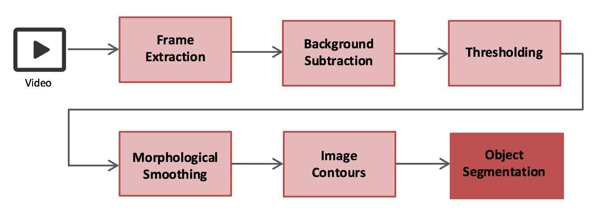
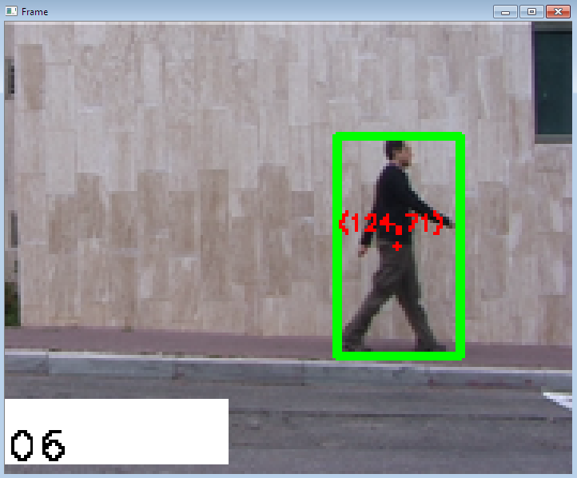

# VIDEO CONTENT ANALYSIS


The video is present in the data folder above (**walk.avi**). The **Object_Tracking.ipynb** file contains the Python code of the analysis of the entire video. Also, the ```OpenCV``` package has to be separately installed for running image processing and video analysis in Python. The OpenCV package is available here: http://opencv.org/downloads.html. Additionally, the setup process to install the dependencies related to video processing for Anaconda can be found here: http://mathalope.co.uk/2015/05/07/opencv-python-how-to-install-opencv-python-package-to-anaconda-windows/ 


# OBJECT TRACKING WORKFLOW
The process of segmenting a single object from a video is shown below:



# OUTPUT


