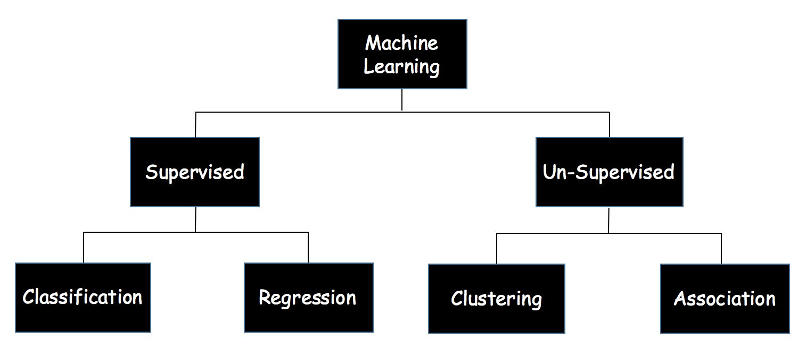
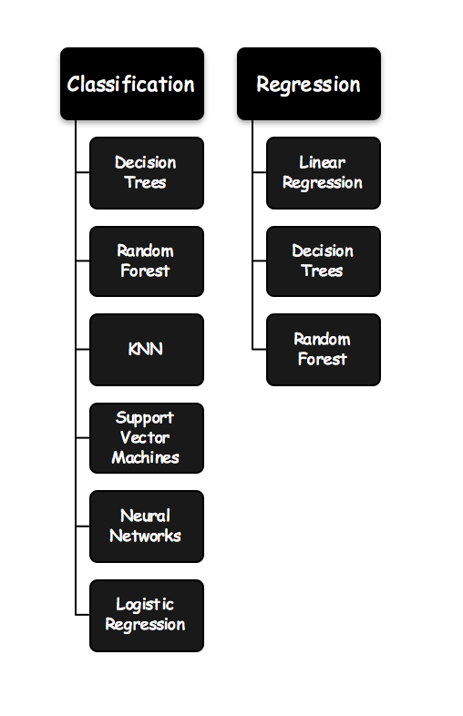
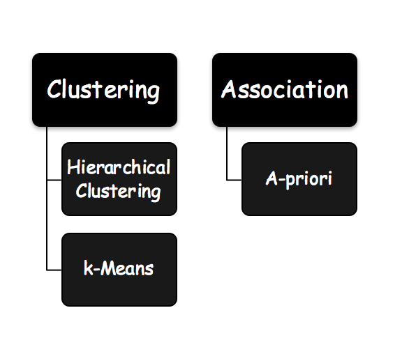

# Machine Learning

* A computer program is said to learn from **experience E** with respect to some **class of tasks T** and **performance measure P** if its performance at tasks in T, as measured by P, **improves** with experience E.  - Tom Mitchell

* Machine learning tasks (**T**) are typically classified into two broad categories, depending on the nature of the **learning signal** or **feedback** available to a learning system. The chart below shows the classification of the learning tasks:

* **Supervised Learning** - The aim of a supervised machine learning algorithm is to build a model that makes predictions based on a **known set of input data** and **known responses to the data (output)**. To read more, visit the Supervised Learning folder. 
	* *Classification* - involves separating the dataset into classes (discrete labels) belonging to the response variable. This technique is used when the **response variable is categorical** in nature. 
	* *Regression* - involves modelling and analysis of several variables to estimate the relationships among them. Here the **response variable (output) is continuous** rather than discrete.

* **Unsupervised Learning** - The aim of an unsupervised machine learning algorithm is to infer a function to **describe hidden structure from unlabeled data**. No known response to the data (output) is present. To read more, visit the Unsupervised Learning folder. 
	* *Clustering* - The process of **grouping a set of data objects** into multiple groups or clusters.
	* *Association* - Discovering **relationships or associations** between specific values of categorical variables in large data sets. 

# Algorithms 

**Tutorials** for the following machine learning algorithms, with thier implementations in **R** and **Python**, are covered in the folders above:

## Supervised Learning

## Unsupervised Learning
