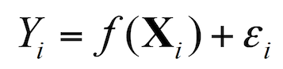

# Supervised Learning

* The aim of a supervised machine learning algorithm is to build a model that makes predictions based on a **known set of input data** and **known responses to the data (output)**. When exposed to more observations, the algorithm improves its predictive performance.

* In order to solve a given problem of supervised learning, one has to gather a training set and then evaluate the accuracy of the learned function using the testing set. 

	* *Training set*: set of data used for **discovering potentially predictive relationship** between the *independent variables (predictor variables or features)* and *dependent variable (response variable)*.

	* *Testing set*: set of data used for **assessing the performance** of the supervised learning algorithm. 

* **Statistical modeling** is a subfield of mathematics which deals with finding relationship between variables to predict an outcome. The common objective behind machine learning and statistical modeling is to learn underlying phenomenon from data. With the help of statistical modeling, we can model the relationship between the **dependent variable (Y)** and **independent variable(s) (X)** by representing the systematic information that X provides about Y using the function:

* Here, f is an unknown function which models the relationship between x and y. e is the term used for representing random error, with mean zero. The difficulty of estimating f will depend on the standard deviation of e.

## Prediction vs. Inference

There are mainly 2 reasons for estimating the function f mentioned above:

* Prediction – This involves accurately predicting the response variable for the future observations. In order to achieve this we also need to make sure that the variance of the error is not too large.

* Inference – This involves understanding the relationship between the response and the predictor variables. This relationship can be positive or negative, linear or non-linear, significant or not significant, etc.

## Parametric vs. Non-Parametric Methods

* After splitting the data into training and testing sets, we can either use parametric or non-parametric methods to estimate the function f.

	* *Parametric* - Estimating the function f is reduced down to estimating a **fixed set of parameters for f**. In order to achieve this, a model is made by making the assumptions about the data and may perform badly if the assumptions are wrong. Example -  *Linear Regression*

	* *Non-Parametric* - No explicit assumption of the functional form of f is made and the algorithm uses a **flexible number of parameter**. Also, fewer assumptions about the data are made. Example -  *K-nearest neighbour*

* Trade-Off between both the methods:
	* *Interpretability* - Non-parametric methods are harder to interpret.
	* *Flexibility* - It is harder to fit a more flexible model to the data.