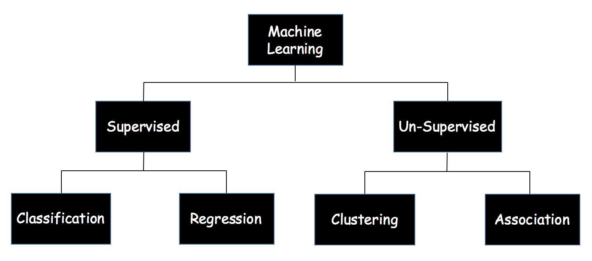

# Machine Learning

* A computer program is said to learn from **experience E** with respect to some **class of tasks T** and **performance measure P** if its performance at tasks in T, as measured by P, **improves** with experience E.  - Tom Mitchell

* Machine learning tasks (**T**) are typically classified into two broad categories, depending on the nature of the **learning signal** or **feedback** available to a learning system. The chart below shows the classification of the learning tasks:

* Supervised Learning - 
	* Classification - 
	* Regression - 

* Unsupervised Learning - 
	* Clustering - 
	* Association - 

