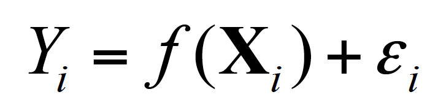

# Supervised Learning

* The aim of a supervised machine learning algorithm is to build a model that makes predictions based on a **known set of input data** and **known responses to the data (output)**. When exposed to more observations, the algorithm improves its predictive performance.

* In order to solve a given problem of supervised learning, one has to gather a training set and then evaluate the accuracy of the learned function using the testing set. 

	* **Training set**: set of data used for discovering potentially predictive relationship between the **independent variables (predictor variables or features)** and **dependent variable(response variable)**.

	* **Testing set**: set of data used for assessing the performance of the supervised learning algorithm. 

* **Statistical modelling** is a subfield of mathematics which deals with finding relationship between variables to predict an outcome. The common objective behind machine learning and statistical modelling is to learn underlying phenomenon from data. Thus, with the help of statistical modelling, we can model the relationship between the **dependent variable (Y)** and **independent  variable(s) (X)** by representing the systematic information that X provides about Y using the equation:

	Where f is an unknown function and ε is a random error with mean 0. 
	Note: The difficulty of estimating f will depend on the standard deviation of the error term. 

* Statistical modelling evaluation techniques are commonly used for assessing machine learning models when solving business problems. A few such techniques are discussed below: 

## Prediction vs. Inference

Thus, when modelling, we wish to fit a model that relates the response variable to the predictor variables, with the aim of accurately predicting the response variable from the future observations (**prediction**) and better understanding the relationship between the response and the predictors (**inference**).

There are 2 reasons for estimating the function f: **Prediction** and **Inference**

**Prediction** - If we can produce a good estimate for f and the variance of the error is not too large, we can make accurate predictions for the response Y based on a new value of X

**Inference** - The Type of relationship between the Y and X's (positive or negative, linear or non-linear, significant or not significant)

## Parametric vs. Non-Parametric Methods

In order to estimate f, we first split f into training and testing data. 
Then we can either use parametric or non-parametric methods to estimate f.

Parametric - reduces the problem of estimating f down to one of estimating a set of parameters. This is done using 2 steps:
Come up with a model by making some assumption of the functional form on X
Use training data to fit the model

Non-Parametric - Do not make an explicit assumption of the functional form of X
However, a very large number of observations is required to obtain an accurate estimate of f

Trade-Off:
Interpretability - Non-parametric methods are harder to interpret
Flexibility - It is harder to fit a more flexible model to the data

## Measuring Quality of Fit

One common measure of accuracy is the mean square error, which is an average of the actual vs the predicted value in squared units.

The machine learning method should be designed to make MSE small on the Testing Data.

In general, for the more the flexible method, the lower the MSE will be for the Training Data. However, it might be higher for the Testing Data. 

## Bias/Variance Trade-Off

There are 2 competing forces that govern the choice of the learning model - bias and variance

Bias - refers to the error of modelling a real life complicated problem to a much simpler problem. This is introduced by the assumptions made when modelling the problem. Thus, the a more flexible/complex a model, the less bias it will have.
Variance -  refers to how much your estimate for f would change by if you had a different training data set. Generally, the more flexible a method is the more variance it has.

The relationship between the Test MSE, the bias, the variance and the error is shown by the equation below:

According to this equation as'a'method'gets'more'complex' the'bias'will'decrease'and'the'variance'will'increase

### NOTE

In'general'training'errors'will'always'decline.

However,'test'errors'will'decline'at'first'(as'reductions'in'bias'dominate)'but'will'then'start'to'increase'again'(as'increases'in'variance'dominate).

### Check out the classification and regression folders to see what they look like. 