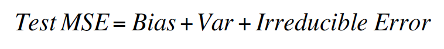
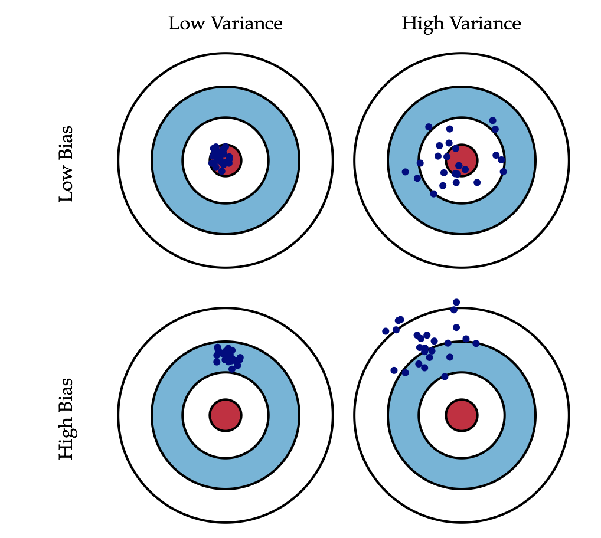

# Supervised Learning

* The aim of a supervised machine learning algorithm is to build a model that makes predictions based on a **known set of input data** and **known responses to the data (output)**. When exposed to more observations, the algorithm improves its predictive performance.

* In order to solve a given problem of supervised learning, one has to gather a training set and then evaluate the accuracy of the learned function using the testing set. 

	* *Training set*: set of data used for **discovering potentially predictive relationship** between the *independent variables (predictor variables or features)* and *dependent variable (response variable)*.

	* *Testing set*: set of data used for **assessing the performance** of the supervised learning algorithm. 

* **Statistical modelling** is a subfield of mathematics which deals with finding relationship between variables to predict an outcome. The common objective behind machine learning and statistical modelling is to learn underlying phenomenon from data. Thus, with the help of statistical modelling, we can model the relationship between the **dependent variable (Y)** and **independent variable(s) (X)** by representing the systematic information that X provides about Y using the equation:

	f is an unknown function and ε is a random error with mean 0. 
	Note: The difficulty of estimating f will depend on the standard deviation of the error term. 

## Prediction vs. Inference

* There are mainly 2 reasons for estimating the function **f** mentioned above: 

	* *Prediction* - Accurately **predicting** the response variable for the future observations. In order to achieve this, we need a good estimate for the function f and we also need to make sure that the the variance of the error is not too large.

	* *Inference* - Better understanding of the **relationship** between the response and the predictors variables. This relationship can be positive or negative, linear or non-linear, significant or not significant, etc. 

## Parametric vs. Non-Parametric Methods

* After splitting the data into training and testing sets, we can either use parametric or non-parametric methods to estimate the function f.

	* *Parametric* - Estimating the function f is reduced down to estimating a **fixed set of parameters for f**. In order to achieve this, a model is made by making the assumptions about the data and may perform badly if the assumptions are wrong. Example -  *Linear Regression*

	* *Non-Parametric* - No explicit assumption of the functional form of f is made and the algorithm uses a **flexible number of parameter**. Also, fewer assumptions about the data are made. Example -  *K-nearest neighbour*

* Trade-Off between both the methods:
	* *Interpretability* - Non-parametric methods are harder to interpret.
	* *Flexibility* - It is harder to fit a more flexible model to the data.

## Assessing Model Accuracy

* Statistical modelling evaluation techniques are commonly used for assessing machine learning models when solving business problems. A few such techniques are discussed below.

* No one method dominates all others over all possible data sets. On a particular data set, one specific method may work best, but some other method may work better on a similar but different data set. Hence it is an important task to decide for any given set of data which method produces the best results and this is often challenging.

### NOTE

In'general'training'errors'will'always'decline.

However,'test'errors'will'decline'at'first'(as'reductions'in'bias'dominate)'but'will'then'start'to'increase'again'(as'increases'in'variance'dominate).

### Check out the classification and regression folders to see what they look like. 

## Measuring Quality of Fit

To evaluate the performance of a model on a dataset, we need to quantify the extent to which the predicted response value for a given observation is close to the true response value for that observation.

Confusion matrix
ROC curve
Lift curve
MSE
* mean square error, which is an average of the actual vs the predicted value in squared units.
* The machine learning method should be designed to make MSE small on the Testing Data.
* n general, for the more the flexible method, the lower the MSE will be for the Training Data. However, it might be higher for the Testing Data. 

Cross-Validation

## Algorithm Selection

There are 2 competing forces that govern the choice of the learning method - bias and variance.

* *Bias* - refers to the error that is introduced due to the **assumptions** made when modelling a real life complicated problem to a much simpler problem. The more flexible/complex a method is the less bias it will have.

* *Variance* -  refers to the error from **sensitivity** to small fluctuations in the training set. Generally, the more flexible a method is the more variance it has.

The relationship between the Test MSE, the bias, the variance and the error is shown by the equation below:

**Bias/Variance Trade-Off** - As a method gets more complex, the bias will increase and the variance will decrease. Algorithms with high bias typically produce simpler models that don't tend to overfit, but may underfit their training data, failing to capture important regularities. In contrast, high-variance learning methods may be able to represent their training set well, but are at risk of overfitting to noisy or unrepresentative training data. Thus, the relative rate of change of these two quantities determines whether the Mean Square Error (average difference between the actual and the predicted value in squared units) increases or decreases.

We can plot four different cases representing combinations of both high and low bias and variance:

# List of Algorithms Covered:

 