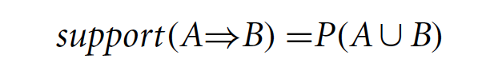
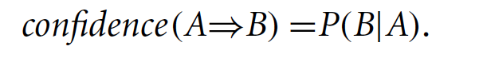
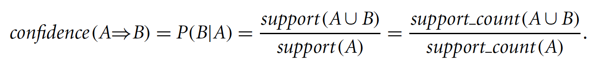

# Association

* Association rule learning is a method for **discovering interesting relations** between variables in large datasets. 

* Association rule learning includes finding frequent patterns, associations, correlations or causal structures among sets of items (data objects) which occur in transactional data, relational data or other forms of data repositories. 

* Given a set of transactions, association finds rules that will **predict the occurrence of an item based on the occurrences of other items** in the transaction (dataset). A brute-force (exhaustive search) approach for finding frequent itemsets is done by comparing the occurrence of each item against every other item.  

# Terms and Definitions

Frequent pattern mining searches for recurring relationship in data and leads to finding associations, correlations and relationships among data. 

* *Itemset*: Collection of one or more items. For K-itemset, an itemset containing k elements.

* *Frequent Itemset*: Set of items that appear frequently together. 

* *Frequent Sequential Pattern*: A frequently occurring subsequence (such as buying X first, then Y and then Z).

* *Frequent Structural Pattern*: A frequently occurring substructure (structural form such as sub-graph, sub-trees or sub-lattice).

Association rules are usually required to satisfy a user-specified **minimum support** and a user-specified **minimum confidence** at the same time. Association rules are considered interesting only if they satisfy the minimum support threshold and the minimum confidence threshold.

* *Support*: Measure of the number of times items occur together. Example – A support of 2% between milk and eggs shows that 2% of all the transactions under analysis show milk and eggs are bough together.  Thus, for A => B, the support is the percentage of transactions that contain the A Union B.

* *Confidence*: Measure of the number of times an item occurs due to another item. Example – A confidence of 60% between milk and eggs shows that 60% of the customers who bought milk also bought eggs. Thus, for A => B, the confidence is the percentage of transactions containing A that also contain B. 

*Relationship between support and confidence:*

Association rule generation is usually split up into two separate steps:
* A minimum support threshold is applied to find all frequent item-sets in a database.
* A minimum confidence constraint is applied to these frequent item-sets in order to form rules.

**Note**: 
* Rules originating from the same itemset have identical support but can have different confidence. 
* If the minimum support is set too high, we could miss itemsets involving interesting rare items (e.g. expensive products)
* If the minimum support is set too low, it is computationally expensive.  

# Market Basket Analysis

* Market Basket Analysis is an example of the application of association modeling. The **analysis of customer buying habits** is done here by finding the associations between different items that the customer places in their *“shopping baskets”*. 

* Each item bought is represented as a Boolean variable (purchased or not purchases) and each basket is represented as a Boolean vector of values assigned to the variables. The Boolean vectors are analyzed for buying patterns. The buying patterns reflect the items that are frequently associated together and are represented in the form of association rules. 

* The discovery of these associations help retailers develop marketing and advertisement strategies. Market Basket Analysis is valuable for direct marketing, sales promotions, and for discovering business trends. Market-basket analysis can also be used effectively for store layout, catalog design, and cross-sell.

# Algorithm

The **Apriori** algorithms uses the concepts covered above. Visit the folder to read more about the algorithm.