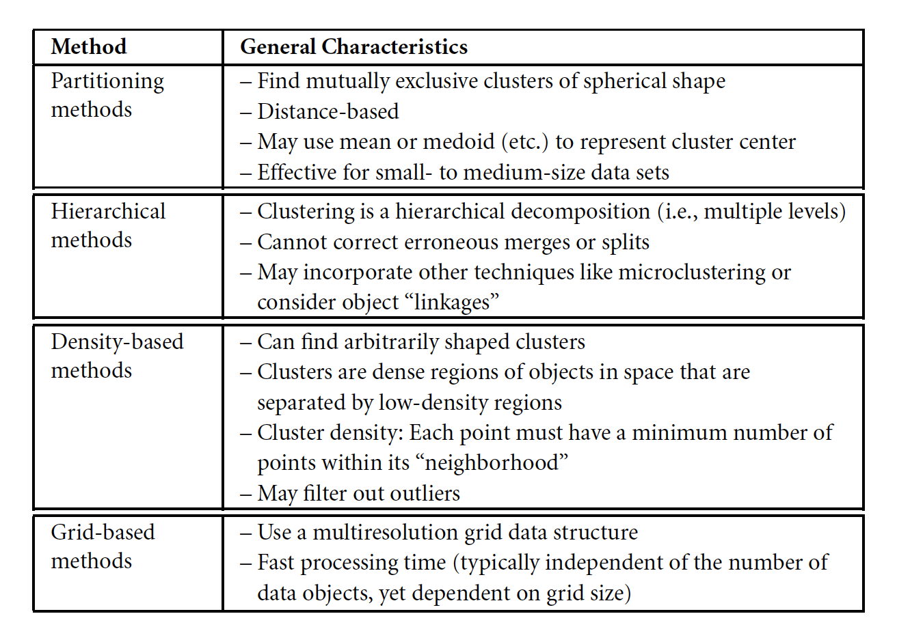

# Clustering

* Clustering is the process of grouping a set of data objects into multiple groups or clusters such that there is a **high intra-cluster similarity** (similarity within the cluster) and a **low inter-cluster similarity** (similarity between the cluster). To achieve clustering, a similarity/dissimilarity measure is defined which reflects the degree of closeness or separation between the data objects. 

* Clustering is a part of unsupervised learning because the class label information is not present here. Clustering is the form of learning by observation rather than learning by examples. Informally, clustering helps finding the natural grouping among the data objects. It shows the internal structure of the data and helps discover an underlying rules and recurring patterns if they exist.

## Overview of Basic Clustering Methods

* Different clustering methods may generate different clusters (identical) on the same data set. In general, the major fundamental clustering methods can be classified into the following categories.

	Note: Some algorithms may combine various methods. 

## Dissimilarity Measures

