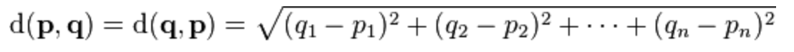
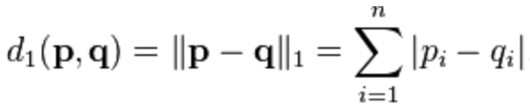
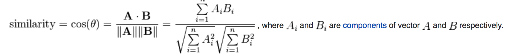
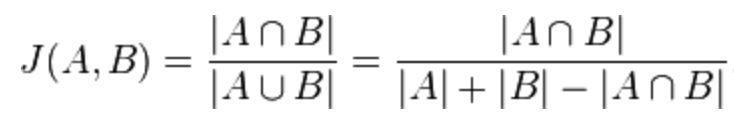

# Clustering

* Clustering is the process of grouping a set of data objects into multiple groups or clusters such that there is a **high intra-cluster similarity** (similarity within the cluster) and a **low inter-cluster similarity** (similarity between the cluster). To achieve clustering, a similarity/dissimilarity measure is defined which reflects the degree of closeness or separation between the data objects. 

* Clustering is a part of unsupervised learning because the class label information is not present here. Clustering is the form of learning by observation rather than learning by examples. Informally, clustering helps finding the natural grouping among the data objects. It shows the internal structure of the data and helps discover an underlying rules and recurring patterns if they exist.

## Overview of Basic Clustering Methods

Different clustering methods may generate different clusters on the same data set. In general, the major fundamental clustering methods can be classified into the following categories:

	Note: Some algorithms may combine various methods. 

## Similarity and Dissimilarity Measures

Similarity and Dissimilarity measures are referred to as **measures of proximity**. 

Three common distance measures that are used for computing the distance of numeric data objects are discussed below. In most cases, data is **normalized** before applying distance calculations.

1) **Euclidean Distance** - This is the straight line distance (the length of the line segment) between 2 n-dimensional vectors. It is given by the formula:

2) **Manhattan Distance** - This is the sum of the absolute distance between 2 n-dimensional vectors. It is given by the formula:

3) **Cosine Similarity** - This is a measure that calculates the cosine of the angles between 2 n-dimensional vectors. It is given by the formula:

A common distance measures that is used for computing the distance of categorical data objects is discussed below:

1) **Jaccard Similarity** - This is a measure of similarity between finite sample sets, and is defined as the size of the intersection divided by the size of the union of the samples. It is given by the formula:

## Algorithms

The **K-Means** and the **Hierarchical Clustering** algorithms use the concepts covered above. Visit the folders to read about the algorithms in detail.
