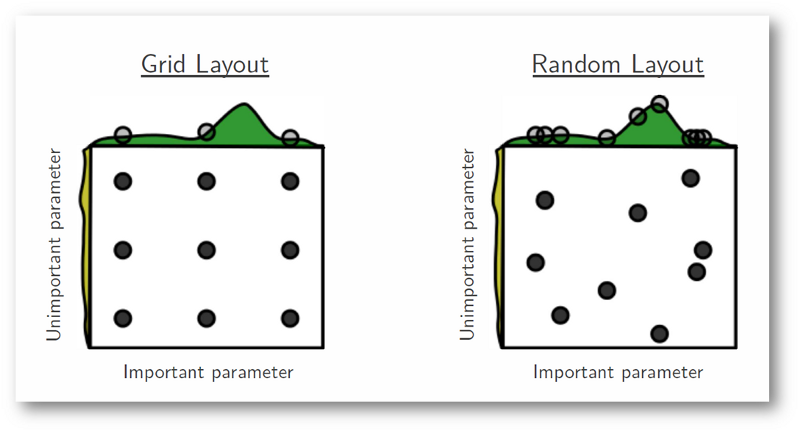

Hyper-parameter Optimization
========================================================
author: Riddhik Rathod, Viraj Bhargave
date: 23-Feb-2016

Hyperparameters?
========================================================

- The hyperparameters controls the capacity and flexibility of the model.
- If hyperparameters are not adjusted properly, the model can loose its predictive accuracy or over-fit the data.

e.g.
- Random Forest - no. of trees, no of features at each split
- Neural Network - learning rate, hidden layer, etc.

Cross-Validation
========================================================

- Cross-Validation is used for estimating the generalized performance of the algorithm.
- The training dataset is tested by partitioning it into N subsets.
- Analysis of N-1 subsets is validated against the Nth subset.
- The mean of these rotational estimates is used for indicating performance.

Hyper-parameter Optimization
========================================================

It is a method of choosing a hyper-paramters for machine learning algorithms, with the goal of optimizing accuracy on an independent dataset.

Four algorithms for Hyper-parameter Optimization:

- Grid Search
- Random Search
- Bayesian Optimization
- Gradient-based Optimization

Grid Search
========================================================

Picks out a grid of hyper-parameter values, evaluates all possible values, returns the best value.

Cons
- Curse of Dimensionality
- Expensive method in terms of computation time

How to improve Grid Search?
- Grid Walk
  - Choose a starting point and "walk downhill" from there, evaluating algorithm only at nearby locations (i.e. hyperparameter values).
- Nelder-Mead simplex algorithm

Random Search
========================================================

- Instead of searching over the entire grid, Random search only evaluates a random sample of points on the grid.
- If the close-to-optimal region of hyperparameters occupies at least 5% of the grid surface, then random search with 60 trials will find that region with high probability.
- Allows exploration of variation in values for each parameter given the same amount of trials.

Example Code
========================================================

[Code](http://localhost:8888/notebooks/018_ML103/Hyper-parameter%20Optimization.ipynb)

References:
========================================================
* Random Forest - http://goo.gl/F14BqE
* GridSearchCV - http://goo.gl/Fca3kX
* RandomizedSearchCV - http://goo.gl/T4MZct
* How to find the best model parameters in scikit-learn (video) - https://goo.gl/1xDhtm
* Random Search for Hyper-Parameter Optimization -  http://jmlr.csail.mit.edu/papers/volume13/bergstra12a/bergstra12a.pdf
* How to Evaluate Machine Learning Models: Hyperparameter Tuning by Alice Zheng  - http://goo.gl/B7KNJs
* Comparing randomized search and grid search for hyperparameter estimation - http://goo.gl/9q1qgd

THANK YOU!
========================================================

