# K-Nearest Neighbors

* The code below demonstrates the K-Nearest Neighbors algorithm (KNN). 
* KNN is a part of supervised machine learning and thus the dataset is split into **training and testing**.
* The KNN algorithm below is used for prediction using the **Euclidean Distance**. 
* The ```Forensic Glass Fragments``` dataset which is a part of the ```MASS``` package in ```R``` is used here. The dataset classifies glass fragments into 7 types based on various attributes such as refractive index, sodium content, etc. 
```{r, eval=TRUE}
library(MASS)
?fgl
```
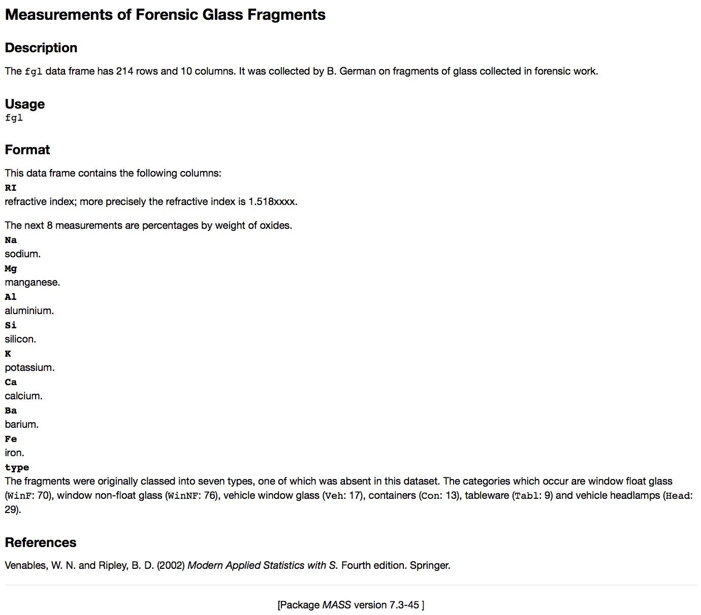

### Implementation in R

The fgl dataset is part of the ```MASS``` package. Exploratory data analysis of the variable types.
```{r, eval=TRUE, include=TRUE}
str(fgl)
```
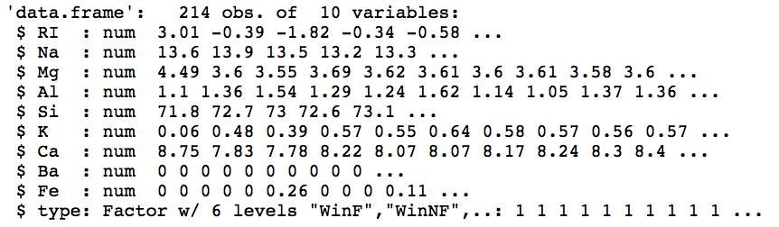

Summary of the features of the dataset.
```{r}
summary(fgl)
```
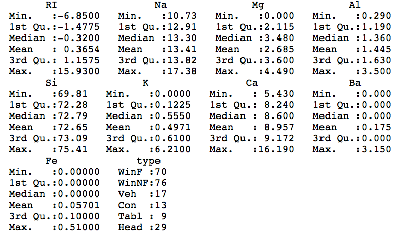

Box plot matrix to visualize the relationship between the type of glass fragment and the other variables.
```{r}
par(mfrow = c(3, 3), mai = c(.3, .6, .1, .1))
plot(RI ~ type, data = fgl, col = c(grey(.2), 2:6))
plot(Na ~ type, data = fgl, col = c(grey(.2), 2:6))
plot(Mg ~ type, data = fgl, col = c(grey(.2), 2:6))
plot(Al ~ type, data = fgl, col = c(grey(.2), 2:6))
plot(Si ~ type, data = fgl, col = c(grey(.2), 2:6))
plot(K ~ type, data = fgl, col = c(grey(.2), 2:6))
plot(Ca ~ type, data = fgl, col = c(grey(.2), 2:6))
plot(Ba ~ type, data = fgl, col = c(grey(.2), 2:6))
plot(Fe ~ type, data = fgl, col = c(grey(.2), 2:6))
```
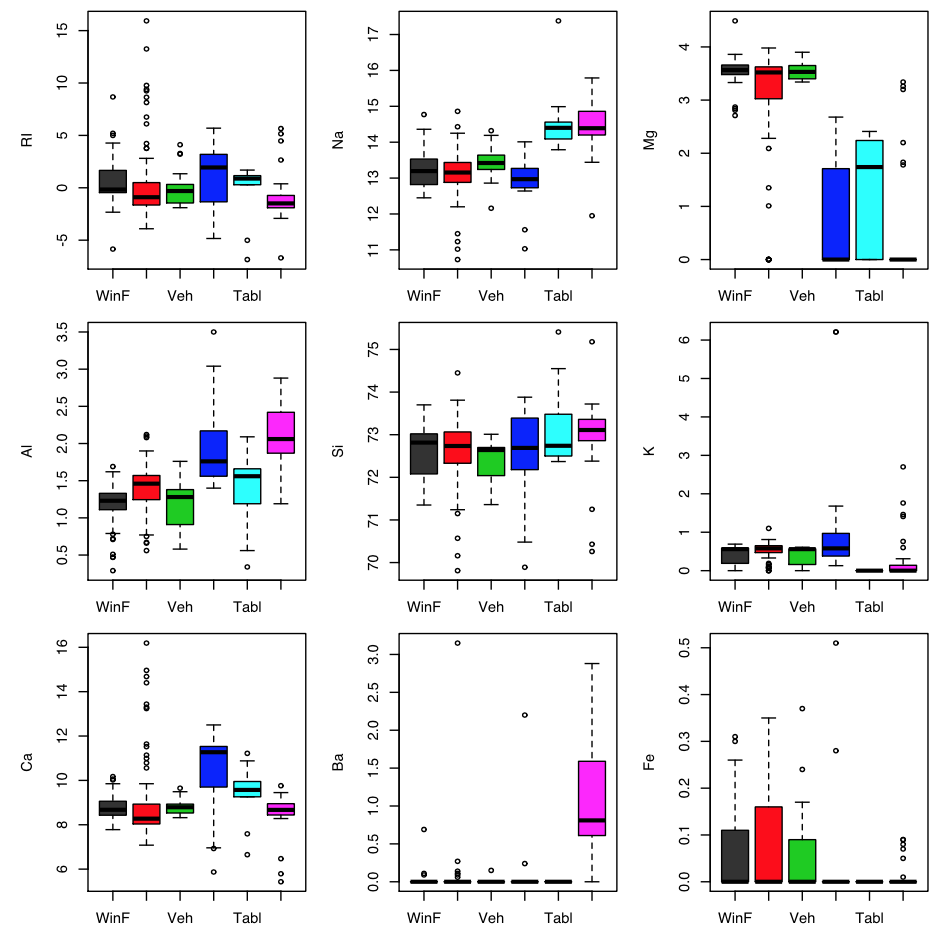

Because the KNN classifier predicts the class of a given test observation by identifying the observations that are nearest to it, the scale of the variables matters. Any variables that are on a large scale will have a much larger effect on the distance between the observations, and hence on the KNN classifier, than variables that are on a small scale. Thus, we are going to standardize all the independent (predictor) variables except the dependent variable (type). All the independent variables have a mean of 1 and standard deviation of 0 after standardization.
```{r}
std_fgl = scale(fgl[, -10])
```

### Splitting the dataset

The dataset is split into two parts: *training* and *testing*. The training part is used for fitting the model and the testing part is used for assessing the model. The split is done randomly to eliminate bias. The ```sample()``` function in R is used for generating 150 random samples as training data and the remaining as testing data. 
```{r}
set.seed(1)

test = sample(1:214, 150)
train = -test

training_data = std_fgl[train, ]
testing_data = std_fgl[test, ]

type = fgl[, 10] # save the type column in a seperate variable

testing_y = type[test]
training_y = type[train]
```

### KNN Model

The ```knn()``` function, which is a part of the ```FNN``` library, is used for performing KNN in R. The first argument for the ```knn()``` function is a data frame that contains the training data set, the second argument is a data frame that contains the testing data set, the third argument is *training_y* variable saved above (the dependent variable from the training data set), and the fourth argument is k (the number of neighbors). The ```knn()``` function returns a vector of predicted Y’s. Let’s start with k = 1. 
```{r}
library(FNN)

predicted_y = knn(training_data, testing_data, training_y, k = 1)
head(predicted_y)
```
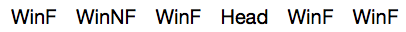

### Evaluation of KNN

A confusion matrix is used for checking the accuracy of the model. The ```confusionMatrix()``` function is a part of the ```caret``` package. It shows the true positives, false positives, true negatives and false negatives and hence the misclassification rate. 
```{r}
#install.packages("caret")
library(caret)
confusionMatrix(testing_y, predicted_y)
```
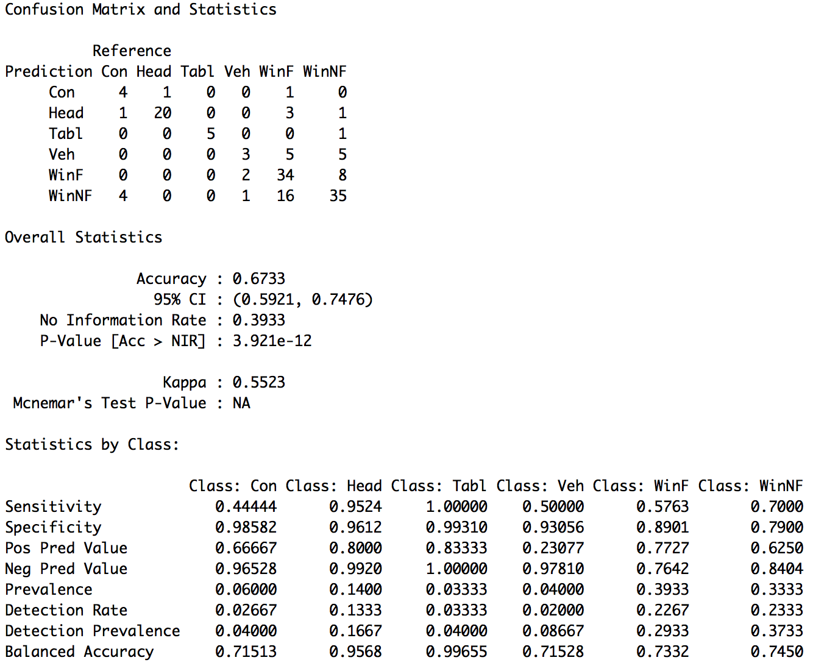

The KNN model can also be assessed by using the *Mean Error*.
```{r}
ME = mean((predicted_y != testing_y))
ME
```
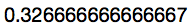

The misclassification for the above model is 32.67% and the accuracy is 67.33%. We can now iterate for different values of k and *decide k on the basis of the lowest misclassification*. This process can be automated using a *for loop*. The code and the results for k values up to 7 is shown below.
```{r}
ME = NULL

for(i in 1:7){
  set.seed(1)
  predicted_y = knn(training_data, testing_data, training_y, k = i)
  
  ME[i] = mean(predicted_y != testing_y)
  
  print(i)  
  print(table(testing_y, predicted_y))
  print (round(ME, 3))
  ME = NULL
  cat("\n")  
}
```
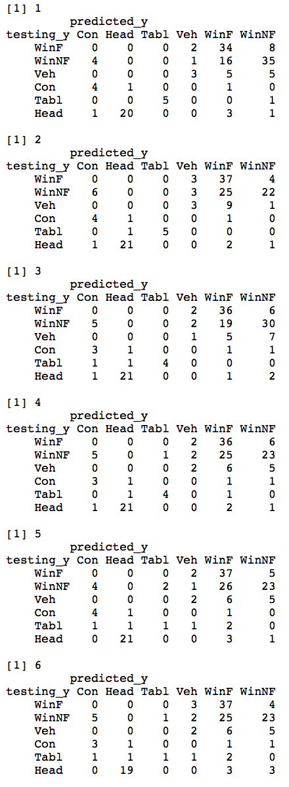
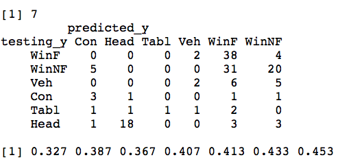

We can now plot the all the values of k with their respective error rates. This will help us decide the best value for k. Before that, we can find out the value of k having the minimum error rate using the code below.
```{r}
min_error_rate = min(ME)
K = which(ME == min_error_rate)
print(min_error_rate)
print (K)
```
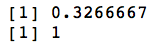

```{r}
plot(x = 1:7, y = ME*100, 
     xlab = "K", ylab = "Error Rate", 
     type = 'l', 
     ylim = c(0, 50))

points(x= 1, y = (min(ME)*100), 
       col = "red", 
       pch = 19)
```
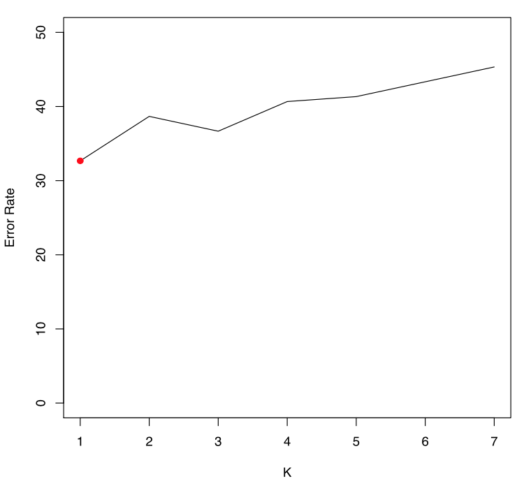

When k = 1, we achieve the lowest misclassification error rate. Thus, *a value of k = 1* is best suited for this dataset.