# Linear Regression Algorithm

* The code below demonstrates Linear Regression. 
* Linear Regression is a part of supervised machine learning and thus the dataset is split into **training and testing data**.
* Linear Regression is used for prediction using the **line of best fit**. 
* The ```Boston``` dataset which is a part of the ```MASS``` package in ```R``` is used here. It contains records of the median value of houses for 506 neighborhoods around Boston. The task is to **predict the median house value (medv)**. 
```{r, eval=TRUE}
library(MASS)
?Boston
```
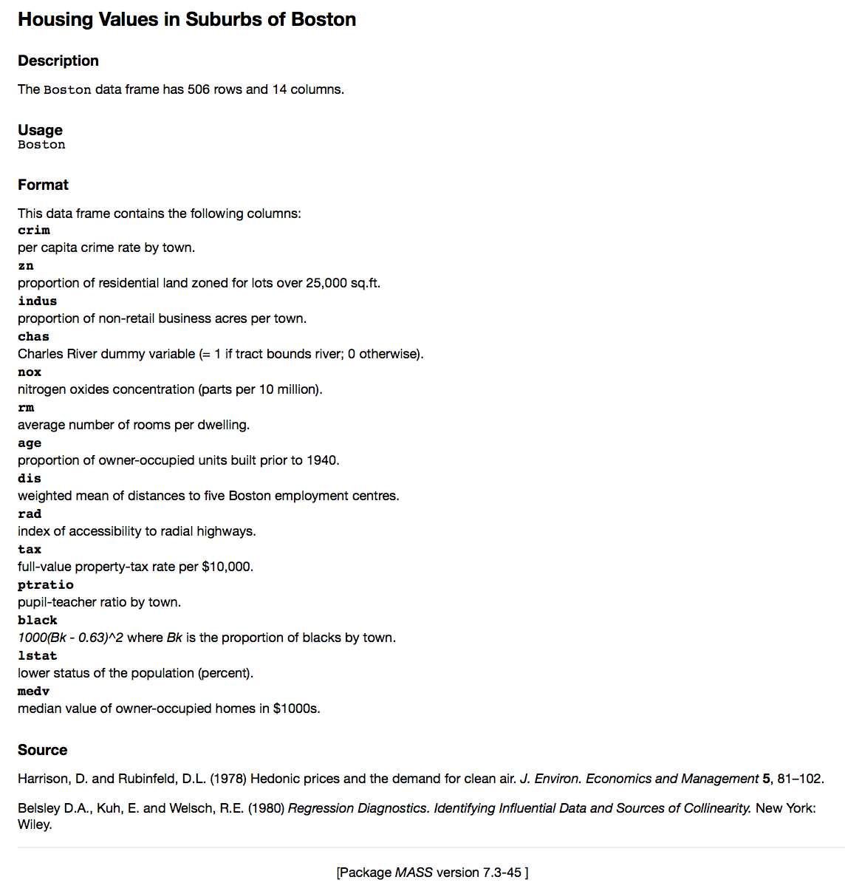


## Implementation in R

The Boston.csv dataset is present in the data folder (or the ```MASS``` package).
```{r, eval=TRUE}
data = read.csv('./data/boston.csv', header = T)
```

Exploratory data analysis of the variable types.
```{r, eval=TRUE, include=TRUE}
str(data)
```


Summary of the features of the dataset.
```{r}
summary(data)
```


Scatter plot matrix to visualize data.
```{r}
plot(data[,-1])
```


### Splitting the dataset

The dataset is split into two parts: *training* and *testing*. The training part is used for fitting the model and the testing part is used for assessing the model. The split is done randomly to eliminate bias. The ```sample()``` function in R is used for generating 400 random samples as training data and the remaining as testing data. 
```{r}
set.seed(100) # to control randomness and get similar results

train = sample(1:506, 400)
test = -train

training_data = data[train, ]
testing_data = data[test, ]
```

### Linear Model

The ```lm()``` function is used for performing linear regression in R. The linear model is *fitted* on the training data.
```{r}
model = lm(medv ~ ., data = training_data)
model
```
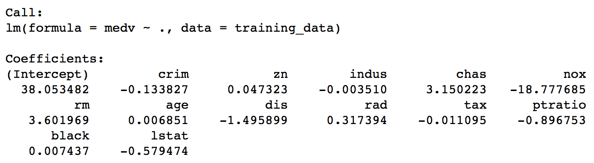

The ```model``` command above only gives us basic information about the regression model. For more detailed information, we use the ```summary()``` function. The summary gives us information about the p-values, standard errors and the R-Squared values for the linear model.
```{r}
summary(model)
```
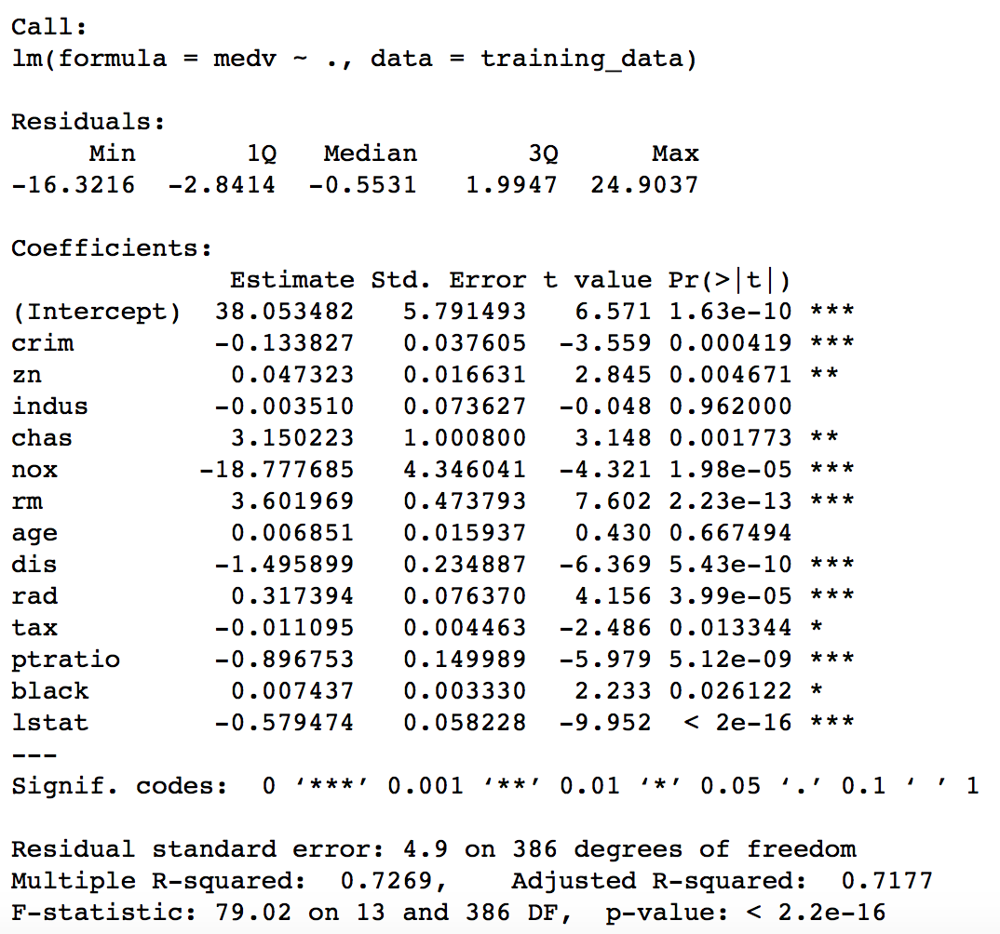

Explanation of the summary:
* Except for the *indus* and the *age*, all the other variables are statistically significant.
* The *adjusted R-squared* value is 71.77%. This means 71.77% of the variation in the data is explained by the independent variables. 
* The *F-statistic* is 79.02. The higher the F-statistic, the better the model. 
* The Residual Standard Error is the standard deviation of the errors (i.e., standard deviation of the predicted values using the regression line subtracted by the actual value).

We can use the ```names()``` function to see what other pieces of information are stored in our linear model. 
```{r}
names(model)
```
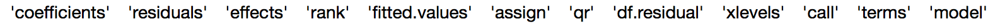

To obtain the confidence interval for the coefficients of the model, we can use the ```confint()``` function.
```{r}
confint(model, level = 0.95)
```
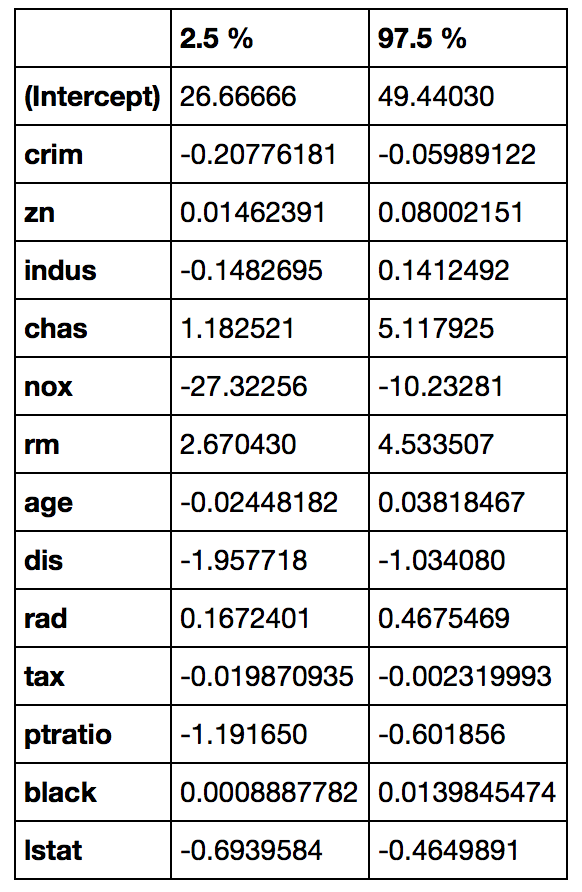

### Checking for collinearity

We want to make sure that the predictor variables that are highly correlated are not in the same model together. The checking for collinearity is done in 2 ways - *VIF* and *Correlation*.

**Variance Inflation Factor (VIF)**

The VIF criteria is used for checking if one or more of the independent variables are correlated with each other in the model. VIF is given by the **formula**: 

VIF = 1/(1-RSquared)

The higher the VIF for a variable, the variable would be highly correlated with at least one of the other predictors in the model. A VIF value of *1* is the best. In order to check VIF in R, we use the function ```vif()``` which is found in an R package called ```car```. 
```{r}
#install.packages("car")
library(car)
vif(model)
```
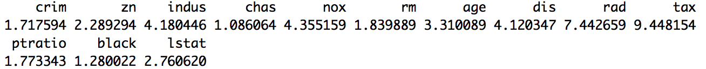

From the above output, we notice that tax has a high VIF (9.44), which means that the variance of the estimated coefficient of tax is inflated by a factor of 9.44 because tax is highly correlated with at least one of the other predictors in the model.

In order to see what variables are highly correlated with tax, we can explore correlations.

**Correlation**

The ```cor()``` function in R computes the correlation matrix.
```{r}
corr_matrix = round(cor(training_data), 2)
corr_matrix
```
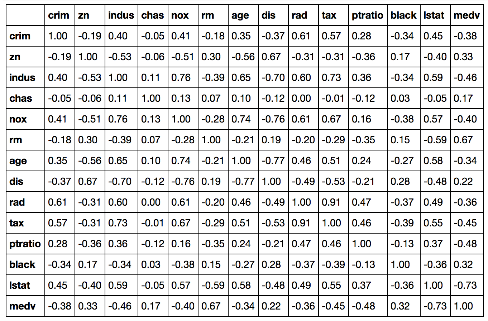

Since there are 14 variables in the dataset, it can become difficult to compare the correlation numbers. Thus, in order to visualize the correlations between the variables, the ```corrplot()``` function from the ```corrplot``` R package is used. The first argument for the ```corrplot()``` function is the *correlation matrix*, and the second argument is the *ordering method* of the variables. In this case we used the **hierarchical clustering** technique to order them.
```{r}
#install.packages("corrplot")
library(corrplot)
corrplot(corr_matrix, order = "hclust")
```


It seems that *tax* and *rad* are highly correlated (0.91). The VIF output is high for both the variables as well. Thus, in order to remove either tax or rad from the model, we can check the adjusted R-Squared value for both the cases.

```{r}
model.tax = lm(medv ~ . -rad, data = training_data)
summary(model.tax)
```
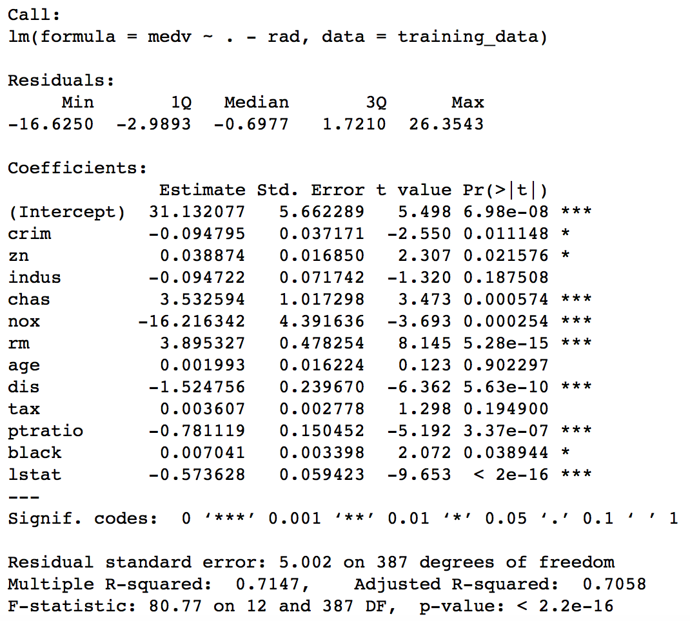

```{r}
model.rad = lm(medv ~ . -tax, data = training_data)
summary(model.rad)
```
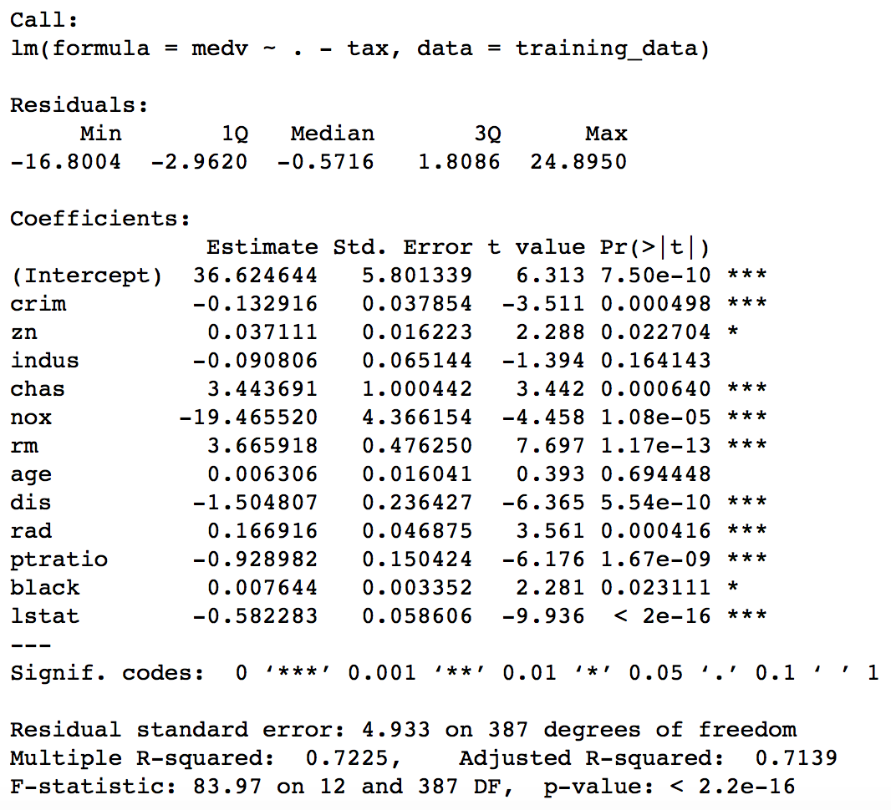

Since the R-squared value for *model.rad* is greater than *model.tax*, we can get rid of the **tax** variable.

Visualizing the other coefficients to see how far they are from zero. This is done by using the ```coeflot()``` function which is a part of the ```coefplot``` library. 
```{r}
#install.packages("coefplot")
library(coefplot)
coefplot(model, 
         coefficients = c('crim','zn','indus','chas','nox','rm','age','dis','rad','tax','ptratio','black','lstat'))
```
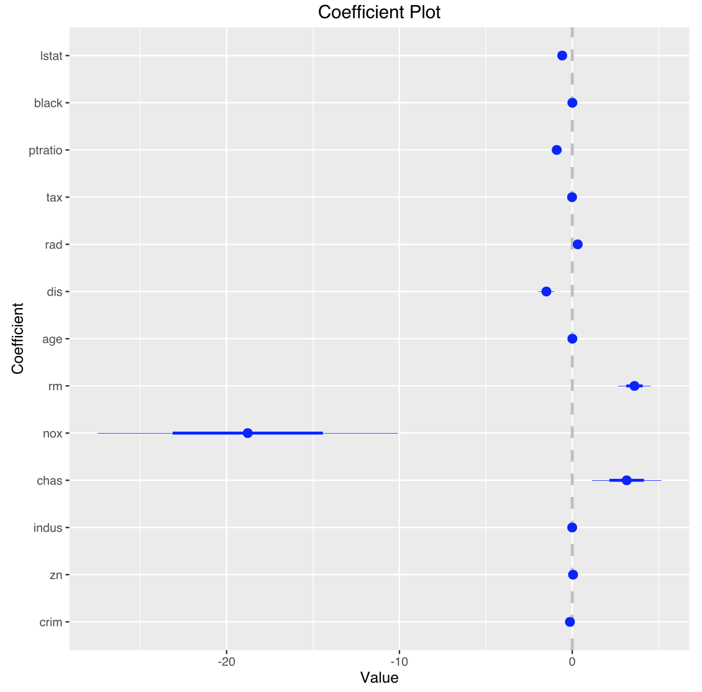

After removing the other non-significant variables, we can get the final model which will be can be used for testing the data.
```{r}
model.lm = lm(medv ~ . -tax -indus -age, data = training_data)
summary(model.lm)
```
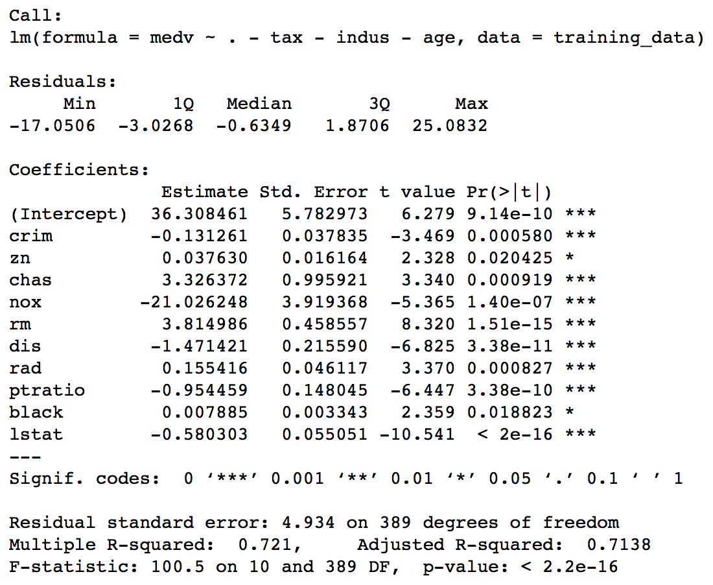

Thus, our final equation for the linear model is:

* *medv = 36.308461 - (0.131261 × crim) +  (0.037630 × zn) + (3.326372 × chas) - (21.026248 × nox) + (3.814986 × rm) - (1.471421 × dis) + (0.155416 × rad) - (0.954459 × ptratio) + (0.007885 × black) - (0.580303 × lstat)*


### Prediction and Accuracy

In order to do predictions using the final model on the testing data, we use the ```predict()``` function in R. 
```{r}
predicted_y = predict(model.lm, testing_data)
```

For assessing the model on the testing data, we first save the dependent variable to a new variable *testing_y*. 
```{r}
testing_y = testing_data$medv
```

The model is assessed by using the **Mean Square Error (MSE)**. This is the average of the squared differences between the actual values of *medv* in the testing data and the predicted values. *A low MSE is desired.*
```{r}
MSE = mean((predicted_y - testing_y)^2)
MSE
```
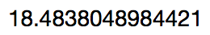

### Dealing with Interaction Terms

Getting all 2-way interaction terms (possibility of over-fitting):
```{r}
model.two = lm(mdev ~ (.)^2, data = training_data)
model.two
```
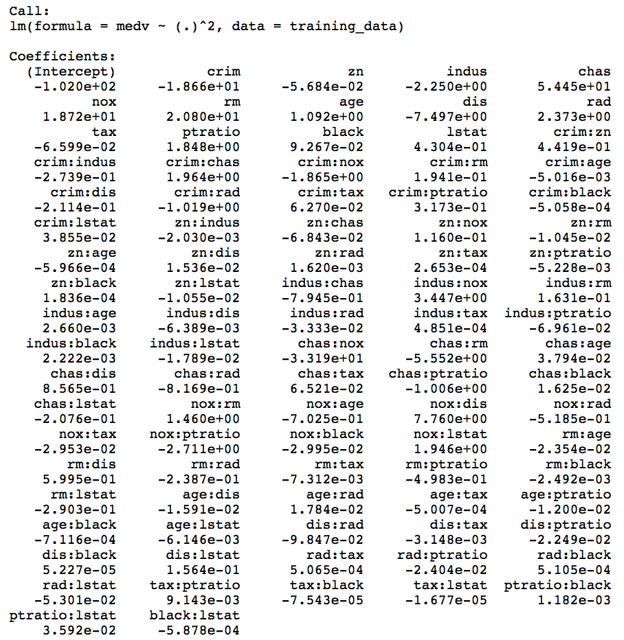

Getting all 3-way & 2-way interaction terms (only code below, output not shown):
```{r}
model.three = lm(mdev ~ (.)^3, data = training_data)
model.three
```

### Checking the assumptions of Linear Regression

The assumptions of Linear Regression are checked by plotting the residual and the fitted values.
```{r}
par(mfrow = c(2, 2))
plot(model.lm)
```
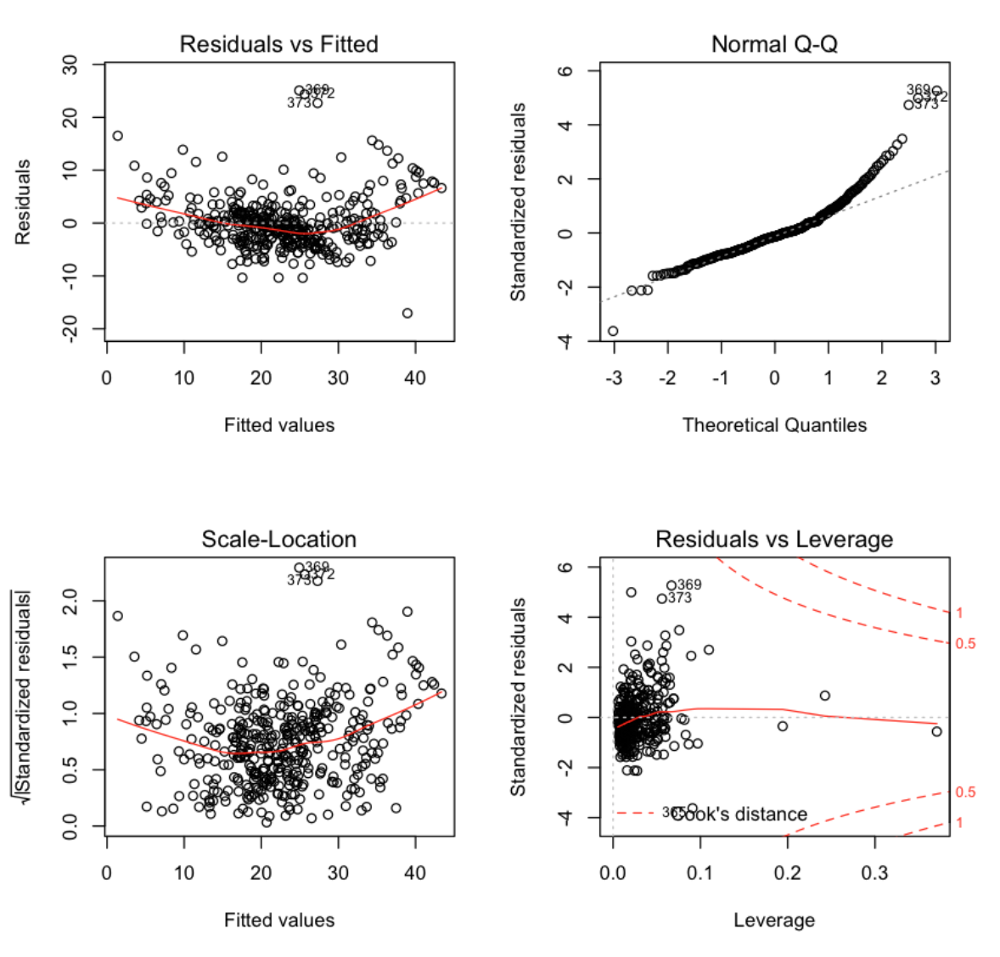

*Residual Vs Fitted plot*: 

    * x axis - Fitted values (values for medv generated by the model).  
    * y axis - Residual(errors) for medv values generating in the training data. 
    * The red line should be fairly flat to conclude there is no pattern in the variation.
    * The points in the plot should look like a cloud of points (not pattern).

*Quantile-Quantile Plot*: 

    * x axis - Ordered theoretical residuals (expected value of residuals if they are normally distributed).
    * y axis - Standardized residual values. 
    * If the residual terms are normally distributed then the residual points roughly follow on a diagonal line.

*The 3rd and 4th plot help us identify non-linearities and non-constant variance.*


# Dealing with categorical variables in Linear Regression
* The ```Carseats``` dataset which is a part of the ```ISLR``` package is used here for demonstrating linear regression. 
* Carseats is a simulated data set containing sales of child car seats at 400 different stores. The task is to **predict sales of children carseats in 400 locations**. 
* One of the predictors variables in Carseats is *ShelveLoc*, which is a categorical variable with levels (Bad, Good and Medium) indicating the quality of the shelving location for the car seats at each site. Given a categorical variable, **R generates dummy variables automatically**.
```{r}
library(ISLR)
?Carseats
```
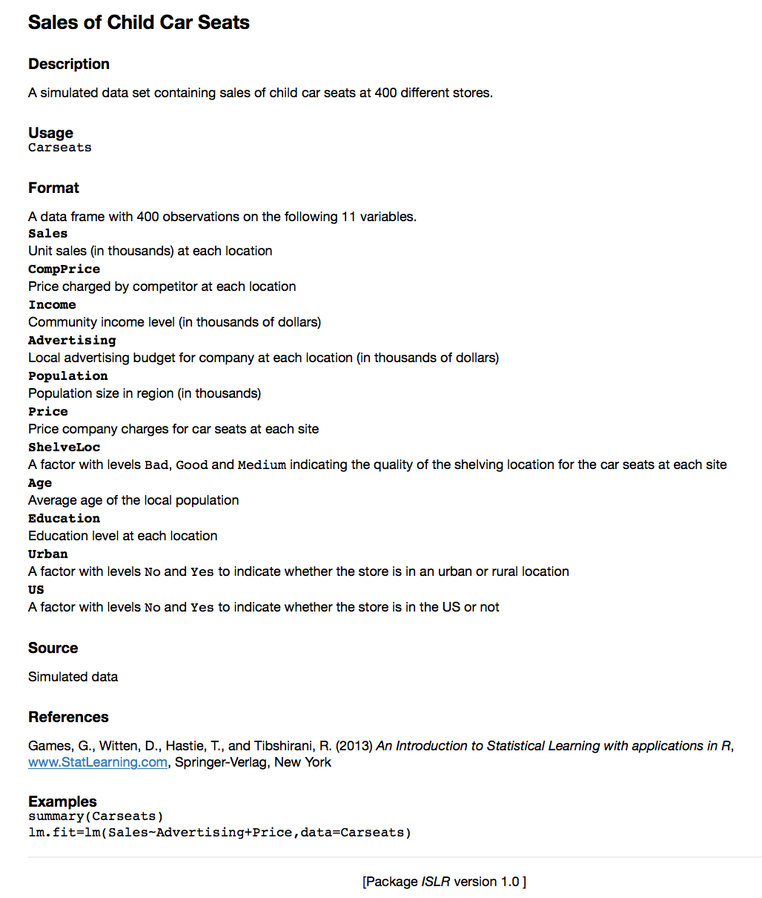

Exploratory data analysis of the variable types.
```{r, eval=TRUE, include=TRUE}
str(Carseats)
```
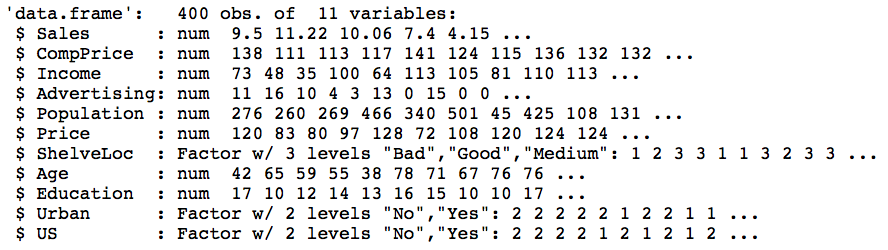

Summary of the features of the dataset.
```{r}
summary(Carseats)
```
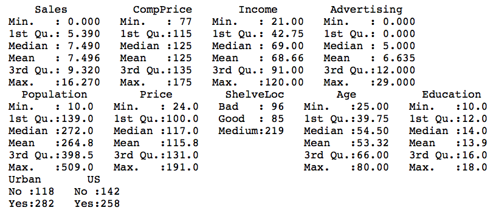

### Splitting the data
```{r}
set.seed(1)
train = sample(1:400, 300)
test = -train

training_data = Carseats[train, ]
testing_data = Carseats[test, ]
```

### Training the model 
```{r}
model = lm(Sales ~ Price +  ShelveLoc, data = training_data)
summary(model)
```
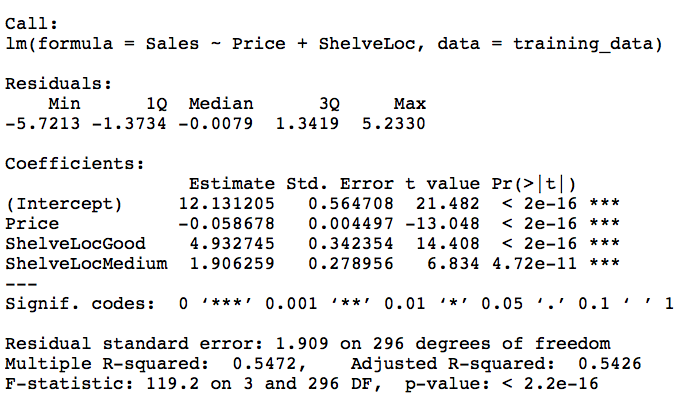

### Dummy variable
```{r}
contrasts(Carseats$ShelveLoc)
```
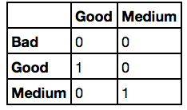

R has created a dummy variable called ShelveLocGood that takes on a value of 1 if the location is good, and 0 otherwise (Bad or Medium). It has also created has created a dummy variable called ShelveLocMeduim that takes on a value of 1 if the location is medium, and 0 otherwise (Good or Bad).

Thus, our model looks like the following:

* *Sales = 12.131205 − (0.058678 × Price) + (4.932745 × ShelveLocGood) + (1.906259 × SelveLocMedium)*