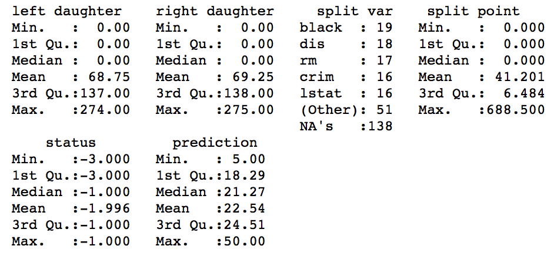
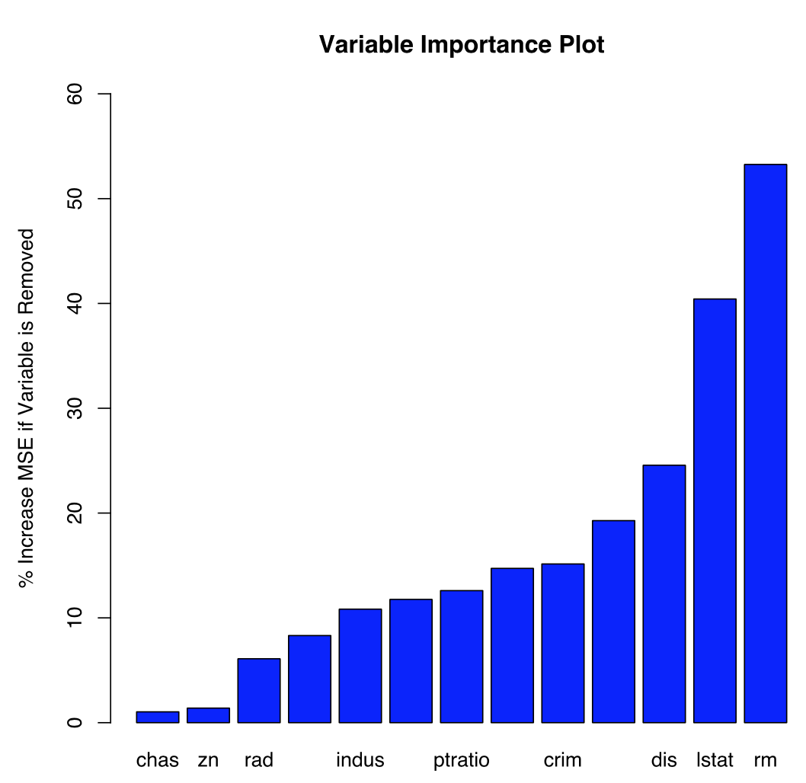

# Random Forest

* The code below demonstrates Random Forest.
* Random Forest is a part of supervised machine learning and thus the dataset is split into **training and testing**.
* The Random Forest algorithm uses **random ensemble decision trees** for regression.
* The ```Boston``` dataset which is a part of the ```MASS``` package in ```R``` is used here. It contains records of the median value of houses for 506 neighborhoods around Boston. The task is to **predict the median house value (medv)**. 
```{r, eval=TRUE}
library(MASS)
?Boston
```


## Implementation in R

The Boston.csv dataset is present in the data folder (or the ```MASS``` package).
```{r, eval=TRUE}
data = read.csv('./data/boston.csv', header = T)
```

Exploratory data analysis of the variable types.
```{r, eval=TRUE, include=TRUE}
str(data)
```


Summary of the features of the dataset.
```{r}
summary(data)
```


Scatter plot matrix to visualize data.
```{r}
plot(data[,-1])
```


### Splitting the dataset

The dataset is split into two parts: *training* and *testing*. The training part is used for fitting the model and the testing part is used for assessing the model. The split is done randomly to eliminate bias. The ```sample()``` function in R is used for generating 400 random samples as training data and the remaining as testing data. 
```{r}
set.seed(100) # to control randomness and get similar results

train = sample(1:506, 400)
test = -train

training_data = data[train, -1]
testing_data = data[test, -1]
```

### Random Forest Model

The ```randomForest()``` function from the ```randomForest``` package is used for fitting the random forest algorithm to the dataset. The argument ```mtry = 6``` indicates that 6 predictors should be considered for each split of the tree. By default, ```randomForest()``` uses p/3 variables when building a random forest regression tree (p = predictors).
```{r}
#install.packages("randomForest")
library(randomForest)

model = randomForest(medv ~ ., data = training_data, mtry = 6, importance = TRUE)
model
```


The model command above shows that the number of trees constructed were 500. Also, the Mean Squared Error (MSE) is 11.043 and the percentage of variance explained by the model is 86.99%. 

The plot below shows the misclassification rate of the model when constructing the random forest. As the forest is built on the training data, each tree is tested on the 1/3rd of the samples (36.8%) not used in building that tree. This internal error estimate, known as the **Out-of-Bag error**, is plotted against the number of trees. 
```{r}
plot(model, main = "Random Forest Model")
```


The ```importance()``` function shows the importance of each variables in constructing the random forest. The important variables are listed below from the most important to the least. The values next to the important variables show the percentage of MSE increased if the variable is removed.
```{r}
imp = importance(model)[,1]
sort(imp, decreasing = TRUE)
```


Each variable is plotted according to its importance below.
```{r}
barplot(sort(imp), 
        col = "red", 
        main = "Variable Importance Plot", 
        ylim = c(0,40),
        ylab = "% Increase MSE if Variable is Removed")
```


Summary statistics for the **first tree** (k = 1) can be found by using the code below.
```{r}
summary(getTree(model, k = 1, labelVar = TRUE))
```


### Prediction and Accuracy

In order to do predictions using the random forest model on the testing data, we use the ```predict()``` function in R.
```{r}
predicted_y = predict(model, testing_data)
```

The Mean Squared Error (MSE) is the average of the squared differences between the actual and predicted values. The MSE for the model is calculated below.
```{r}
testing_y = testing_data$medv

MSE = mean((predicted_y - testing_y)^2)
MSE
```


## Bagging Model

The argument ```mtry = 13``` below indicates that all 13 predictors should be considered for each split of the tree. This is a special case of random forest known as **bagging** since all the predictor variables are included. 
```{r}
#install.packages("randomForest")
library(randomForest)

model = randomForest(medv ~., data = training_data, mtry = 13, importance = TRUE)
model
```


The model command above shows that the number of trees constructed were 500. Also, the Mean Squared Error (MSE) is 11.223 and the percentage of variance explained is by the model is 86.77%. 

The plot below shows the misclassification rate of the model when constructing the random forest. As the forest is built on the training data, each tree is tested on the 1/3rd of the samples (36.8%) not used in building that tree. This internal error estimate, known as the **Out-of-Bag error**, is plotted against the number of trees. 
```{r}
plot(model, main = "Bagging Model")
```


The important variables are listed below from the most important to the least. The values next to the important variables show the percentage of MSE increased if the variable is removed.
```{r}
imp = importance(model)[,1]
sort(imp, decreasing = TRUE)
```


Each variable is plotted according to its importance below.
```{r}
barplot(sort(imp), 
        col = "blue", 
        main = "Variable Importance Plot", 
        ylim = c(0,60),
        ylab = "% Increase MSE if Variable is Removed")
```


Summary statistics for the **first tree** (k = 1) can be found by using the code below.
```{r}
summary(getTree(model, k = 1, labelVar = TRUE))
```


In order to do predictions using the random forest model on the testing data, we use the ```predict()``` function in R.
```{r}
predicted_y = predict(model, testing_data)
```

The Mean Squared Error (MSE) is the average of the squared differences between the actual and predicted values. The MSE for the model is given below.
```{r}
testing_y = testing_data$medv

MSE = mean((predicted_y - testing_y)^2)
MSE
```
