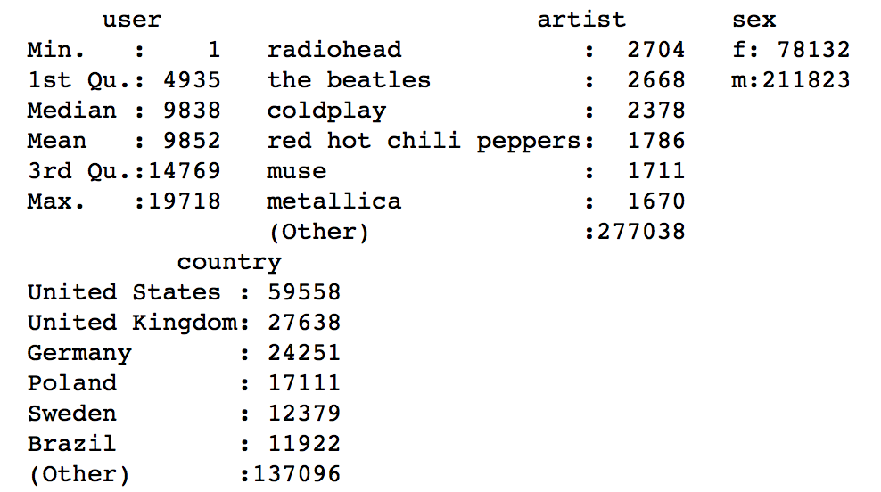
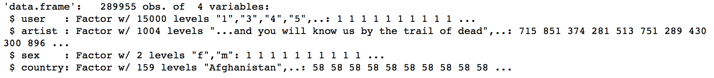
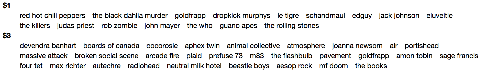
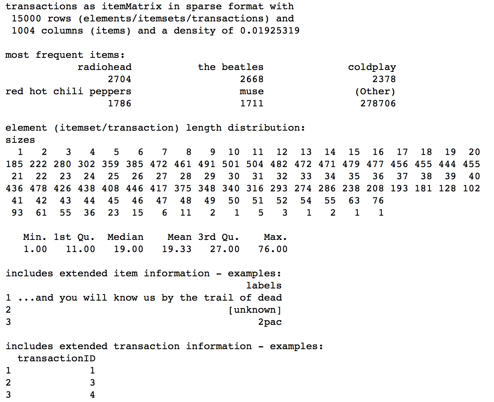
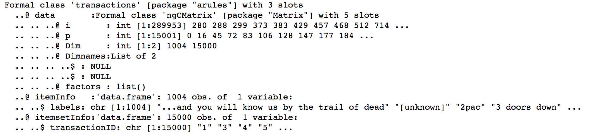
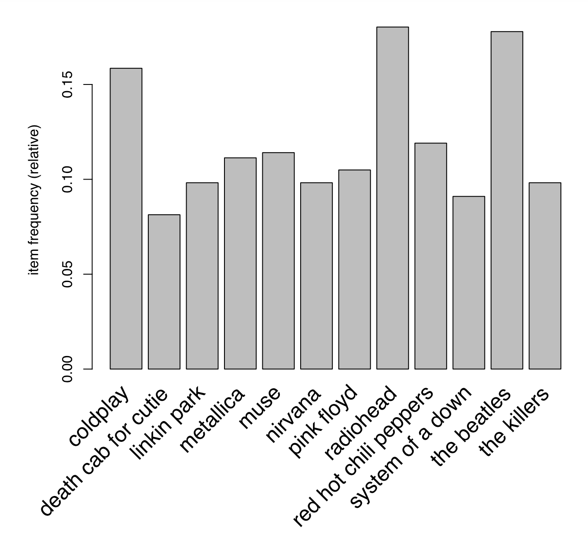
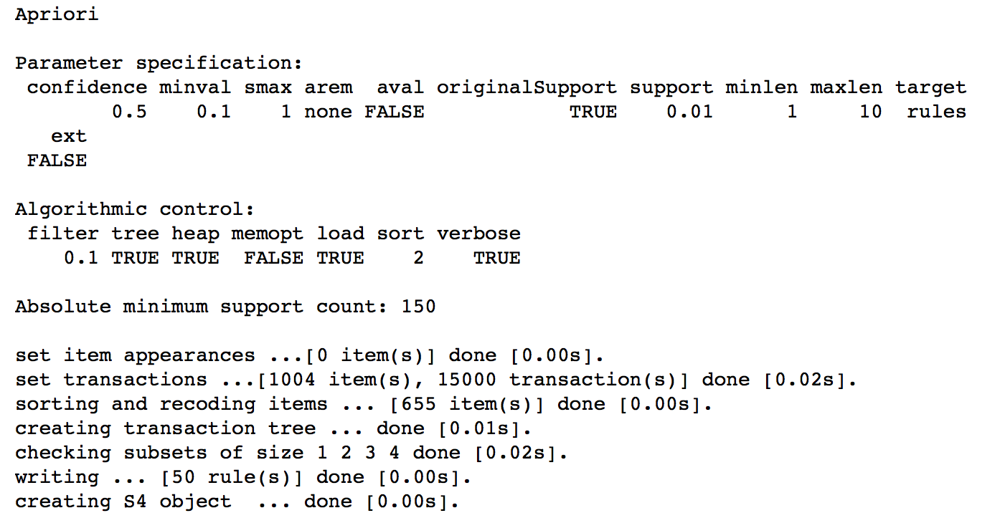
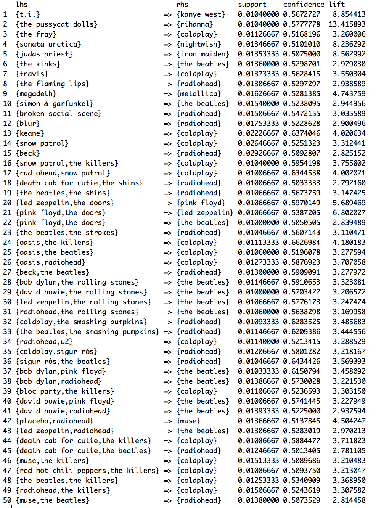

# Apriori Algorithm

* The code below demonstrates the use of the Apriori algorithm. 
* Apriori is a part of unsupervised machine learning and thus there is **no training and testing data**.
* Apriori helps forming association rules and discovering interesting relationships between variables.
* The **music.csv** file present in the data folder is used here. It contains information about the music tastes for different users based on the sex and the country. The Apriori algorithm is implemented to find out music rules based on the association of different artists.

### Implementation in R

The music.csv dataset is present in the data folder.
```{r, eval=TRUE}
music = read.csv('./data/music.csv', header = T)
```

Summary of the features of the dataset.
```{r}
summary(music)
```


Converting the user variable to a factor.
```{r}
music$user = as.factor(music$user)
```

Exploratory data analysis of the variable types.
```{r, eval=TRUE, include=TRUE}
str(music)
```


The ```arules``` package is used for finding association rules.
```{r, eval=TRUE, include=TRUE}
#install.packages("arules")
library(arules)
```

Pre-processing the data by splitting the list of users and removing duplicate artists. 
```{r, eval=TRUE, include=TRUE}
playlist = split(x = music[,"artist"], f = music$user) # split into a list of users
playlist = lapply(playlist, unique) #remove artist duplicates
```

Preview of the pre-processed data. The first 2 listeners (1 and 3) listen to the following bands:
```{r, eval=TRUE, include=TRUE}
playlist[1:2]
```


The code below coerces the dataset to a **transaction**. Once the data has been coerced to transactions it is ready for mining itemsets or rules. Association Rule Learning uses the transaction data files available in R. The transaction class is a direct extension of the ```itemMatrix``` class.
```{r, eval=TRUE, include=TRUE}
playlist = as(playlist,"transactions")
```

Exploratory analysis of the transaction data.
```{r, eval=TRUE, include=TRUE}
summary(playlist)
```


```{r, eval=TRUE, include=TRUE}
str(playlist)
```


The plot below shows **item frequencies > 80% support**. The ```itemFrequencyPlot()``` function creates an item frequency bar plot for inspecting the distribution of the objects in the transaction. This function is a part of the ```arules``` package.
```{r, eval=TRUE, include=TRUE}
itemFrequencyPlot(playlist, support = 0.08, cex.names = 1.5)
```


Finally, we build the association rules with a **support of > 1%** and a **confidence of > 50%**. The ```inspect()``` function is used for inspecting the rules.
```{r, eval=TRUE, include=TRUE}
musicrules = apriori(playlist, parameter = list(support=0.01, confidence =.5))
```


```{r, eval=TRUE, include=TRUE}
inspect(musicrules)
```
