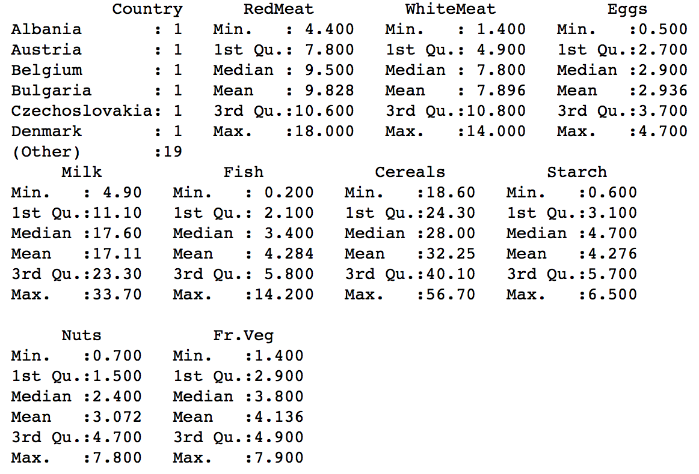
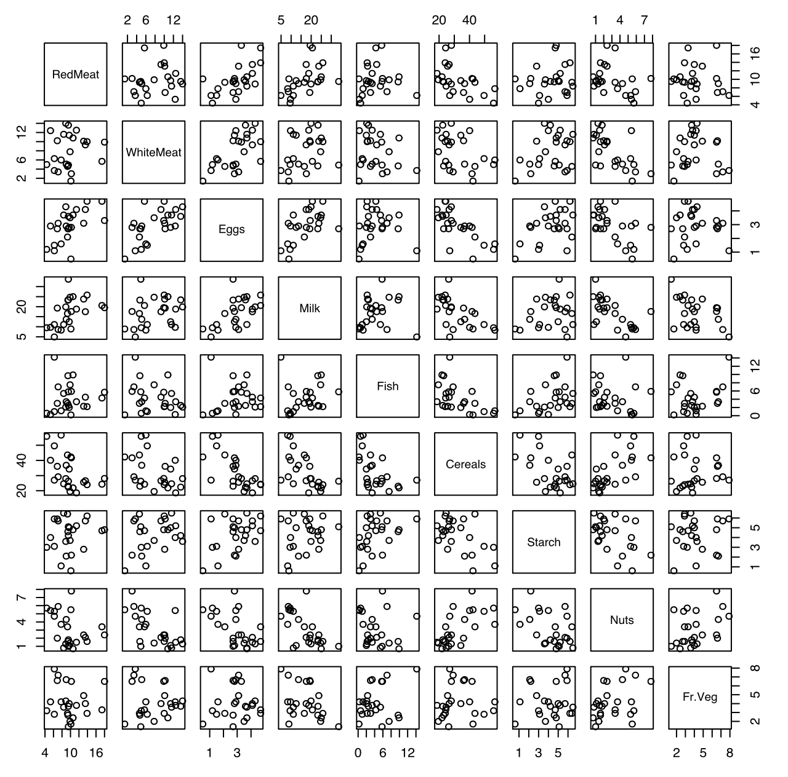

# Hierarchical Clustering

* The code below demonstrates the use of the Hierarchical Clustering.  
* Hierarchical Clustering is a part of unsupervised machine learning and thus there is **no training and testing data**.
* Hierarchical Clustering helps forming clusters of the dataset and getting useful insights.


### Implementation in R

The cluster library is used for demonstrating Hierarchical Clustering. 
```{r}
library(cluster)
??cluster
```

The protein.csv dataset is present in the data folder.
```{r, eval=TRUE}
food = read.csv('./data/protein.csv', header = T)
```

Exploratory data analysis of the variable types
```{r, eval=TRUE, include=TRUE}
str(food)
```


Summary of the features of the dataset
```{r}
summary(food)
```


Plot between each variable to visualize data
```{r}
plot(food[,-1])
```


The `dist()` function returns the distance matrix computed by using a distance measure.
```{r}
dist_matrix = dist(food[,-1])
dist_matrix
```


Hierarchical Clustering is a part of the cluster library. The `agnes()` function computes agglomerative hierarchical clustering of the dataset. 
* The first parameter is the dataset to be clustered.
* The parameter diss = FALSE treats the dataset as a matrix of observations by variables and not as a dissimilarity matrix. 
* The third parameter below specifies to metric to be used for calculating the dissimilarity between the data objects.
* The method parameter defines the clustering method to be used - single, complete, average (default), etc.

Using the **average linkage** hierarchical clustering:
```{r}
avg_clust = agnes(food, diss =FALSE, metric = "euclidian")
str(avg_clust)
```


### Explanation of the model summary:

1. **order** - The final clustering arrangement of the data for each observation.
2. **height** - This is the clustering height (on the dendrogram). IT corresponds to the distance between two cluster. 
3. **ac** - This is the **agglomerative coefficient**. It is a measure of the quality of an agglomerative clustering of the data.
4. **merge** - Negative entries in merge indicate agglomerations of singletons, and positive entries indicate agglomerations of non-singletons.
5. **diss** - The dissimilarity matrix.
6. **call** - The call which produced the result.
7. **method** - The cluster method that has been used.
8. **data** - Iterations to get the best cluster.

Plot and Dendrogram for **average linkage**: 
```{r}
plot(avg_clust, hang = -1)
```


Using the **single linkage** hierarchial clustering:
```{r}
single_clust = agnes(food, diss = FALSE, metric = "euclidian", method = "single")
str(single_clust)
```


Plot and Dendrogram for **single linkage**:
```{r}
plot(single_clust, hang = -1, labels = food$Country)
```


Using the **complete linkage** hierarchial clustering:
```{r}
complete_clust = agnes(food, diss = FALSE, metric = "euclidian", method = "complete")
str(complete_clust)
```


Plot and Dendrogram for **complete linkage**:
```{r}
plot(complete_clust, hang = -1, labels = food$Country)
rect.hclust(complete_clust, 6)
(abline(h=22))
```

