# Classification Decision Tree

* The code below demonstrates Classification Decision Trees. 
* Decision Tree is a part of supervised machine learning and thus the dataset is split into **training and testing**.
* The Decision Tree algorithm uses **Entropy** for classification.
* The **credit.csv** dataset from the data folder is used here. The dataset contains various attributes for predicting whether a given customer would default a loan or not based on various factor such as balance, age, etc. The **dependent variable (default)** can have a value of either 1 (Non-Default) or 2 (Default).

### Implementation in R

The credit.csv dataset is present in the data folder.
```{r, eval=TRUE}
credit = read.csv("./data/credit.csv", header = T)
```

Exploratory data analysis of the variable types.
```{r, eval=TRUE, include=TRUE}
str(credit)
```
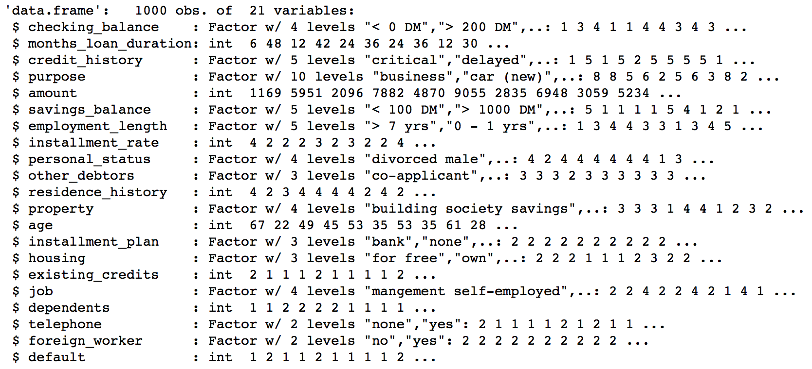

Converting the default variable to factor.
```{r, eval=TRUE, include=TRUE}
credit$default = as.factor(credit$default)
```

Summary of the features of the dataset.
```{r}
summary(credit)
```
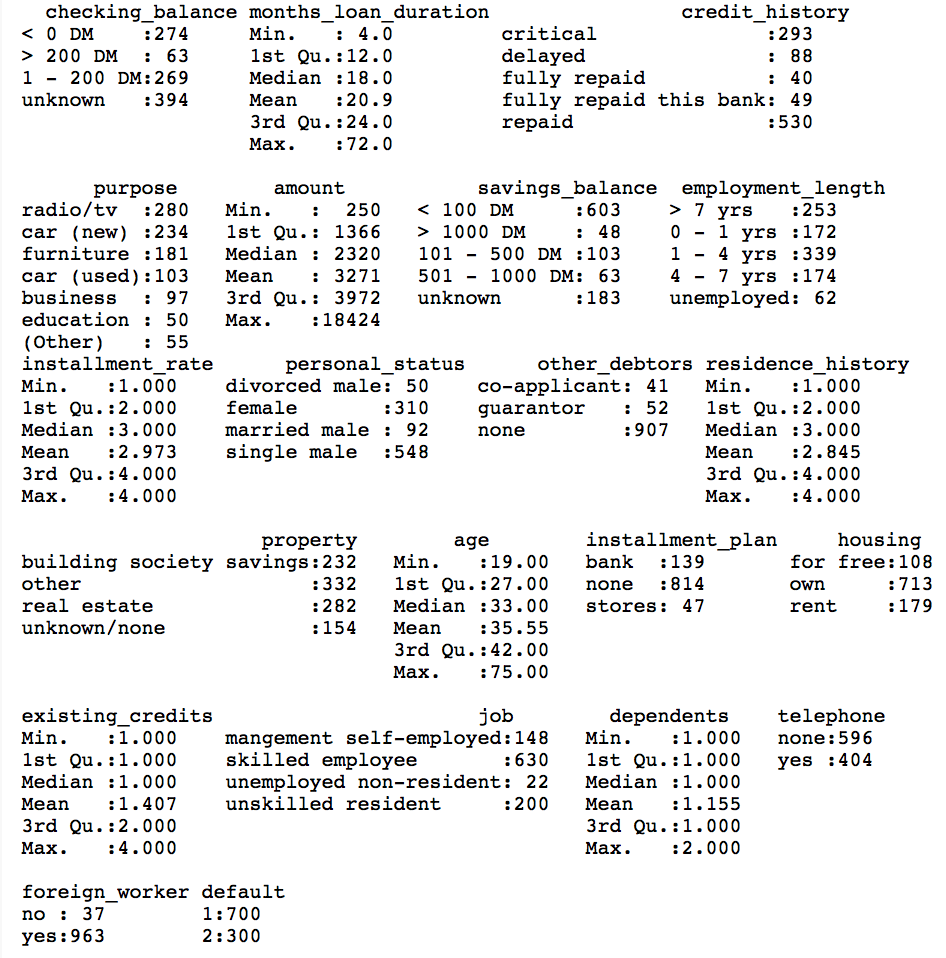

Scatter plot matrix to visualize numeric data.
```{r}
plot(credit[, c(2, 5, 8, 11, 13, 16, 18)])
```
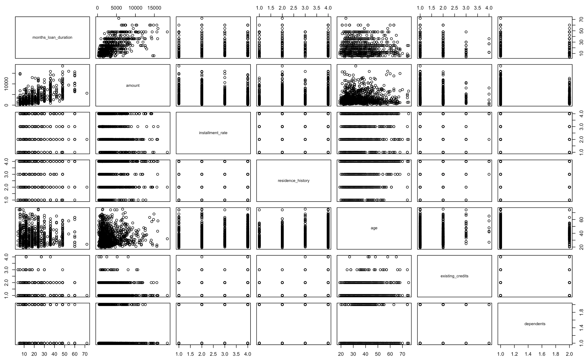

Exploratory analysis of some more variables.
```{r}
table(credit$checking_balance)
```
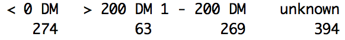

```{r}
table(credit$savings_balance)
```
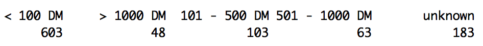

### Splitting the dataset

The dataset is split into two parts: *training* and *testing*. The training part is used for fitting the model and the testing part is used for assessing the model. The split is done randomly to eliminate bias. The ```sample()``` function in R is used for generating 800 random samples as training data and the remaining as testing data. 
```{r}
set.seed(100) # to control randomness and get similar results

train = sample(1:1000, 800)
test = -train

training_data = credit[train,]
testing_data = credit[test,]
```

### Decision Tree Model

The ```tree()``` function from the ```tree``` package is used for fitting the decision tree algorithm to the dataset. 
```{r}
#install.packages("tree")
library(tree)

model = tree(default ~., training_data)
model
```
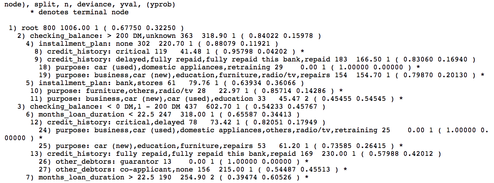

The model command above prints the actual decision tree. A plot of the tree is shown below to make it easy to visualize. In order to see the decisions, we call the ```summary()``` function on the model. 
```{r}
summary(model)
```
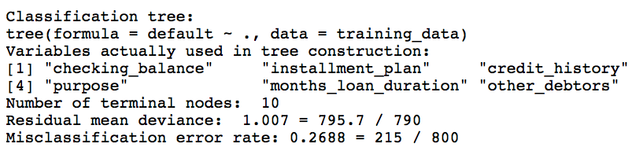

Notice that the output indicates that only 6 variables have been used for constructing the tree. Also, the training Mean Sqaured Error (MSE) is 1.007. The plot of the tree is shown below.
```{r}
plot(model)
text(model, pretty = 0)
```
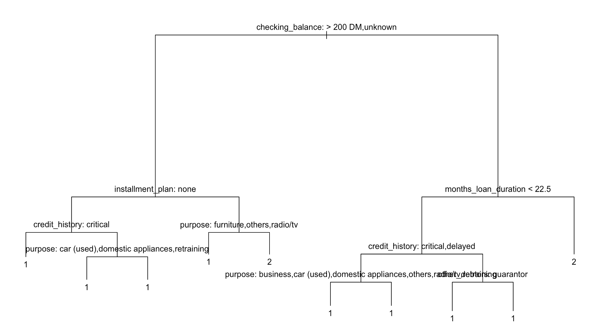

### Prediction and Accuracy

In order to do predictions using the tree model on the testing data, we use the ```predict()``` function in R.
```{r}
predicted_y = predict(model, testing_data, type = "class")
```

A confusion matrix is used for checking the accuracy of the model. The ```confusionMatrix()``` function is a part of the ```caret``` package. It shows the true positives, false positives, true negatives and false negatives and hence the misclassification rate. 
```{r}
#install.packages("caret")
library(caret)
confusionMatrix(testing_data$default, predicted_y)
```
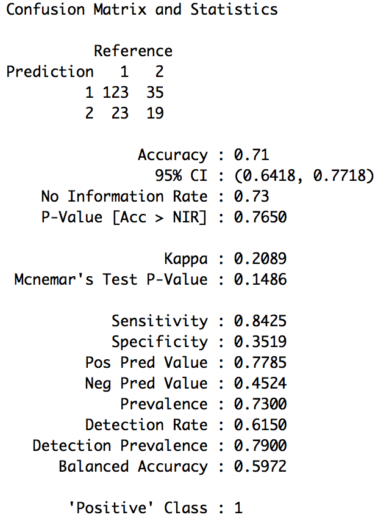

### Tree Pruning

Now, we will see if the tree needs pruning. The function ```cv.tree()``` of the ```tree``` package performs cross validation in order to determine the optimal level of tree complexity. We use the argument ```FUN = prune.misclass``` in order to indicate that we want the classification error rate to guide the cross validation and pruning process rather than the default setting of the function.
```{r}
set.seed(1)
cv_tree_model = cv.tree(model, FUN = prune.misclass)
```

A plot of different tree sizes and thier residual sum of squares is shown below. 
```{r}
plot(cv_tree_model$size, cv_tree_model$dev, type = "b", ylab = "Residual Sum Square (RSS)", xlab = "Tree Size")
```
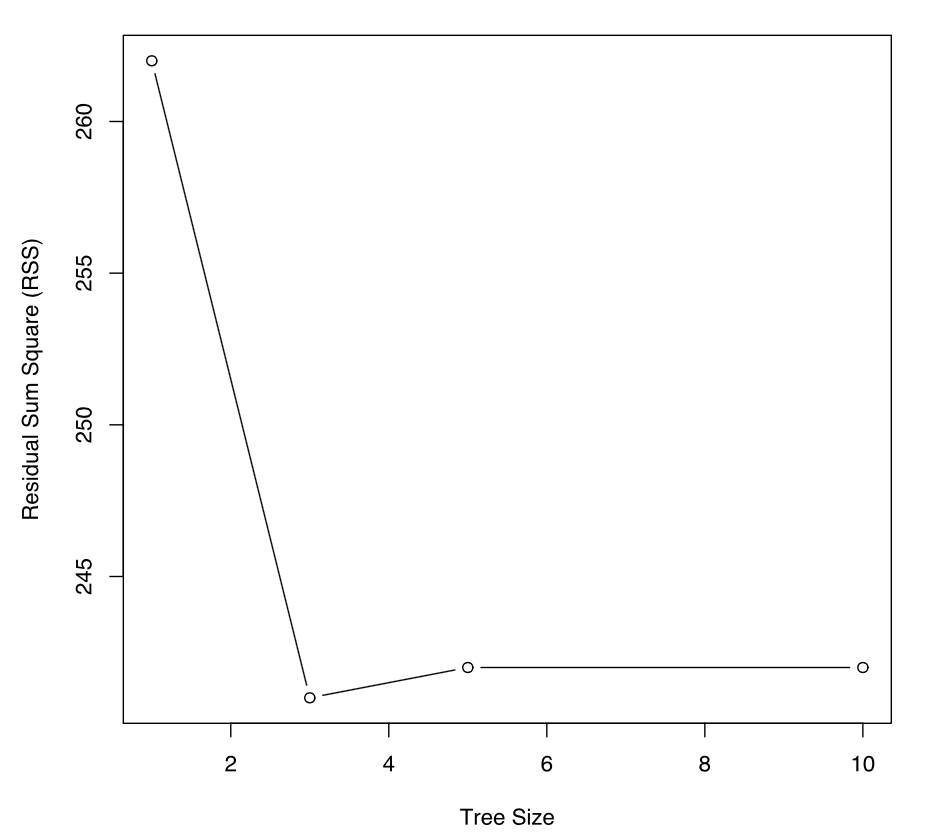

A tree size with the lowest residual sum of squares is desired. The tree with the best size is:
```{r}
cv_tree_model$size[which.min(cv_tree_model$dev)]
```

The above code returns the value **3** which is the best tree size. Thus, a pruned tree of with size 3 is constructed below. 
```{r}
pruned_tree = prune.tree(model, best = 3)

plot(pruned_tree)
text(pruned_tree, pretty = 0)
```
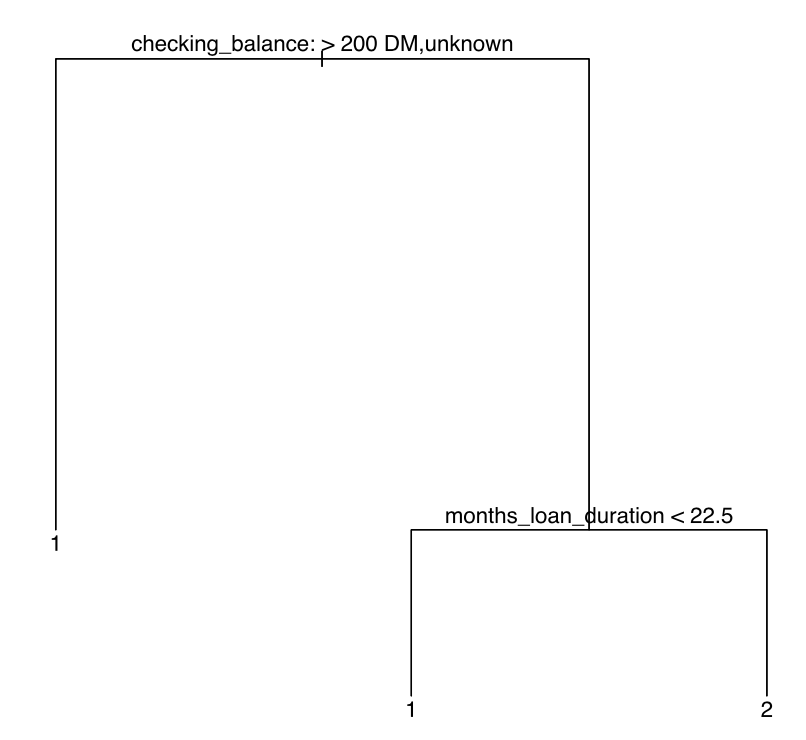

Predictions and accuracy using the pruned tree model:
```{r}
predicted_pruned_y = predict(pruned_tree, testing_data, type = "class")
confusionMatrix(testing_data$default, predicted_pruned_y)
```
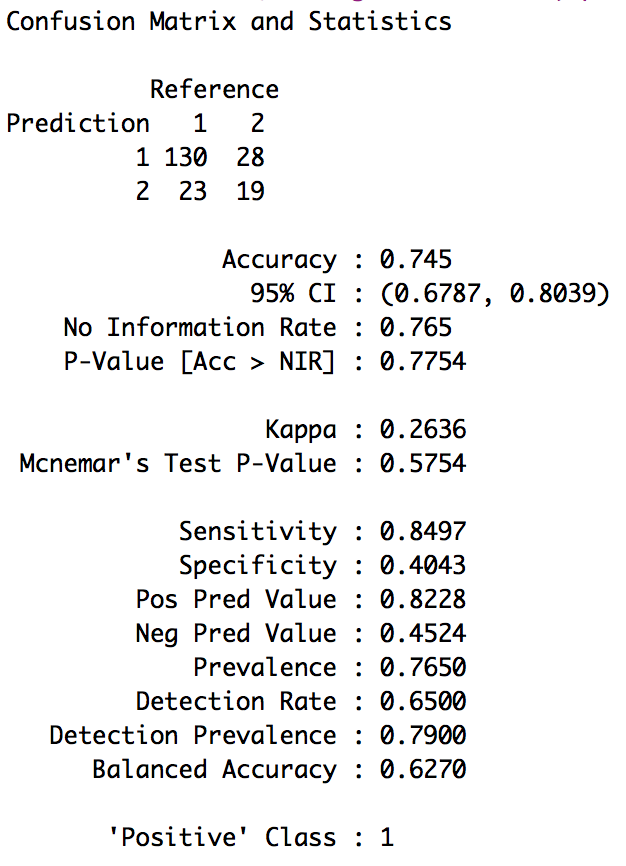

It can be observed that the *pruned tree model gives a higher accuracy* compared to the original tree model.