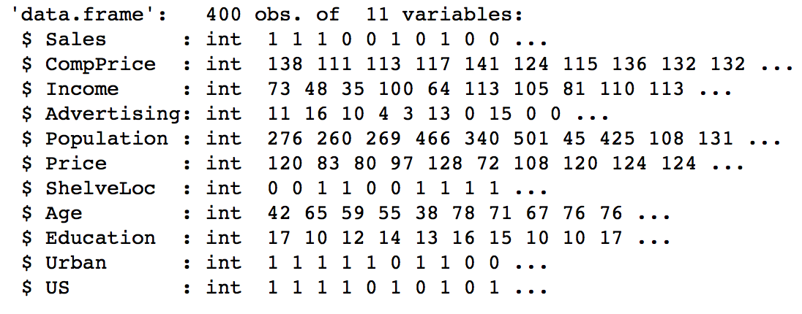
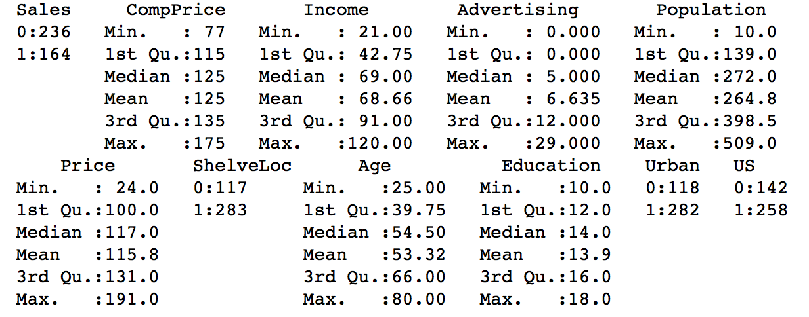

# Logisitic Regression Algorithm

* The code below demonstrates the logistic regression algorithm. 
* Logisitc Regression is a part of supervised machine learning for predicting categorical variables. The dataset is split into **training and testing data**.
* Logistic Regression is used for prediction using the **logit function**. 
* **Dependent Variable** = **medv** 
* Data Source: ```MASS``` library in ```R```.
* library(nnet) used for multinominal logistic regression 

### Implementation in R

The carseats.csv dataset is present in the data folder.
```{r, eval=TRUE}
carseats = read.csv(file.choose(), header = TRUE)
```

Exploratory data analysis of the variable types.
```{r, eval=TRUE, include=TRUE}
str(carseats)
```


Converting categorical variables to factor
```{r, eval=TRUE, include=TRUE}
carseats$Sales = as.factor(carseats$Sales)
carseats$ShelveLoc = as.factor(carseats$ShelveLoc)
carseats$Urban = as.factor(carseats$Urban)
carseats$US = as.factor(carseats$US)
```

Summary of the features of the dataset.
```{r}
summary(carseats)
```


Scatter plot matrix to visualize numeric data.
```{r}
plot(carseats[,c(-1,-7,-10,-11)])
```


Splitting the dataset into training and testing data. This is done by randomly selecting 400 observations for testing and the rest for training. The ```sample()``` function generates 400 random values for splitting the dataset.
```{r}
set.seed(100)

train = sample(1:400, 300)
test = -train

training_data = carseats[train,]
testing_data = carseats[test,]
```

building a logistic regression model using all predictors the dependent variable is sales 

Creating a linear model on the *training data* using the ```lm()``` function in R and checking the model summary. 
```{r}
model = glm(Sales ~.,data = training_data, family =binomial(link="logit"))
model
```
```{r}
summary(model)
```

The varaiables that are significant at the 0.05 alpha level are:
1. CompPrice
2. Income
3. Advertising
4. Price
5. ShelveLoc1
6. Age

## Fitting a logistic model using only significant predictors found above.
model_2 <- glm(Sales ~ CompPrice + Income + Advertising + Price + ShelveLoc + Age, data = training_data, family = "binomial")
model_2
summary(model_2)


## Based on the model, it can be agreed that the sales are high when money is invested in advertising.
## This is because the coefficient of the Advertising variable is positive and highly significant. Also, 
## a unit increase on the amount spent in advertising increases the sales by 0.163208 units.
## Also, according to the model, since the Price of the carseat has a negative coefficient, 
## for a sales actually decreases by 0.104214 for a unit increase in the price. Thus, based on the model
## I agree with the boss. 

## Predicting the sales on the testing dataset. 
## A threshold value of 50% is used to predict whether the sales 
## are going to be high or low on the testing data.

logistic_probs = predict(model_2, testing_data, type = "response")

for(i in 1:100){
  if (logistic_probs[i] >= 0.500){
    logistic_probs[i] = 1
  }
  if (logistic_probs[i] < 0.500){
    logistic_probs[i] = 0
  }
}

## Using the caret library for confusion matrix
library(caret)
confusionMatrix(testing_data$Sales, logistic_probs)

## Misclassification error rate = (7+4)/100 = 0.11
```{r}
testing_y = testing_data$medv
predicted_y = predict(model,testing_data)
```

Assessing the model on testing data. Confusion matrix
```{r}
install.packages("e1071")
library(e1071)
confusionMatrix(testing_y,predicted_y)
```

MSE
```{r}
mean((predicted_y-testing_y)^2)
```

Removing the non-significant variables and then try the model (not done here):
```{r}
model.final = lm(medv ~ , data = training_data)
summary(model)
```

Dealing with interaction terms
```{r}
model = lm(mdev ~ log(lstat) + rm, data = training_data)
summary(model)
```
```{r}
model = lm(mdev ~ log(lstat)*rm, data = training_data)
summary(model)
```
get all two-way interaction terms (possibility of over-fitting)
```{r}
model = lm(mdev ~ (.)^2, data = training_data)
summary(model)
```

get all three-way & two-way interaction terms (possibility of over-fitting)
```{r}
model = lm(mdev ~ (.)^3, data = training_data)
summary(model)
logistic_probs = predict(model, testing_data, type = "response")
head(logistic_probs)
```

# log(odds = p-admitted/(1-p-admitted)) = -25.161 + 0.2Exam1 + 0.2Exam2

# Some other plots between the predictor significant and dependent variables
library(popbio)
logi.hist.plot(curlen, sexcode, boxp = F, type = "count", col = "gray",
               xlabel = "size")
               
### Visualize the coefficients to see how far they are from zero.
install.packages("coefplot")
library(coefplot)
coefplot(model1)

## zoom into the estimates of the variables without the intercept
coefplot(model, coefficients = c('Year','Lag1','Lag2','Lag3','Lag4','Lag5','Volume'))
coefplot(model1, coefficients = c('Year','Lag1','Lag2','Volume'))


## Assess model1

predict_y = predict(model1, testing_data,type = "response")
head(predict_y)

# create the categorical varible using the predicted probabilities 

predicted_y_cat = rep("Down",252)
predicted_y_cat[predict_y > 0.5] = "Up"

testing_y = testing_data$Direction

# Create the confusion matrix 

table(testing_y,predicted_y_cat)

# accuracy
mean(testing_y == predicted_y_cat)

# Multinomial Logistic Regression:

library(nnet)

# Read the data from CSV
data <- read.csv(file.choose(),header = T)

#Predictor Variables
Age <- data$Age

# REsponse Variable
choice <- data$Choice

#Regression Model
model_1 <- multinom(choice ~ Age, data = data)

summary(model_1)

# Logistic REgression Example 2

# Read the data from CSV
data2 <- read.csv(file.choose(),header = T)
str(data2)

#Regression Model
model_2 <- multinom(data2$Loan.approval ~ Age+Salary, data = data2)

summary(model_2)