# Logistic Regression Algorithm

* The code below demonstrates Logistic Regression. 
* Logistic Regression is a part of supervised machine learning and thus the dataset is split into **training and testing**.
* Logistic Regression is used for prediction using the **logit** function. 
* The *carsales* dataset present in the data folder is used here. It contains information about the make, price, cost, etc. for cars. The **dependent variable is Sales** which is an indication of whether the car was sold or not. 

### Implementation in R

The carsales dataset is present in the data folder.
```{r, eval=TRUE}
carsales = read.csv("./data/carsales", header = TRUE)
```

Exploratory data analysis of the variable types.
```{r, eval=TRUE, include=TRUE}
str(carsales)
```


Converting categorical variables to factor.
```{r, eval=TRUE, include=TRUE}
carsales$Sales = as.factor(carseats$Sales)
carsales$ShelveLoc = as.factor(carseats$ShelveLoc)
carsales$Urban = as.factor(carseats$Urban)
carsales$US = as.factor(carseats$US)
```

Summary of the features of the dataset.
```{r}
summary(carsales)
```


Scatter plot matrix to visualize numeric data.
```{r}
plot(carsales[,c(-1,-7,-10,-11)])
```
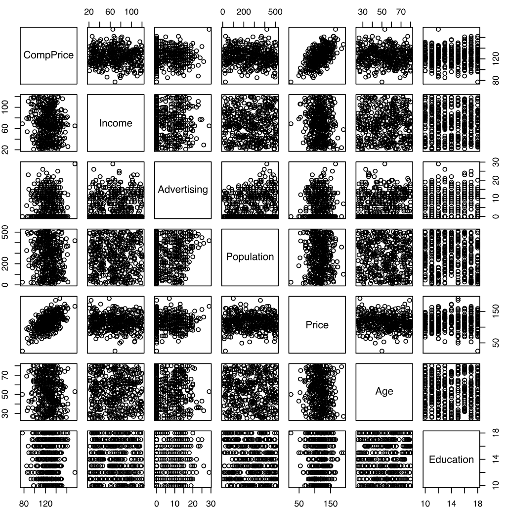


### Splitting the dataset

The dataset is split into two parts: *training* and *testing*. The training part is used for fitting the model and the testing part is used for assessing the model. The split is done randomly to eliminate bias. The ```sample()``` function in R is used for generating 300 random samples as training data and the remaining as testing data. 
```{r}
set.seed(100) # to control randomness and get similar results

train = sample(1:400, 300)
test = -train

training_data = carsales[train,]
testing_data = carsales[test,]
```

### Logistic Model

The ```glm()``` function is used for performing logistic regression in R. The logit model is *fitted* on the training data. The ```family``` parameter in ```glm()``` is used for specifying the ```logit``` function.
```{r}
model = glm(Sales ~.,data = training_data, family = binomial(link = "logit"))
model
```
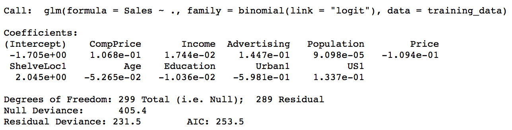

The ```model``` command above only gives us basic information about the regression model. For more detailed information, we use the ```summary()``` function. The summary gives us information about the p-values, null deviance, AIC and Fisher Scoring iterations for the the logistic model.
```{r}
summary(model)
```
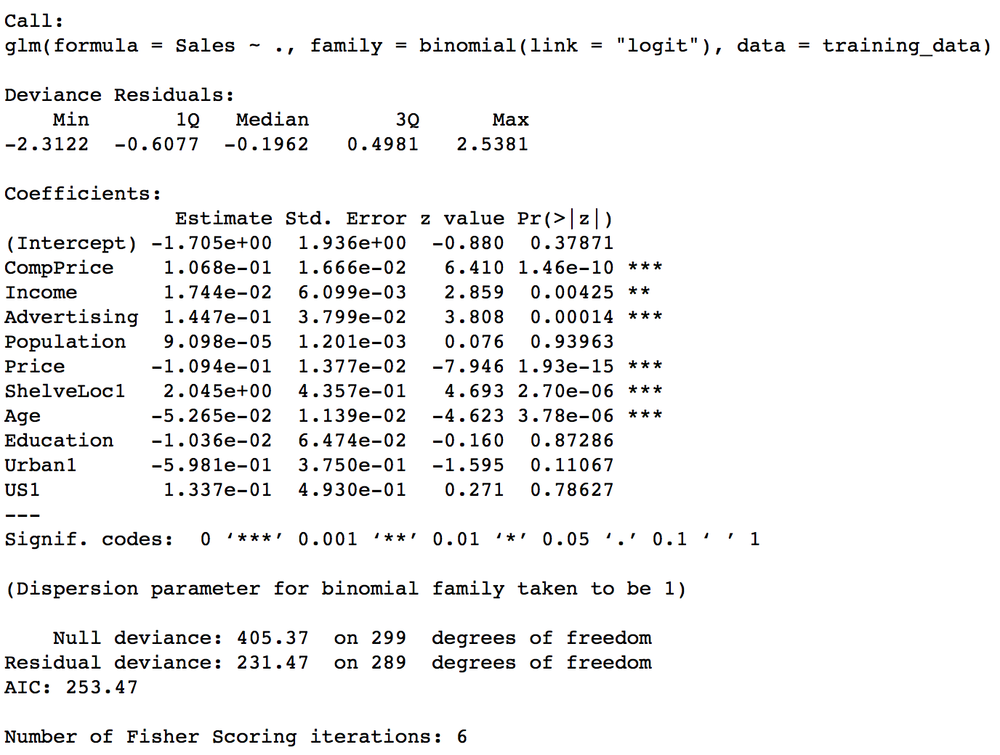

We can use the ```names()``` function to see what other pieces of information are stored in our linear model. 
```{r}
names(model)
```


To obtain the confidence interval for the coefficients of the model, we can use the ```confint()``` function.
```{r}
confint(model, level = 0.95)
```
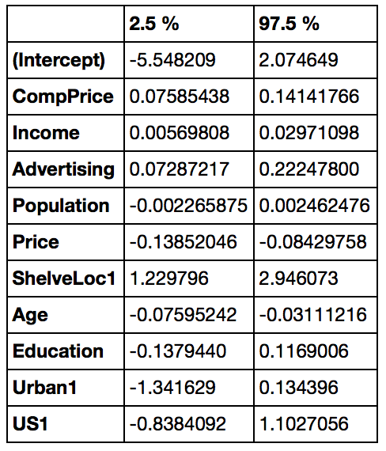

### Checking for collinearity

We want to make sure that the predictor variables that are highly correlated are not in the same model together. The checking for collinearity is done in 2 ways - *VIF* and *Correlation*.

**Variance Inflation Factor (VIF)**

The VIF criteria is used for checking if one or more of the independent variables are correlated with each other in the model. VIF is given by the **formula**: 

VIF = 1/(1-RSquared)

R-Squared is a measure of how much variation in data is captured by the independent variables. The higher the VIF for a variable, the variable would be highly correlated with at least one of the other predictors in the model. A VIF value of *1* is the best. In order to check VIF in R, we use the function ```vif()``` which is found in an R package called ```car```. 
```{r}
#install.packages("car")
library(car)
vif(model)
```
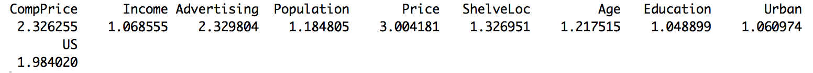

From the above output, we notice that there is **no** variable which has a significantly high VIF (> 5). We can also check the correlation between variables to confirm this observation.

**Correlation**

The ```cor()``` function in R computes the correlation matrix.
```{r}
corr_matrix = round(cor(training_data[,c(-1,-7,-10,-11)]), 2)
corr_matrix
```
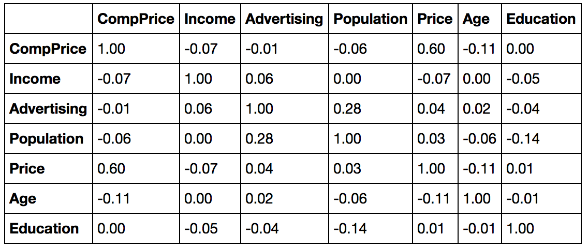

In order to visualize the correlations between the variables, the ```corrplot()``` function from the ```corrplot``` R package is used. The first argument for the ```corrplot()``` function is the *correlation matrix*, and the second argument is the *ordering method* of the variables. In this case we used the **hierarchical clustering** technique to order them.
```{r}
#install.packages("corrplot")
library(corrplot)
corrplot(corr_matrix, order = "hclust")
```
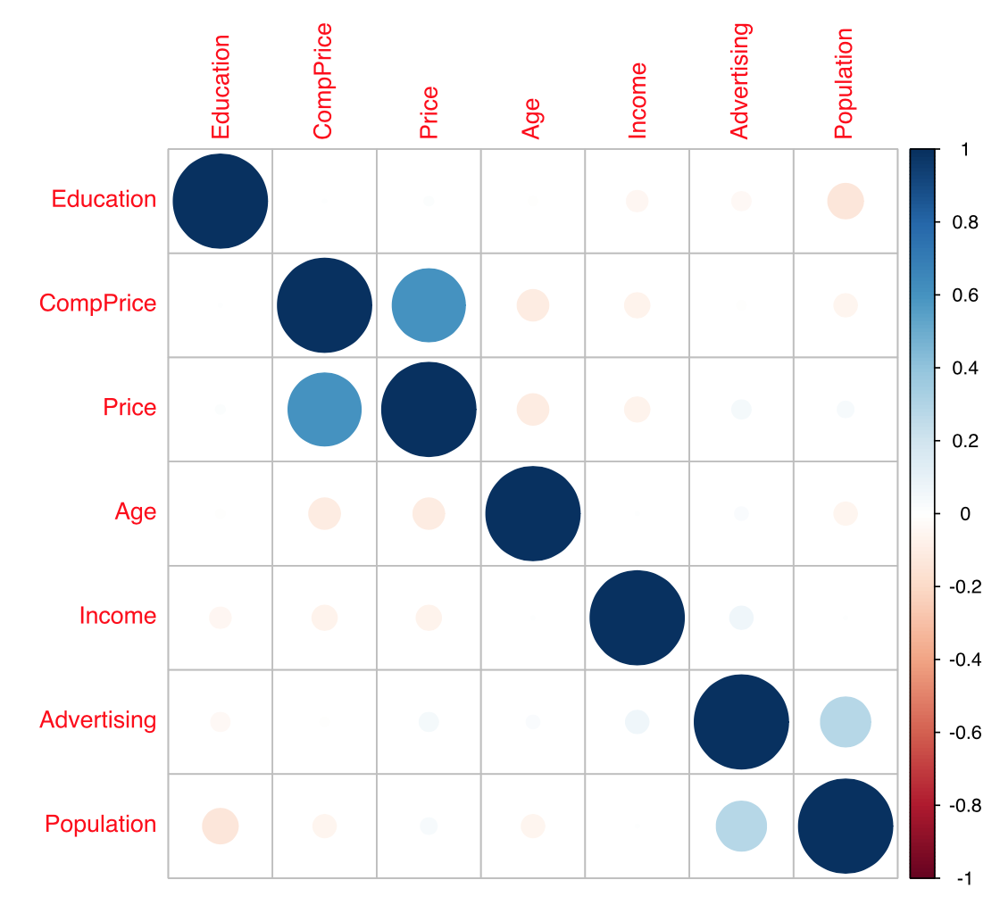

The above plot confirms that none of the variables are highly correlated.

We now visualize the other coefficients to see how far they are from zero. This is done by using the ```coeflot()``` function which is a part of the ```coefplot``` library. 
```{r}
#install.packages("coefplot")
library(coefplot)
coefplot(model)
```
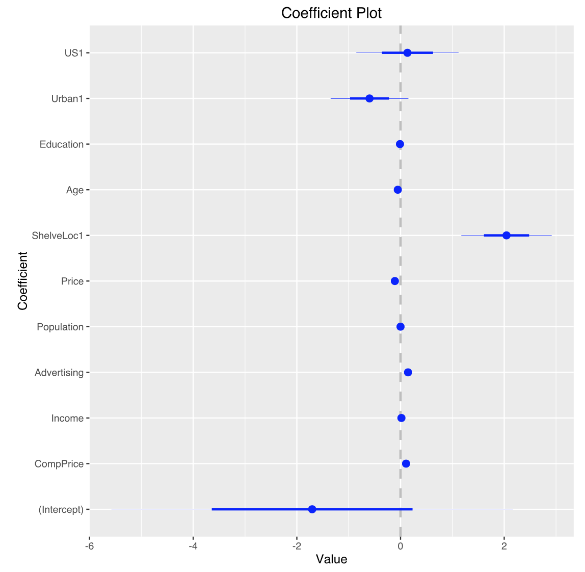

Thus, after removing the non-significant variables, we can get the final model which will be can be used for testing the data.
```{r}
model.log = glm(Sales ~ CompPrice + Income + Advertising + Price + ShelveLoc + Age, 
                data = training_data, 
                family = binomial(link = "logit"))
summary(model.log)
```


Thus, our final equation for the logistic regression model is:

* *log(odds = Sales/(1 - Sales)) = -2.15131 + (0.10513 x CompPrice) + (0.01804 x Income) + (0.14640 x Advertising) - (0.10831 x Price) + (2.07546 x ShelveLoc1) - (0.05278 x Age)*

### Prediction and Accuracy

In order to do predictions using the final model on the testing data, we use the ```predict()``` function in R. 
```{r}
logistic_probs = predict(model.log, testing_data, type = "response")
```

A threshold of 50% is used for predicting whether the sales are going to be made or not for the testing data. The *for loop* below converts all the probabilities greater than or equal to 50% to 1 (indicating sales) or 0 otherwise (indicating no sales).
```{r}
for(i in 1:100){
  if (logistic_probs[i] >= 0.500){
    logistic_probs[i] = 1
  }
  if (logistic_probs[i] < 0.500){
    logistic_probs[i] = 0
  }
}
```

A confusion matrix is used for checking the accuracy of the model. The ```confusionMatrix()``` function is a part of the ```caret``` package. It shows the true positives, false positives, true negatives and false negatives and hence the misclassification rate. 
```{r}
#install.packages("caret")
library(caret)
confusionMatrix(testing_data$Sales, logistic_probs)
```
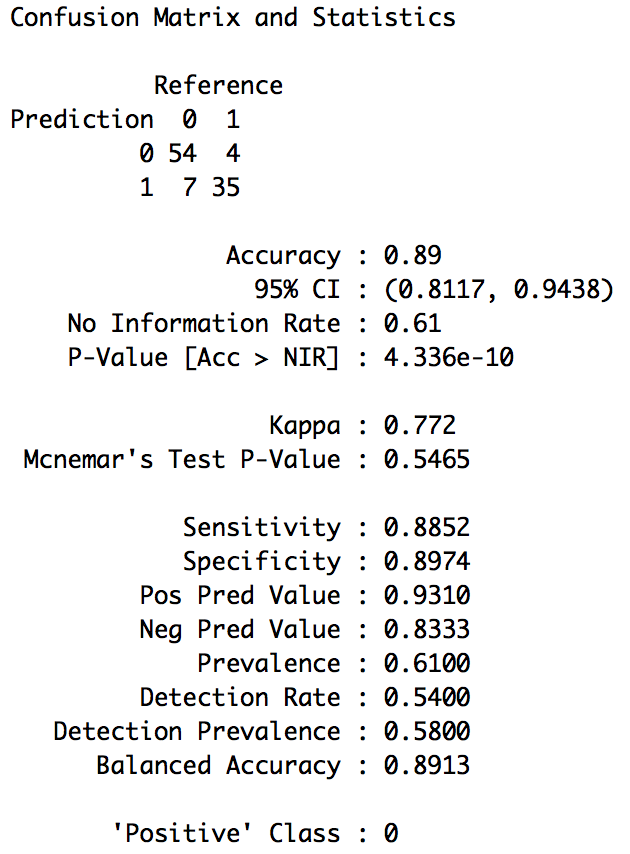

The misclassification rate of the model is given by:
```{r}
(7+4)/(54+4+7+35)
```
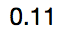

The misclassification rate is 11%.

The accuracy of the model is calculated below.
```{r}
mean(testing_data$Sales == logistic_probs)
```
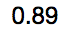


### Dealing with Interaction Terms

Getting all 2-way interaction terms (possibility of over-fitting):
```{r}
model.two = glm(Sales ~ (.)^2, data = training_data, family = binomial(link = "logit"))
model.two
```
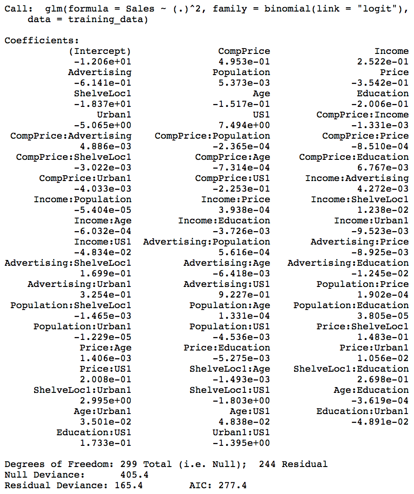

Getting all 3-way & 2-way interaction terms (only code below, output not shown):
```{r}
model.three = glm(Sales ~ (.)^2, data = training_data, family = binomial(link = "logit"))
model.three
```


# Multinomial Logistic Regression:

* The loan_approval dataset from the data folder is used here for demonstrating Multinomial Logistic Regression.
* The dependent variable, Loan approval, contains 3 categories - Yes, No and Withstand.
* The ```nnet``` library is required in R to perform Multinomial Logistic Regression.

```{r}
#install.packages("nnet")
library(nnet)
```

The **loan_approval** dataset is present in the data folder.
```{r, eval=TRUE}
data = read.csv("./data/loan_approval.csv", header = TRUE)
```

Exploratory data analysis of the variable types.
```{r, eval=TRUE, include=TRUE}
str(data)
```
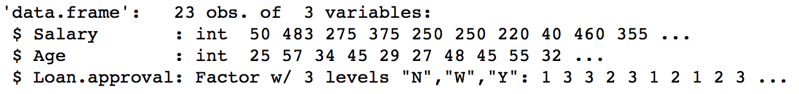

Summary of the features of the dataset.
```{r}
summary(data)
```
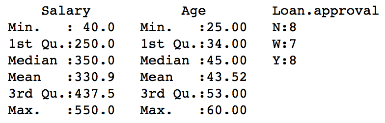

Scatter plot matrix to visualize numeric data.
```{r}
plot(data[,-3])
```
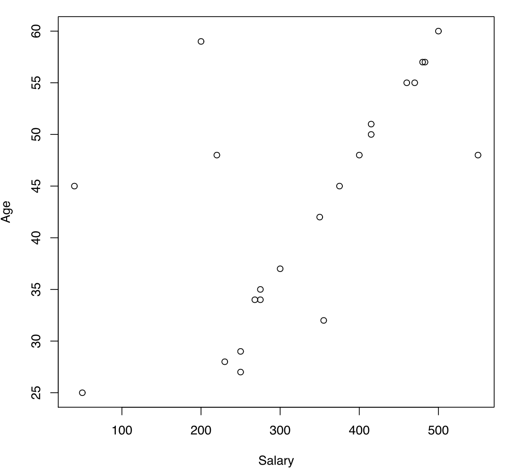

### Splitting the dataset

The dataset is split into two parts: *training* and *testing*. The training part is used for fitting the model and the testing part is used for assessing the model. The split is done randomly to eliminate bias. The ```sample()``` function in R is used for generating 15 random samples as training data and the remaining as testing data. 
```{r}
set.seed(100) # to control randomness and get similar results

train = sample(1:23, 15)
test = -train

training_data = data[train,]
testing_data = data[test,]
```

### Logistic Model

The ```multinom()``` function from the ```nnet``` package is used for performing multinomial logistic regression in R. The logit model is *fitted* on the training data. The ```summary``` function is then used for getting detailed information about the p-values, residual deviance and AIC for the logistic model.

```{r}
model_2 = multinom(Loan.approval ~ Age+Salary, data = testing_data)
summary(model_2)
```
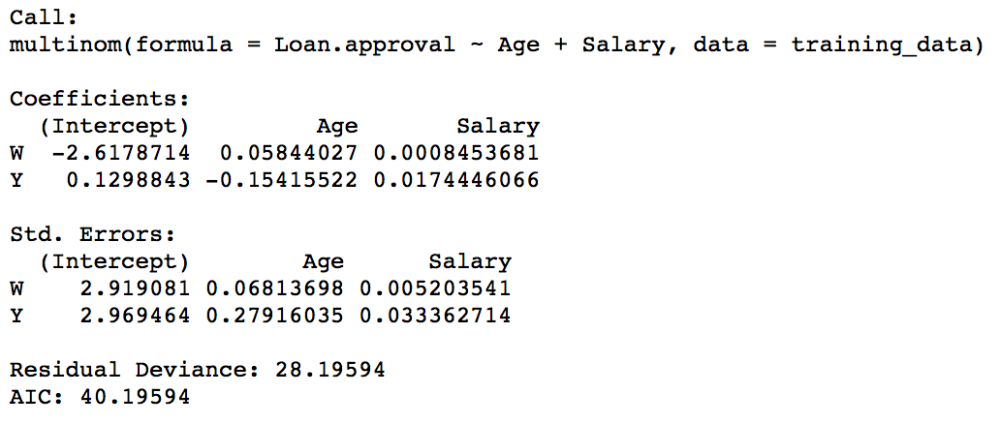

### Prediction and Accuracy

In order to do predictions using the final model on the testing data, we use the ```predict()``` function in R. 
```{r}
logistic_probs = predict(model_2, testing_data)
logistic_probs
```
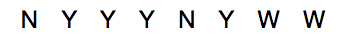

A confusion matrix is used for checking the accuracy of the model. The ```confusionMatrix()``` function is a part of the ```caret``` package. It shows the true positives, false positives, true negatives and false negatives and hence the misclassification rate. 
```{r}
#install.packages("caret")
library(caret)
confusionMatrix(testing_data$Loan.approval, logistic_probs)
```
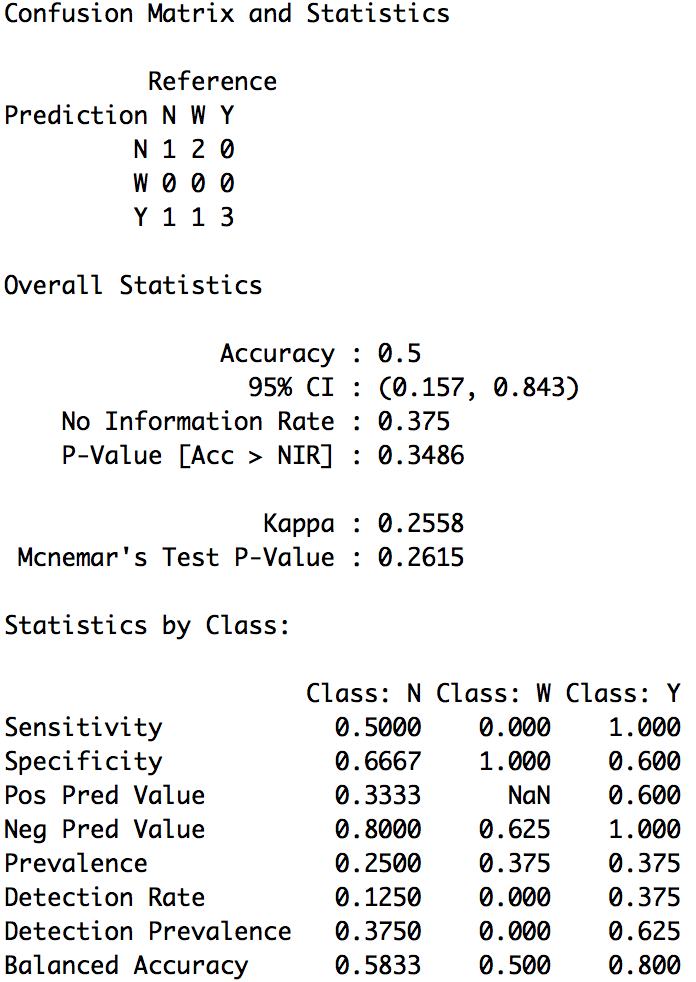