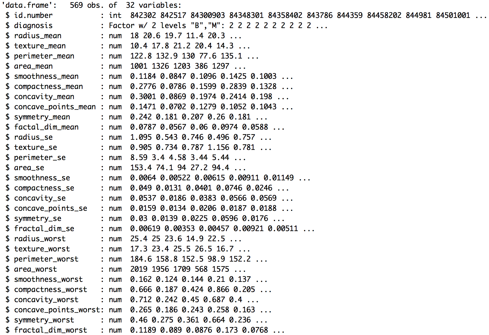
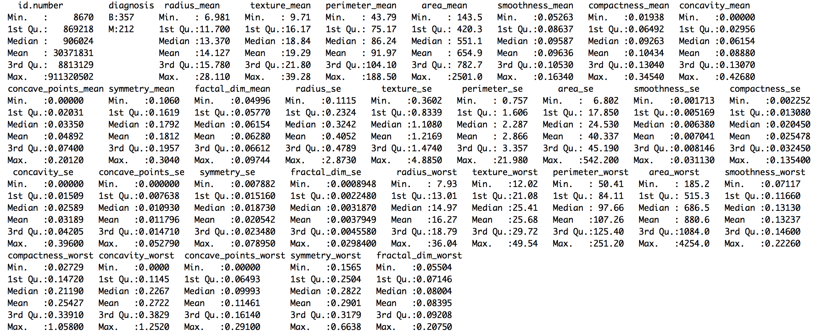
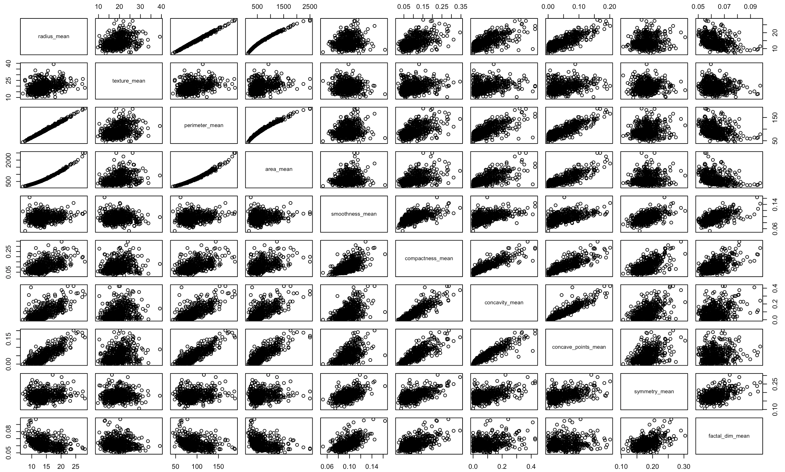
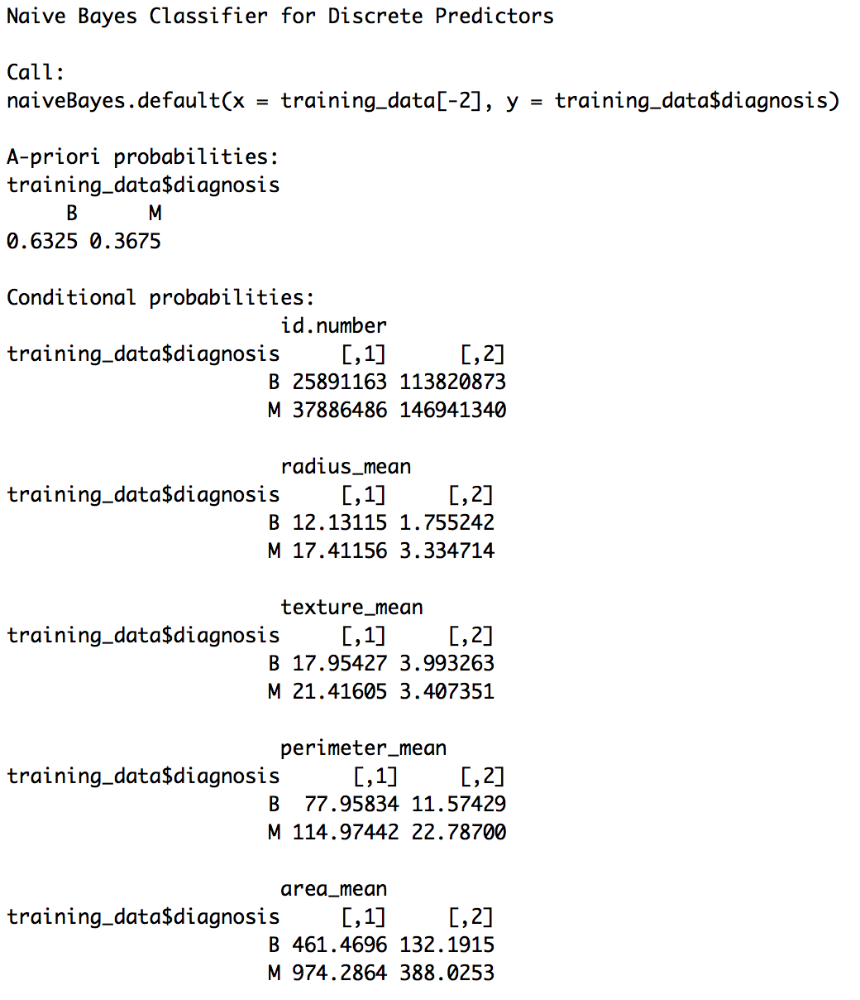
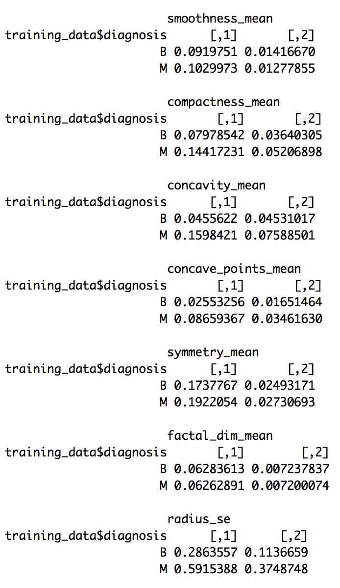
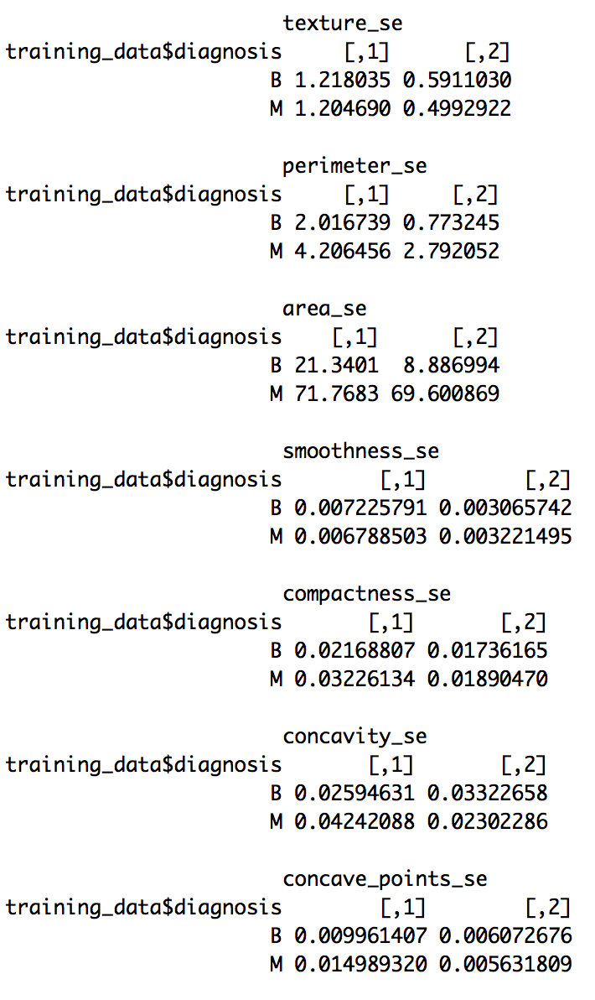
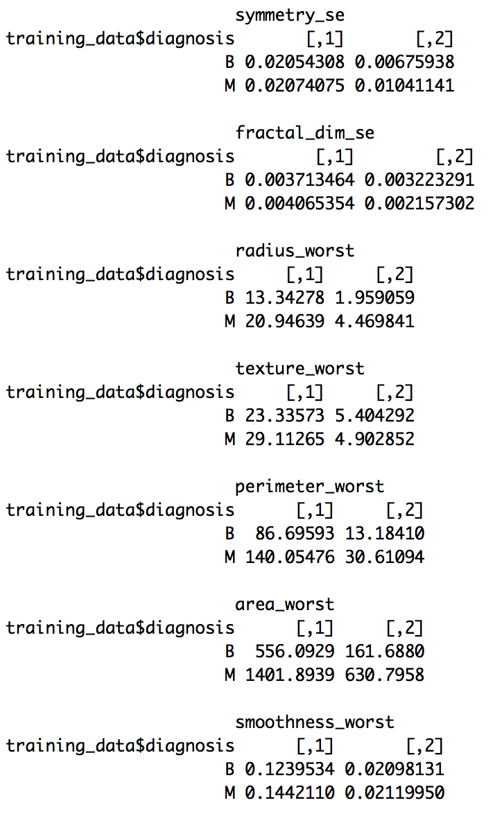
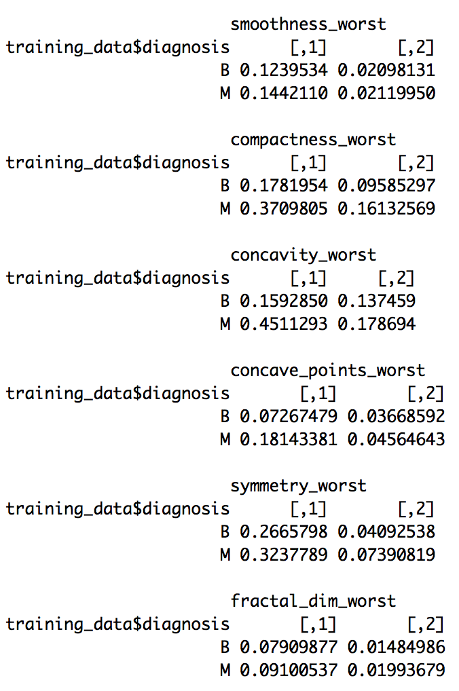
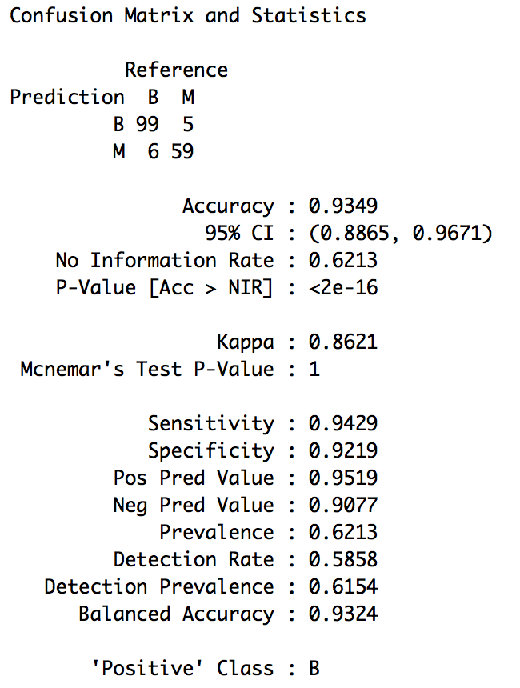
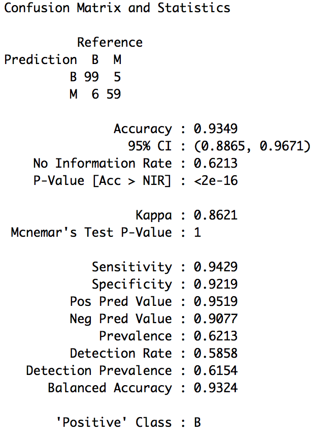

# Naive Bayes Classification
* The file contains breast cancer data.
* The task  is to identify diagnosis type (M or B) from given dataset using Naive Bayes Algorithm.
* The diagnosis is coded as M to indicate malignant or B to indicate benign. )

## Implementation in R

The credit.csv dataset is present in the data folder.
```{r, eval=TRUE}
cancer = read.csv("./data/wisc_bc_data.csv", header = T)
```

Exploratory data analysis of the variable types.
```{r, eval=TRUE, include=TRUE}
str(cancer)
```


Summary of the features of the dataset.
```{r}
summary(letters)
```


Visualization of the mean value of the variables. 
```{r}
plot(cancer[,c(3:12)])
```


### Splitting the dataset

The dataset is split into two parts: *training* and *testing*. The training part is used for fitting the model and the testing part is used for assessing the model. The split is done randomly to eliminate bias. The ```sample()``` function in R is used for generating 400 random samples as training data and the remaining as testing data. 
```{r}
set.seed(100) # to control randomness and get similar results

train = sample(1:569, 400)
test = -train

training_data = cancer[train,]
testing_data = cancer[test,]
```

### Naive Bayes Model

```{r}
#install.packages("e1071")
library(e1071)

model <- naiveBayes(training_data[-2], training_data$diagnosis)
model
```






### Prediction and Accuracy

In order to do predictions using the SVM model on the testing data, we use the ```predict()``` function in R.
```{r}
predicted_y = predict(bestmodel, testing_data)
```

A confusion matrix is used for checking the accuracy of the model. The ```confusionMatrix()``` function is a part of the ```caret``` package. It shows the true positives, false positives, true negatives and false negatives and hence the misclassification rate. 
```{r}
#install.packages("caret")
library(caret)
confusionMatrix(testing_data$letter, predicted_y)
```



# improving naive bayes model - laplace smoothing
```{r}
model_improved = naiveBayes(training_data[-2], training_data$diagnosis, laplace = 1)
predicted_y_improved <- predict(model_improved, testing_data)
confusionMatrix(testing_data$diagnosis, predicted_y_improved)
```
