# Random Forest

* The code below demonstrates Random Forest.
* Random Forest is a part of supervised machine learning and thus the dataset is split into **training and testing**.
* The Random Forest algorithm uses **random ensemble decision trees** for classification.
* The **credit.csv** dataset from the data folder is used here. The dataset contains various attributes for predicting whether a given customer would default a loan or not based on various factor such as balance, age, etc. The **dependent variable (default)** can have a value of either 1 (Non-Default) or 2 (Default).

## Implementation in R

The credit.csv dataset is present in the data folder.
```{r, eval=TRUE}
credit = read.csv("./data/credit.csv", header = T)
```

Exploratory data analysis of the variable types.
```{r, eval=TRUE, include=TRUE}
str(credit)
```


Converting the default variable to factor.
```{r, eval=TRUE, include=TRUE}
credit$default = as.factor(credit$default)
```

Summary of the features of the dataset.
```{r}
summary(credit)
```
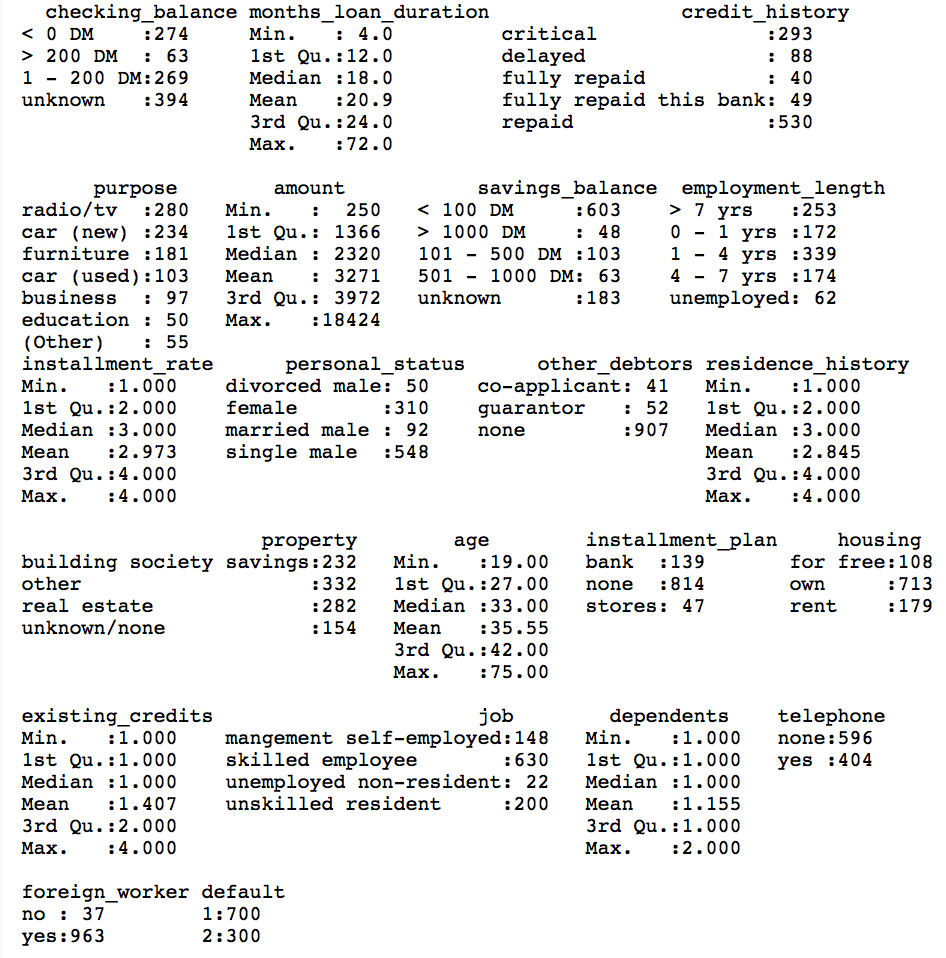

Scatter plot matrix to visualize numeric data.
```{r}
plot(credit[, c(2, 5, 8, 11, 13, 16, 18)])
```
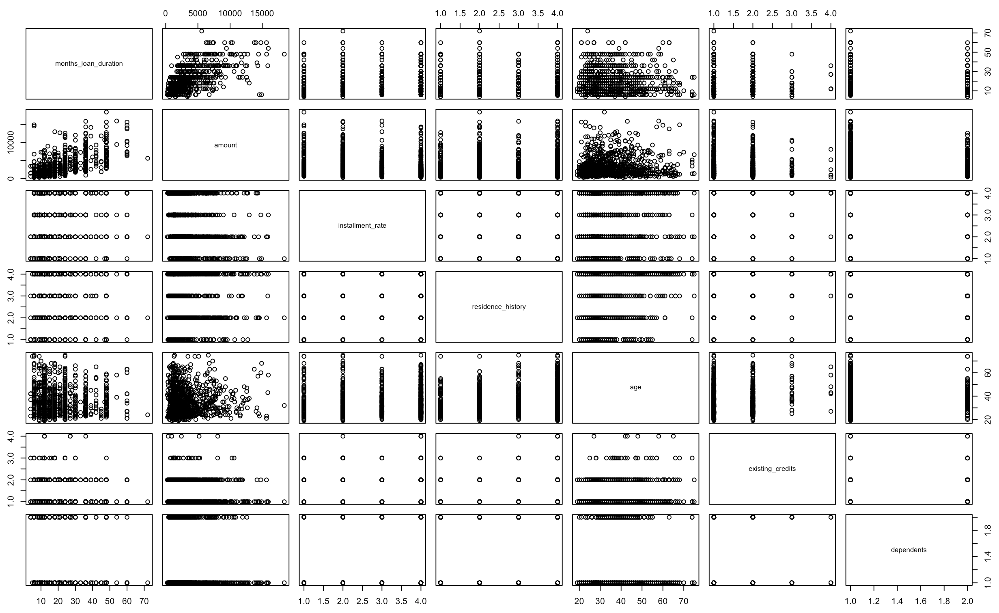

Exploratory analysis of some more variables.
```{r}
table(credit$checking_balance)
```
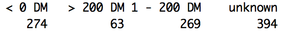

```{r}
table(credit$savings_balance)
```


### Splitting the dataset

The dataset is split into two parts: *training* and *testing*. The training part is used for fitting the model and the testing part is used for assessing the model. The split is done randomly to eliminate bias. The ```sample()``` function in R is used for generating 800 random samples as training data and the remaining as testing data. 
```{r}
set.seed(100) # to control randomness and get similar results

train = sample(1:1000, 800)
test = -train

training_data = credit[train,]
testing_data = credit[test,]
```

### Random Forest Model

The ```randomForest()``` function from the ```randomForest``` package is used for fitting the random forest algorithm to the dataset. The argument ```mtry = 6``` indicates that 6 predictors should be considered for each split of the tree. By default, ```randomForest()``` uses sqrt(p) variables when building a random forest classification tree (p = predictors).
```{r}
#install.packages("randomForest")
library(randomForest)

model = randomForest(medv ~., data = training_data, mtry = 6, importance = TRUE)
model
```
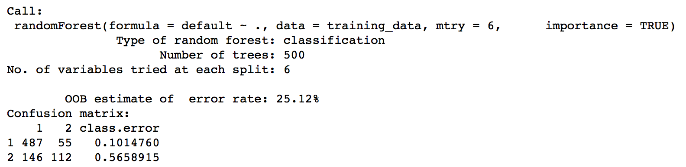

The model command above shows that the number of trees constructed were 500. Also, the error rate is 25.12%. The confusion matrix shows the class error rate. A plot of the error rate for the model is shown below.
```{r}
plot(model)
```
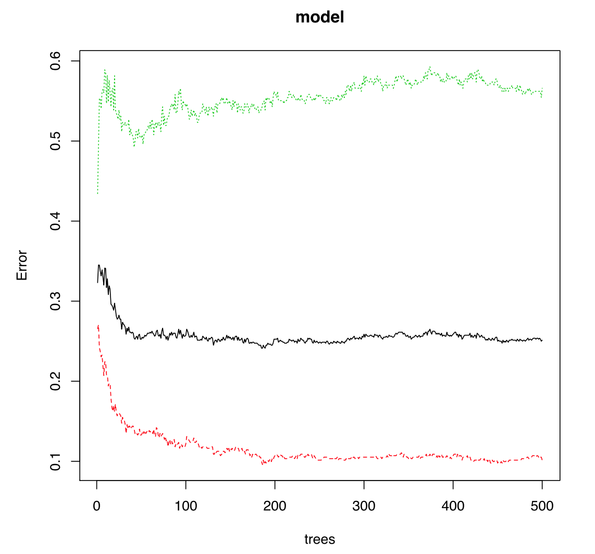

Using the ```importance()``` function, we can view the importance of each variable:
```{r}
imp = importance(model)[,1]
barplot(sort(imp), col = "red", main = "Variable Importance Plot", ylab = "% Increase MSE if Variable is Removed")
```
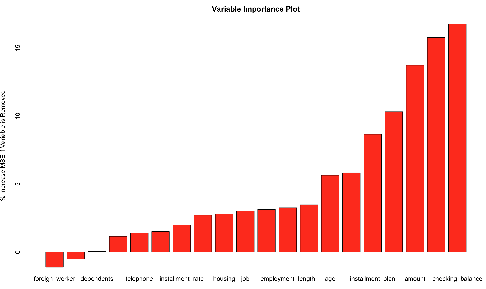

Summary statistics for the first tree (k = 1) can be found by using the code below.
```{r}
summary(getTree(model, k = 1, labelVar = TRUE))
```
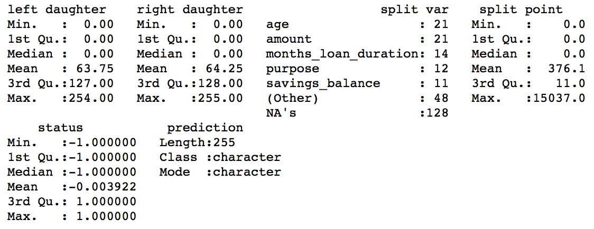

### Prediction and Accuracy

In order to do predictions using the random forest model on the testing data, we use the ```predict()``` function in R.
```{r}
predicted_y = predict(model, testing_data)
```

A confusion matrix is used for checking the accuracy of the model. The ```confusionMatrix()``` function is a part of the ```caret``` package. It shows the true positives, false positives, true negatives and false negatives and hence the misclassification rate. 
```{r}
#install.packages("caret")
library(caret)
confusionMatrix(testing_data$default, predicted_y)
```
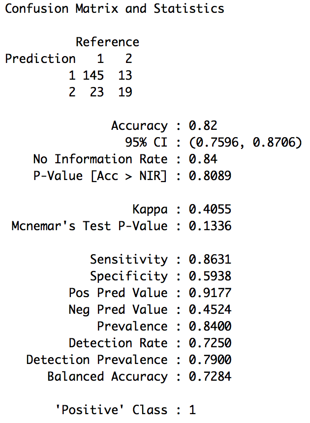

## Bagging Model

The ```randomForest()``` function from the ```randomForest``` package is used for fitting the random forest algorithm to the dataset. The argument ```mtry = 13``` below indicates that all 13 predictors should be considered for each split of the tree. This is a special case of random forest known as **bagging** since all the predictor variables are included. 
```{r}
#install.packages("randomForest")
library(randomForest)

model = randomForest(default ~., data = training_data, mtry = 13, importance = TRUE)
model
```


The model command above shows that the number of trees constructed were 500. Also, the error rate is 24.75%. A plot of the MSE for the model is shown below.
```{r}
plot(model)
```
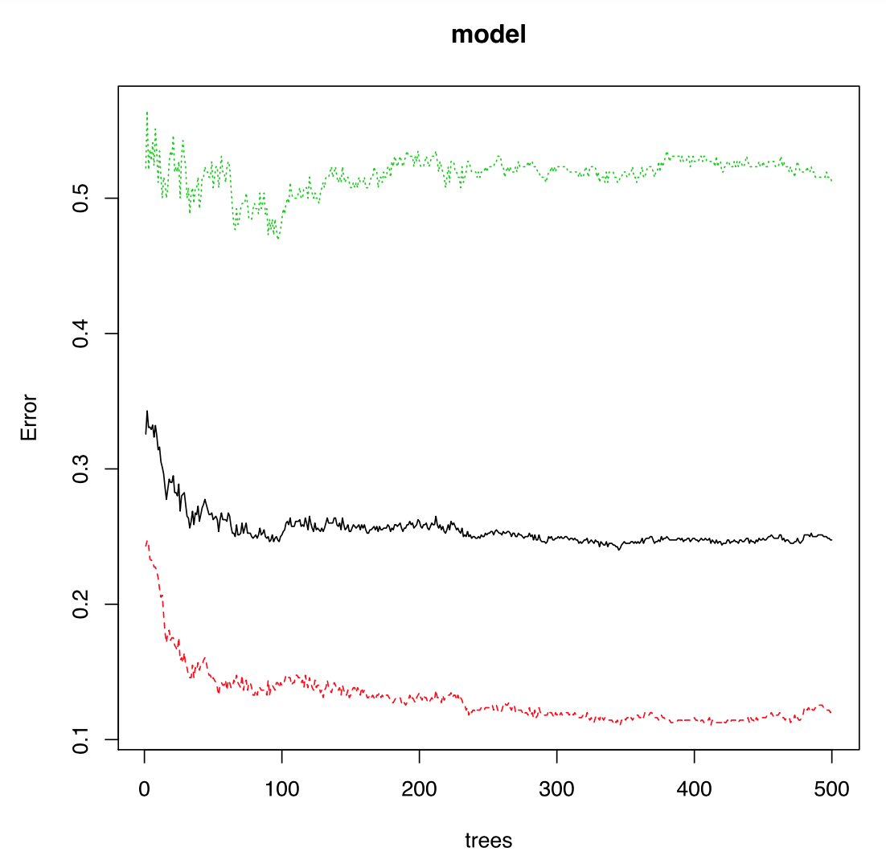

Using the ```importance()``` function, we can view the importance of each variable:
```{r}
imp = importance(model)[,1]
barplot(sort(imp), col = "blue", main = "Variable Importance Plot", ylab = "% Increase MSE if Variable is Removed")
```
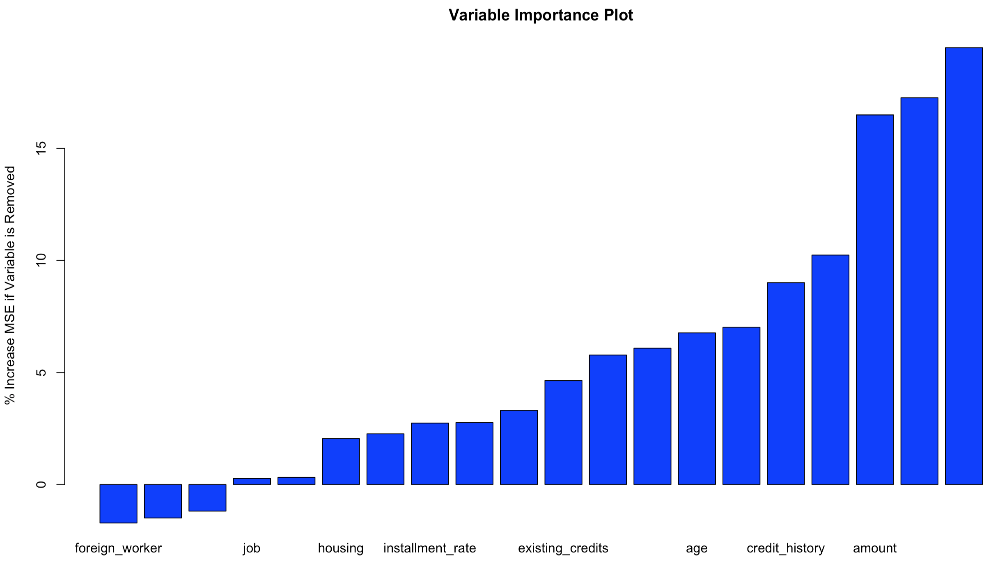

Summary statistics for the first tree (k = 1).
```{r}
summary(getTree(model, k = 1, labelVar = TRUE))
```
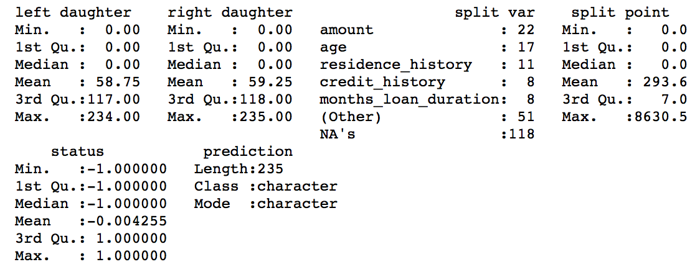

In order to do predictions using the random forest model on the testing data, we use the ```predict()``` function in R.
```{r}
predicted_y = predict(model, testing_data)
```

The confusion matrix for the above predictions is shown below.
```{r}
confusionMatrix(testing_data$default, predicted_y)
```
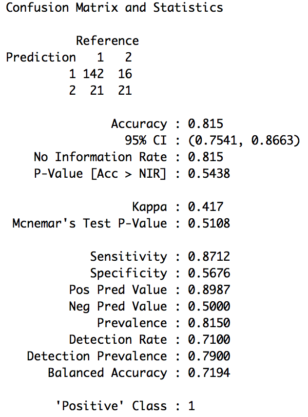