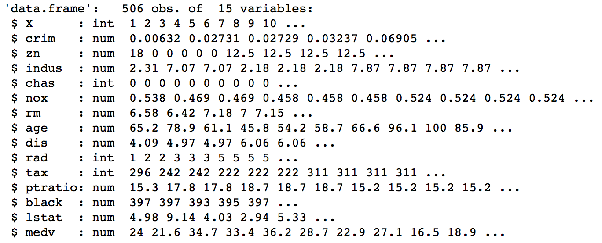
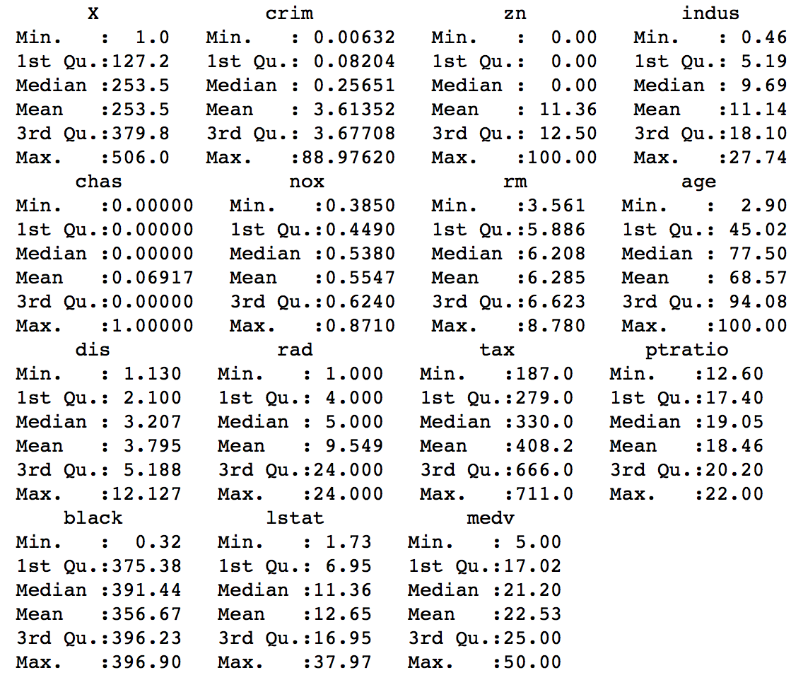

# Regression Decision Tree

* The code below demonstrates Regression Decision Trees.
* Decision Tree is a part of supervised machine learning and thus the dataset is split into **training and testing**.
* The Decision Tree algorithm uses **Entropy** for classification.
* The ```Boston``` dataset which is a part of the ```MASS``` package in ```R``` is used here. It contains records of the median value of houses for 506 neighborhoods around Boston. The task is to **predict the median house value (medv)**. 
```{r, eval=TRUE}
library(MASS)
?Boston
```


## Implementation in R

The Boston.csv dataset is present in the data folder (or the ```MASS``` package).
```{r, eval=TRUE}
data = read.csv('./data/boston.csv', header = T)
```

Exploratory data analysis of the variable types.
```{r, eval=TRUE, include=TRUE}
str(data)
```


Summary of the features of the dataset.
```{r}
summary(data)
```


Scatter plot matrix to visualize data.
```{r}
plot(data[,-1])
```


### Splitting the dataset

The dataset is split into two parts: *training* and *testing*. The training part is used for fitting the model and the testing part is used for assessing the model. The split is done randomly to eliminate bias. The ```sample()``` function in R is used for generating 400 random samples as training data and the remaining as testing data. 
```{r}
set.seed(100) # to control randomness and get similar results

train = sample(1:506,400)
test = -train

training_data = data[train,]
testing_data = data[test,]
```

### Decision Tree Model

The ```tree()``` function from the ```tree``` package is used for fitting the decision tree algorithm to the dataset.
```{r}
#install.packages("tree")
library(tree)

model = tree(medv ~., training_data)
model
```


The model command above prints the actual decision tree. The root node has 400 observations with a mean value of medv equal 22.68 (whic represents the mean value of medv in the whole training dataset). The tree has 8 leaf (terminal) nodes (look at the *). The tree indicates that lower values of lstat correpsond to more expensive houses.. In order to see the decisions, we call the ```summary()``` function on the model. 
```{r}
summary(model)
```


Notice that the output indicates that only 4 variables have been used for constructing the tree. Also, the training Mean Sqaured Error (MSE) is 13.59. The plot of the tree is shown below.
```{r}
plot(model)
text(model, pretty = 0)
```


### Prediction and Accuracy

In order to do predictions using the tree model on the testing data, we use the ```predict()``` function in R.
```{r}
predicted_y = predict(model, testing_data, type = "class")
```

The Mean Squared Error (MSE) is the average of the squared differences between the actual and predicted values. The MSE for the model is given below.
```{r}
test_y = testing_data$medv

MSE = mean((predicted_y - test_y)^2)
MSE
```


### Tree Pruning

Now, we will see if the tree needs pruning. The function ```cv.tree()``` of the ```tree``` package performs cross validation in order to determine the optimal level of tree complexity.
```{r}
set.seed(1)
cv_tree_model = cv.tree(model)
```

A plot of different tree sizes and thier residual sum of squares is shown below. 
```{r}
plot(cv_tree_model$size, cv_tree_model$dev, type = "b", ylab = "Residual Sum Square (RSS)", xlab = "Tree Size")
```


A tree size with the lowest residual sum of squares is desired. The tree with the best size is:
```{r}
cv_tree_model$size[which.min(cv_tree_model$dev)]
```

The above code returns the value **9** which is the best tree size. Thus, a pruned tree of with size 9 is constructed below. 
```{r}
pruned_tree = prune.tree(model, best = 9)

plot(pruned_tree)
text(pruned_tree, pretty = 0)
```


Predictions and accuracy using the pruned tree model:
```{r}
predicted_pruned_y = predict(pruned_tree, testing_data)

MSE = mean((predicted_pruned_y - test_y)^2)
MSE
```


It is observed that the pruned tree model gives the same accuracy as the original tree model.