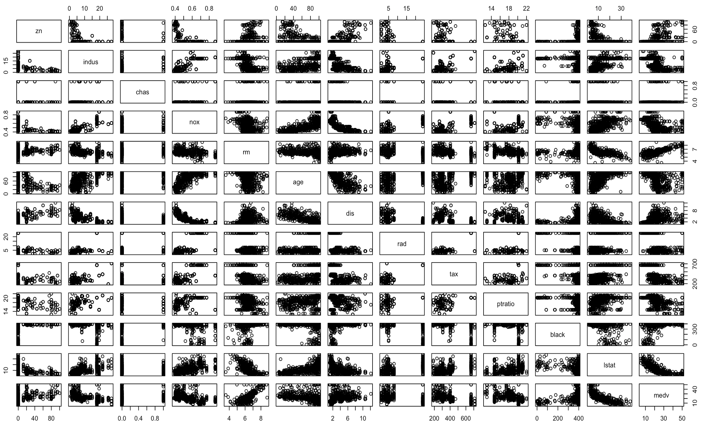

# Linear Regression Algorithm

* The code below demonstrates the linear regression algorithm. 
* Linear Regression is a part of supervised machine learning and thus the dataset is split into **training and testing data**.
* Linear Regression is used for prediction using the **line of best fit**. 
* **Dependent Variable** = **medv** (median value of owner-occupied homes in \$1000s.)
* Data Source: ```MASS``` library in ```R```.


### Implementation in R

The Boston.csv dataset is present in the data folder.
```{r, eval=TRUE}
data = read.csv('./data/boston.csv', header = T)
```

Exploratory data analysis of the variable types.
```{r, eval=TRUE, include=TRUE}
str(data)
```


Summary of the features of the dataset.
```{r}
summary(data)
```


Scatter plot matrix to visualize data.
```{r}
plot(data)
```


Splitting the dataset into training and testing data. This is done by randomly selecting 400 observations for testing and the rest for training. The ```sample()``` function generates 400 random values for splitting the dataset.
```{r}
set.seed(100)
train = sample(1:506,400)
test = -train

training_data = Boston[train,]
testing_data = Boston[test,]
```

Creating a linear model on the *training data* using the ```lm()``` function in R and checking the model summary. 
```{r}
model = lm(medv ~ log(lstat) + rm, data = training_data)
summary(model)
```

checking for collinearity - we want to make sure that the predictor variables that are highly correlated are not in the same model together

Ways of checking collieanrity :
1. correlation matrix
2. look at the correlation plot
3. look at the VIF

1. Correlation Matrix
```{r}
corr_matrix = round(cor(training_data),2)
```

2. visualize these correlation
```{r}
install.packages("corrplot")
library(corrplot)
corrplot(corr_matrix, order = "hclust")
```

3. VIF - Variance 
according to the VIF output, we can see that tax and rad are affecting the collinearity
in the model, this is because they have a high VIF (larger than 5)
A value of VIF = 1 is the best!
VIF = 1/(1-RSquared)
```{r}
install.packages("car")
library(car)
vif(model.lstat)
```

we need to get rid of either rad or tax from our model
```{r}
model.tax <- lm(medv ~ . + log(lstat) - lstat - rad, data = training_data)
summary(model.tax)
```
```{r}
model.rad <- lm(medv ~ . + log(lstat) - lstat - tax, data = training_data)
summary(model.rad)
```

with the above evaluation, we get rid of rad, and the R-Squared was lowered compared to 
when we got rid of tax. So we should leave tax out.
 
Assess the model using the testing data. In order to do this, saving the dependent variable to a new variable
```{r}
testing_y = testing_data$medv
predicted_y = predict(model,testing_data)
```

Assessing the model on testing data. Confusion matrix
```{r}
install.packages("e1071")
library(e1071)
confusionMatrix(testing_y,predicted_y)
```

MSE
```{r}
mean((predicted_y-testing_y)^2)
```

Removing the non-significant variables and then try the model (not done here):
```{r}
model.final = lm(medv ~ , data = training_data)
summary(model)
```

Dealing with interaction terms
```{r}
model = lm(mdev ~ log(lstat) + rm, data = training_data)
summary(model)
```
```{r}
model = lm(mdev ~ log(lstat)*rm, data = training_data)
summary(model)
```
get all two-way interaction terms (possibility of over-fitting)
```{r}
model = lm(mdev ~ (.)^2, data = training_data)
summary(model)
```

get all three-way & two-way interaction terms (possibility of over-fitting)
```{r}
model = lm(mdev ~ (.)^3, data = training_data)
summary(model)
```

# Checking the assumptions of Linear Regression

1.
2.
3.
4.

# Dealing with categorical variables in Linear Regression
```{r}
library(ISLR)
?Carseats
str(Carseats)
```

## split the data
set.seed(1)
train = sample(1:400,300)
test = -train

training_data = Carseats[train,]
testing_data = Carseats[test,]

## Training the model 
model = lm(Sales ~ Price +  ShelveLoc, data = training_data)
summary(model)

# When we have a categorical variable, R creates a dummy variable
contrasts(Carseats$ShelveLoc)