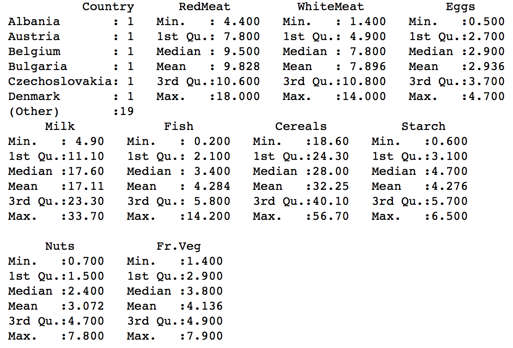
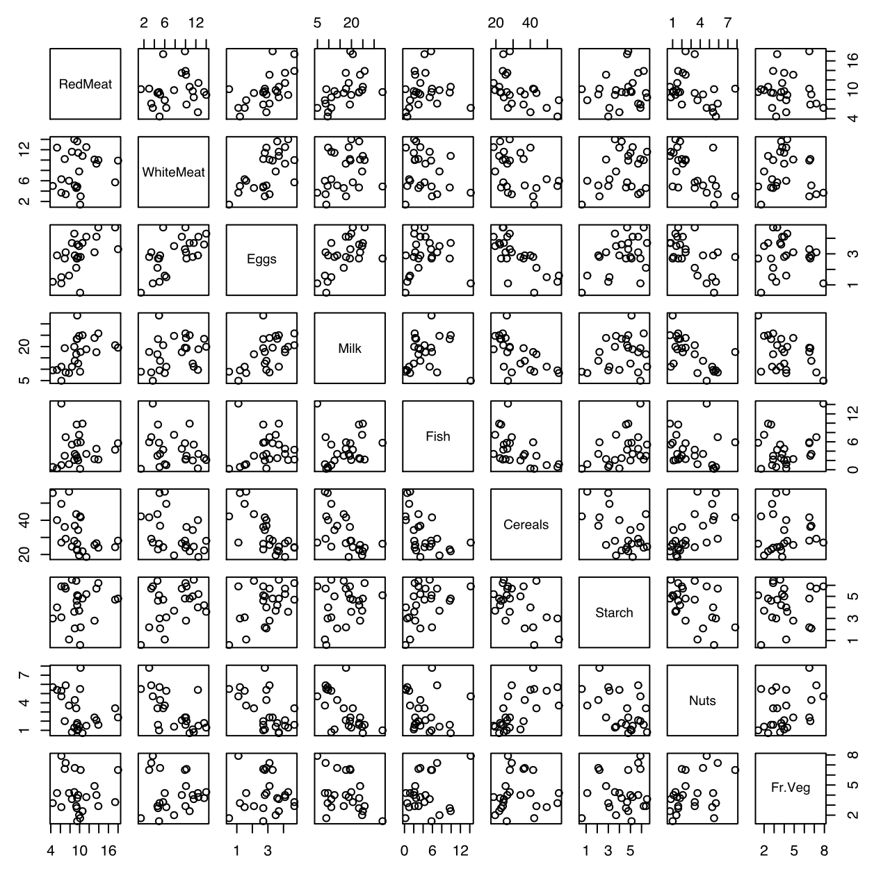
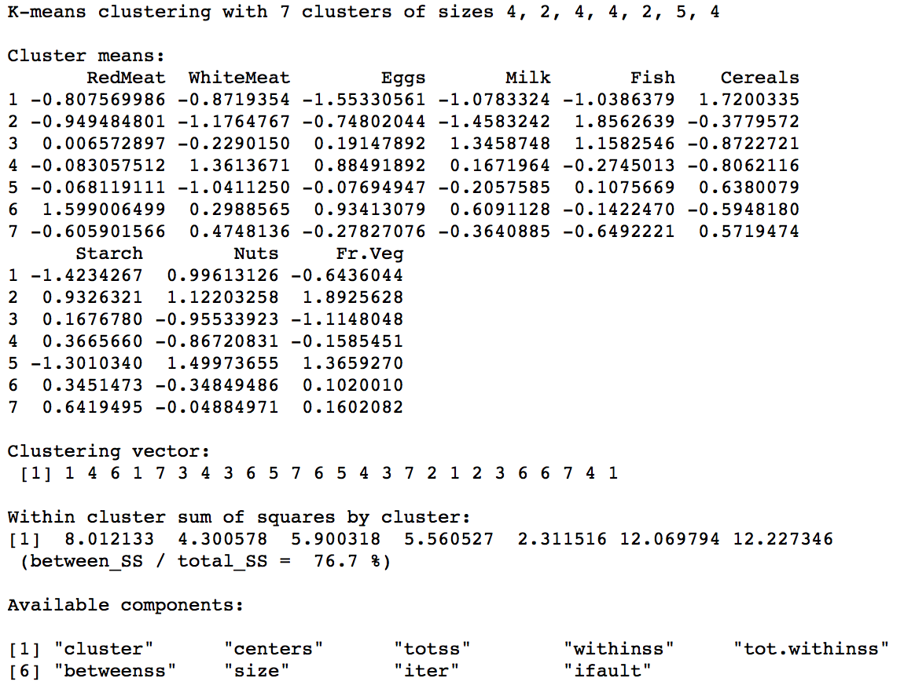
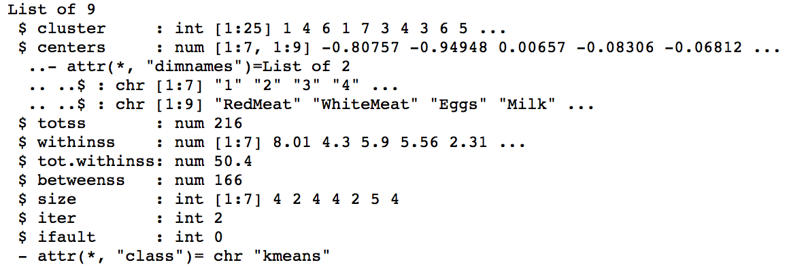
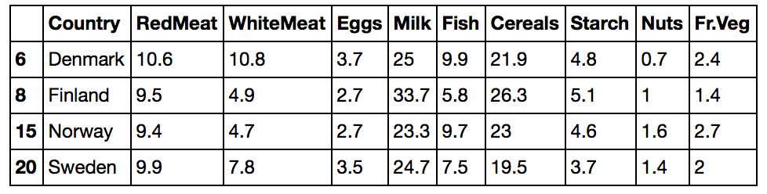
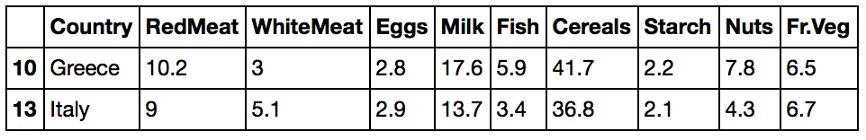
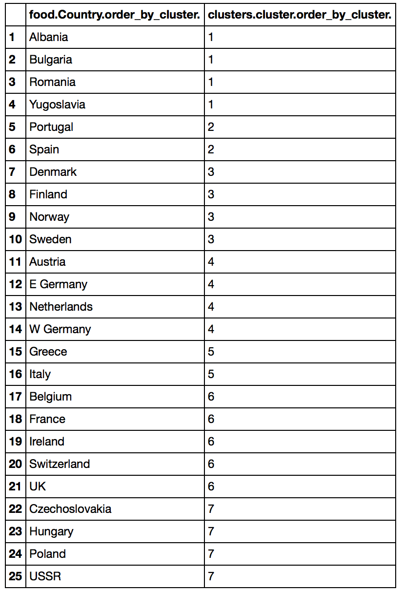
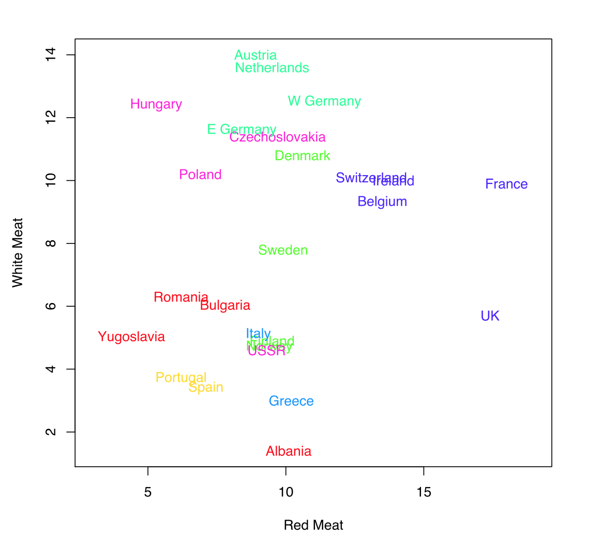

# K-Means Algorithm

* The code below demonstrates the use of the k-means algorithm. 
* K-Means is a part of unsupervised machine learning and thus there is **no training and testing data**.
* K-Means helps forming clusters of the dataset and getting useful insights.


### Implementation in R

The protien.csv dataset is present in the data folder.
```{r, eval=TRUE}
food = read.csv('./data/protein.csv', header = T)
```

Exploratory data analysis of the variable types
```{r, eval=TRUE, include=TRUE}
str(food)
```


Summary of the features of the dataset
```{r}
summary(food)
```


Plot between each variable to visualize data
```{r}
plot(food[,-1])
```


Normalizing the data since the range of all variables is different. 
```{r}
std_data = scale(food[,-1])
```

Running the k-means algorithm on the dataset. The dataset is divided into 7 clusters. 
nstart is the random starting point. Clustering is done for all the random points and the best cluster is taken.
For nstart = 10, 10 different starting points are chosen randomly and the k-means algorithm runs 10 times.
After this, the best k-means solution is chosen among them. 
```{r}
clusters = kmeans(std_data, nstart = 10, centers = 7)
```

Checking the model details. 
```{r}
clusters
```



### Explanation of the model:

The clustering happens on the basis of the protien consumption for each product. Similar protein consumption for different products will be a part of the same cluster. Thus, cumulatively, the protien consumption of meat, eggs, milk, etc. is similar to each other within a cluster. 

1. A total of 7 clusters of size - 4, 2, 4, 4, 2, 5, 4 are formed.
2. **Cluster means** - The centres of the clusters.
3. **Clustering vector** - The final clustering arrangement of the data for each observation. For example, the 1st  observation falls in the 1st cluster.  
4. **Within cluster sum of squares by cluster:** - This is a measure of distortion within the cluster. When the clustering is better, these values (or the sum of these values) is **low**.

Summary of the model
```{r}
str(clusters)
```



### Explanation of the model summary:

1. **cluster** - The final clustering arrangement of the data for each observation.
2. **centers** - A matrix of cluster centres.
3. **totss** - This is the sum of **tot.withinss** and **betweenss**.
4. **withinss** - This is a measure of distortion within the cluster. When the clustering is better, these values are **low**.
5. **tot.withinss** - The sum of the withinss values. The **lower the tot.withinss** the **lesser the distortion** within the cluster.
6. **betweenss** - Between clusters we need lower similarity. Thus, **higher the betweenss**, the **better the clustering**. 
7. **size** - The number of points in each cluster.
8. **iter** - Iterations to get the best cluster.
9. **ifault** - indicator of a possible algorithm problem -- for experts.


Details of the elements of cluster 3
```{r}
cluster_3 = subset(food, clusters$cluster==3)
cluster_3
```



Details of the elements of cluster 5
```{r}
cluster_5 = subset(food, clusters$cluster==5)
cluster_5
```


Ordering the countries accroding to clusters for better interpretation of protien consumption.
```{r}
order_by_cluster = order(clusters$cluster)
country = data.frame(food$Country[order_by_cluster],clusters$cluster[order_by_cluster])
country
```


* **Interpretation**: Albania, Bulgaria, Romania, Yugoslavia have similar protien consumption for the mentioned products since they fall in the same cluster.

Plotting the ReadMeat vs WhiteMeat protien consumption of the countries according to thier cluster. 
```{r}
plot(food$RedMeat, food$WhiteMeat, type = "n", xlim = c(3,19), xlab = "Red Meat",ylab = "White Meat")
text(x = food$RedMeat, y = food$WhiteMeat, labels = food$Country, col = rainbow(7)[clusters$cluster])
```
