# Support Vector Machine

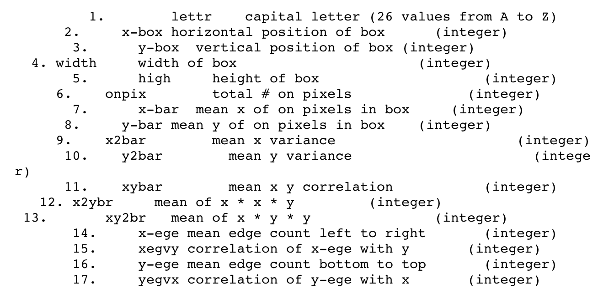

## Implementation in R

The credit.csv dataset is present in the data folder.
```{r, eval=TRUE}
letters = read.csv("./data/letterdata.csv", header = T)
```

Exploratory data analysis of the variable types.
```{r, eval=TRUE, include=TRUE}
str(letters)
```
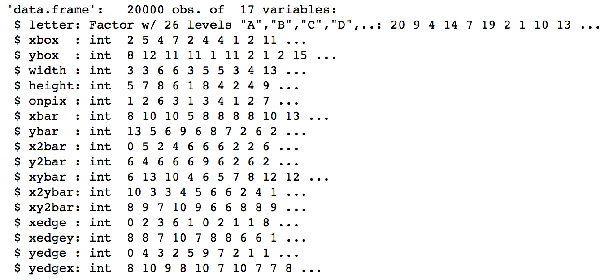

Summary of the features of the dataset.
```{r}
summary(letters)
```
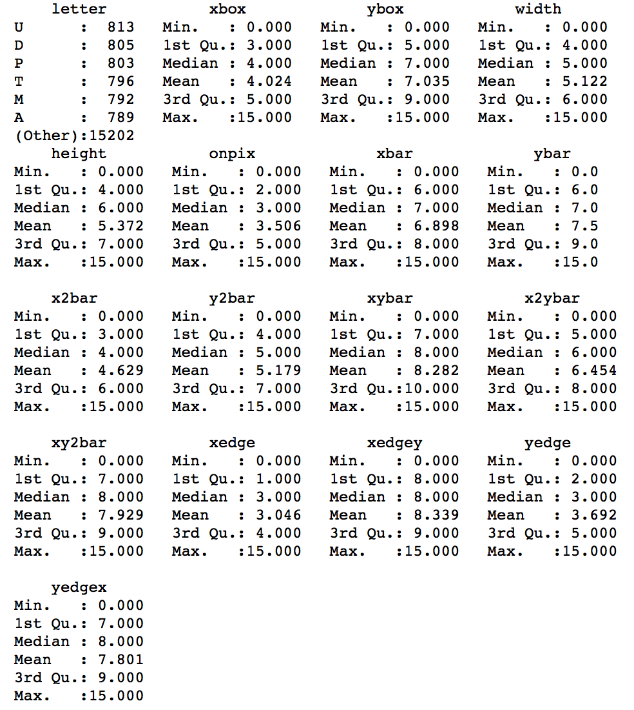

exp another var
```{r}
table(letters$xbox)
```
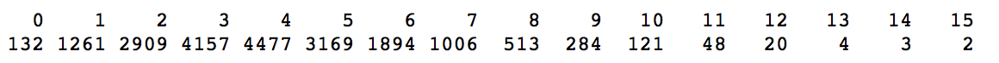

### Splitting the dataset

The dataset is split into two parts: *training* and *testing*. The training part is used for fitting the model and the testing part is used for assessing the model. The split is done randomly to eliminate bias. The ```sample()``` function in R is used for generating 16000 random samples as training data and the remaining as testing data. 
```{r}
set.seed(100) # to control randomness and get similar results

train = sample(1:20000, 16000)
test = -train

training_data = letters[train,]
testing_data = letters[test,]
```

### SVM Model

```{r}
#install.packages("e1071")
# install.packages("kernlab")
library(e1071)
library(kernlab)

model_linear = svm(letter ~ ., data = training_data, kernel = "linear", cost = 0.05, scale = FALSE)
model_linear
```


summary
```{r}
summary(model_linear)
```
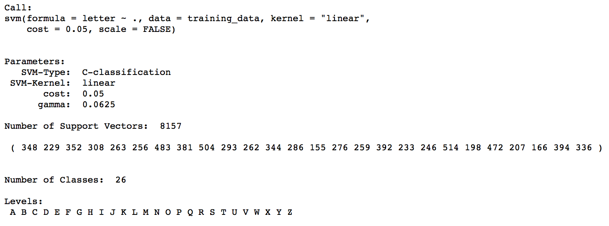

svm radial model
```{r}
model_radial = svm(letter ~ ., data = training_data, cost = 0.05, scale = FALSE)
model_radial
```
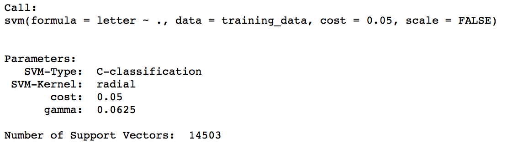

radial summary
```{r}
summary(model_radial)
```
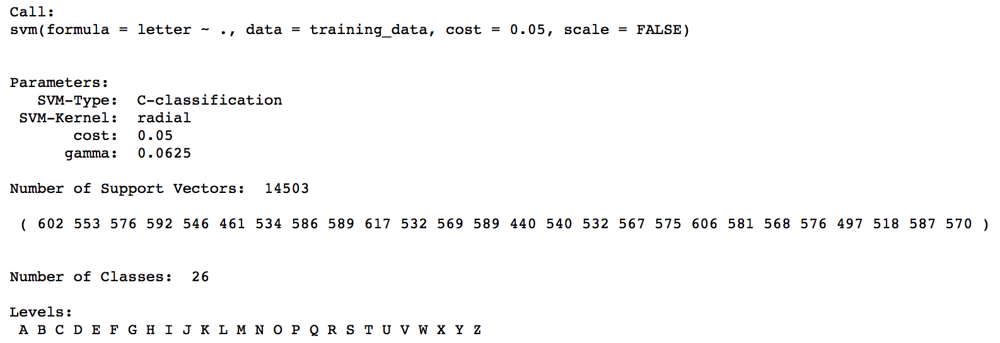

tuning svm to find the best model
```{r}
tune.out=tune(svm , letter ~., data=training_data, kernel ="radial", ranges =list(cost=c(0.1 ,1 ,10), gamma=c(0.5,1,2)))
summary(tune.out )
```


best model after tuning.summary of best model
```{r}
bestmodel = tune.out$best.model
summary(bestmodel)
```
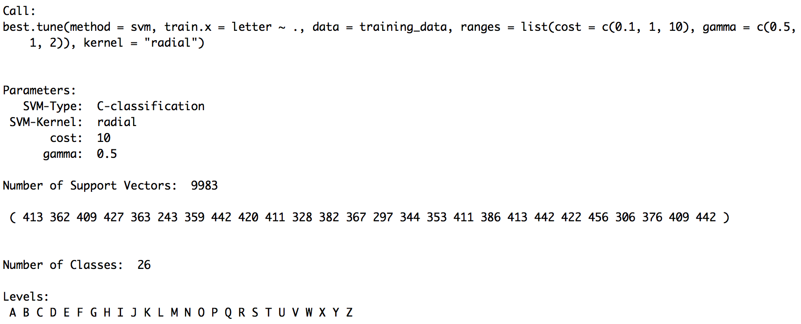

### Prediction and Accuracy

In order to do predictions using the SVM model on the testing data, we use the ```predict()``` function in R.
```{r}
predicted_y = predict(bestmodel, testing_data)
```

A confusion matrix is used for checking the accuracy of the model. The ```confusionMatrix()``` function is a part of the ```caret``` package. It shows the true positives, false positives, true negatives and false negatives and hence the misclassification rate. 
```{r}
#install.packages("caret")
library(caret)
confusionMatrix(testing_data$letter, predicted_y)
```
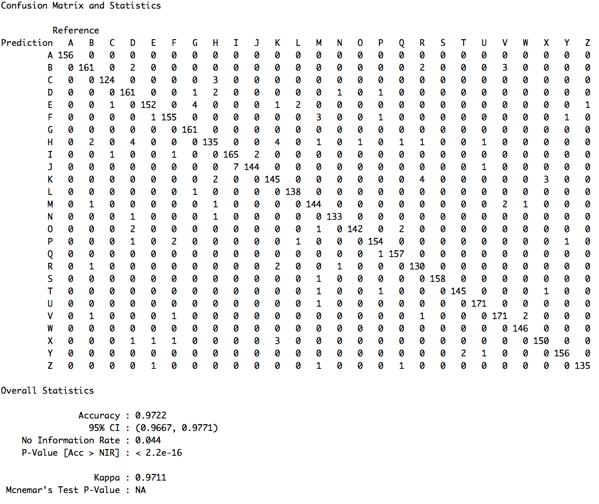
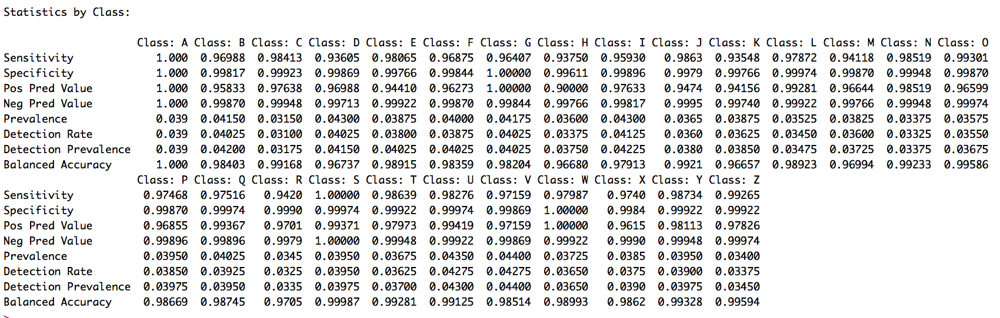

svm classification plot of xbox vs height 
```{r}
plot(model_2, data = training_data, xbox ~ height)
```
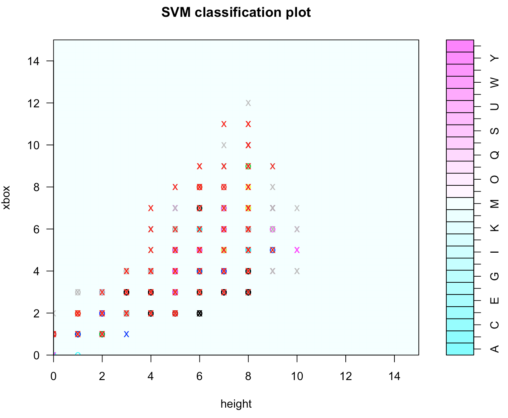